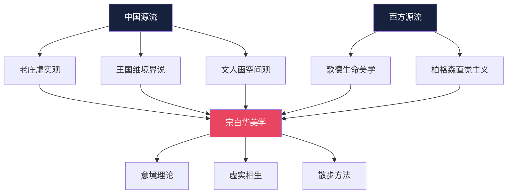
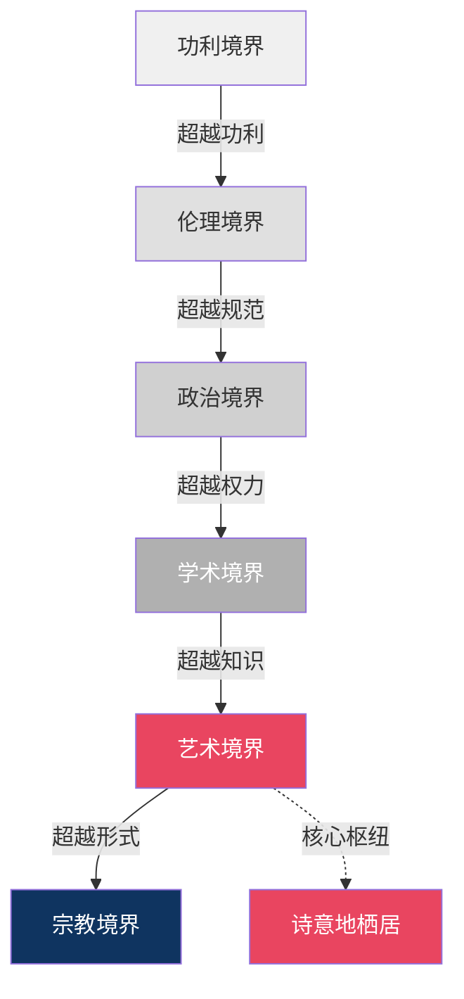
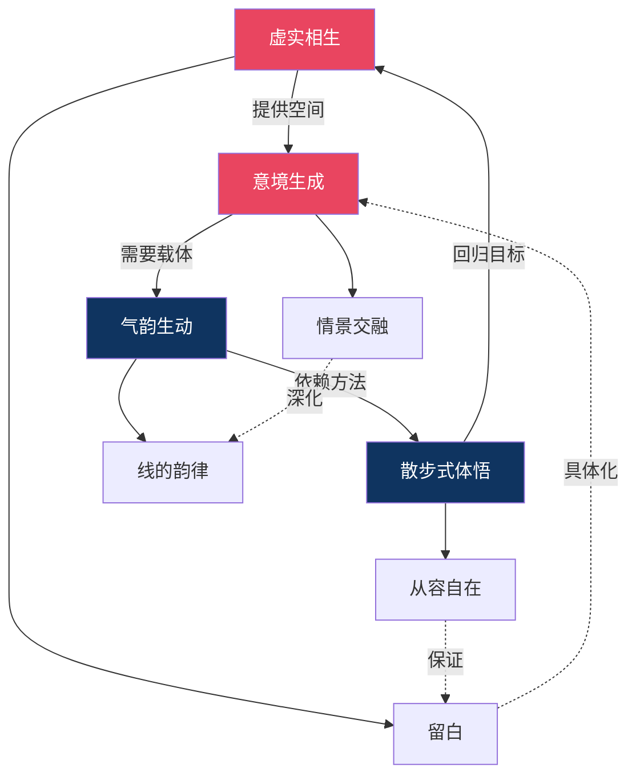

# 散步式美学的内在理路｜《美学散步》图谱逻辑深度解析

---

> **系列导航**
> 
> ◆ 《人类文明经典阅读计划》第 7 辑 · 艺术美学
> ◇ 本期书目：宗白华《美学散步》
> ○ 上一篇：《知识图谱》| 下一篇：《核心思想精读》

---

## ◇ 为什么用图谱来理解"散步"？

这看似矛盾——"散步"本是自由自在、无拘无束的，为何要用结构化的图谱来呈现？

答案在于：**图谱不是对散步的束缚，而是对散步路径的显影**。

就像园林中的小径，看似随意蜿蜒，实则每一处转折都暗含匠心。宗白华先生的"散步"，亦是在自由中蕴含着深刻的逻辑。

本篇将揭示图谱背后的四重逻辑。

---

## ◆ 逻辑一：从"散"到"聚"——形散神不散

《美学散步》的表面特征是"散"——

○ 没有严密的理论体系
◇ 没有层层递进的论证结构
● 没有刻意建构的学术框架

但深入阅读后会发现，其内在有一条清晰的主线：

**以"意境"为核心，以"虚实相生"为方法，以"人生境界"为归宿。**

这种"形散神不散"的结构，正是中国美学特有的表达方式。它不同于西方美学的"建筑式"建构，而更像中国画的"散点透视"——看似分散，实则处处呼应。

---

## ◇ 逻辑二：中西交汇——双重思想源流的融合

宗白华美学的独特性，在于他同时拥有深厚的中西学术背景。图谱中的人物网络，揭示了这种双重源流。

### 中国源流的三条脉络

**第一条：老庄的虚实观**

老子的"有无相生"、庄子的"逍遥游"，奠定了中国美学"以虚为美"的基调。宗白华将这一思想发展为系统的"虚实相生"理论。

**第二条：王国维的境界说**

王国维在《人间词话》中提出的"境界"概念，是宗白华"意境理论"的直接源头。但他没有止步于词学，而是将其扩展为涵盖所有艺术门类的普遍范畴。

**第三条：文人画的空间意识**

从苏轼到石涛，中国文人画形成了独特的空间观念——不是焦点透视的"科学性"空间，而是"俯仰往还，远近取与"的节奏化空间。

### 西方源流的两条脉络

**第一条：歌德的生命美学**

歌德强调艺术是"生命的表达"，这一思想深刻影响了宗白华。他将"气韵生动"重新阐释为"活跃生命的传达"。

**第二条：柏格森的直觉主义**

柏格森认为，真正的认知不是理性分析，而是直觉体悟。这与宗白华"散步式"的美学方法不谋而合。

---

## ● 逻辑三：从艺术到人生——境界的层层递进

图谱中的人生六境界，不是并列的六个选项，而是**层层递进的阶梯**。

**递进的逻辑是什么？**

每一层的超越，都是从"外在约束"走向"内在自由"的过程：

○ 功利境界被外在的利益驱动
◇ 伦理境界被外在的道德约束
● 政治境界被外在的权力结构
◆ 学术境界被外在的知识体系
○ 艺术境界开始回归内在的生命体验
◇ 宗教境界达到完全的超越与解脱

宗白华将"艺术境界"置于核心位置，因为它是从世俗走向超越的**关键枢纽**。

---

## ◆ 逻辑四：概念的网状关联——不是孤立，而是交织

图谱中的网络图揭示了一个重要事实：宗白华美学中的核心概念，**不是孤立的命题，而是相互支撑的网络**。

**这个网络告诉我们什么？**

- 没有一个概念可以脱离其他概念而独立存在
- "虚实相生"提供了意境生成的空间基础
- "气韵生动"是意境在艺术中的具体呈现
- "散步式体悟"是抵达这一切的方法论保证
- 四者形成闭环，互为因果，互为支撑

---

## ◇ 图谱的终极意义：看见"散步"的全貌

通过图谱，我们看到的不是对"散步"的肢解，而是对"散步"全貌的呈现。

就像站在高处俯瞰园林——

○ 在地面上行走时，你只能看到眼前的景致
◇ 而登高远眺，才能看见曲径通幽的整体布局

图谱的意义，就在于这种"登高"的视野。它让我们在理解宗白华美学时，既能"入乎其内"地体悟每一个概念的精微，又能"出乎其外"地把握整个体系的脉络。

> "散步"不是无序的游荡，而是以从容的姿态，在美的世界中穿行。
> 图谱不是对散步的束缚，而是对散步路径的显影。

---

> **互动话题**
> 
> ◆ 四重逻辑中，哪一层颠覆了你对"散步"的理解？
> ○ 在评论区分享你的感悟
> ◇ 点赞最高的评论将出现在下期推文中

---

> **系列导航卡片**
> 
> ┌─────────────────────────────────┐
> │ ◆ 《人类文明经典阅读计划》系列导航 │
> │                                  │
> │ ◇ 第07辑 · 艺术美学 ◄ 当前所在    │
> │                                  │
> │ 本期书目：                        │
> │ ◇ 《美学散步》宗白华              │
> │ ◆ 《美的历程》李泽厚              │
> │ ○ 《艺术的故事》贡布里希          │
> │                                  │
> │ 图谱逻辑：                        │
> │ ● 形散神聚  ● 中西交汇            │
> │ ● 境界递进  ● 概念网络            │
> └─────────────────────────────────┘

---

**标签**：#诗意美学 #虚实相生 #意境理论 #人生境界 #图谱逻辑 #宗白华 #中国美学
