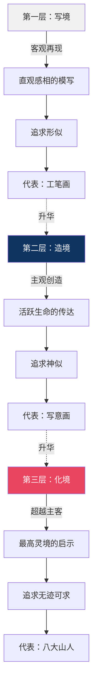
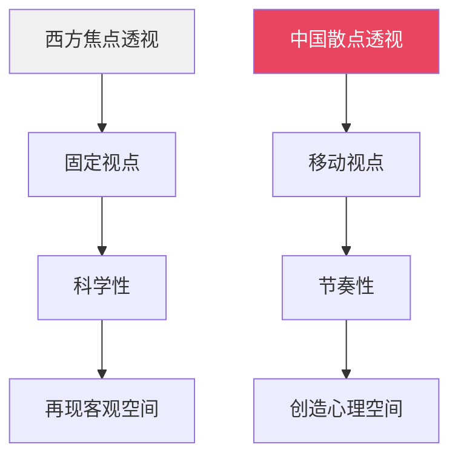
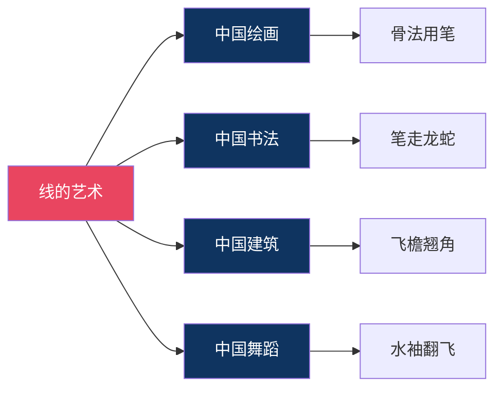
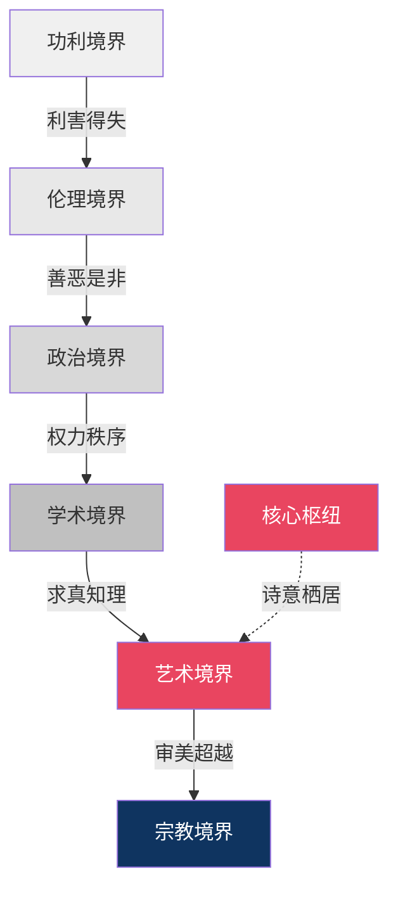

# 虚实之间，看见中国美学的灵魂｜《美学散步》核心思想精读

---

> **系列导航**
> 
> ◆ 《人类文明经典阅读计划》第 7 辑 · 艺术美学
> ◇ 本期书目：宗白华《美学散步》
> ○ 上一篇：《图谱逻辑》| 下一篇：《职场中的美学智慧》

---

## ◆ 引子：一个关于"空"的故事

宋代画院曾以"深山藏古寺"为题考画师。

有人画山峦叠嶂中露出一角寺庙，有人画古木参天中隐现红墙碧瓦。唯独一人，只画了山间一弯溪水，一位挑水的老僧。寺庙呢？藏在画中，也藏在画外。

这幅画得了第一。

宗白华先生在《美学散步》中反复提及这类故事，因为它们揭示了中国美学最核心的思想：**虚实相生，以虚为美**。

---

## ◇ 核心思想一：虚实相生——中国美学的宇宙观

### 什么是"虚实相生"？

"虚"不是空无，"实"不是填满。虚实之间的关系，不是对立，而是相生。

宗白华先生从三个层面阐释了这一思想：

**在宇宙观层面**

老子说："天下万物生于有，有生于无。"
庄子说："虚室生白，吉祥止止。"

中国古人认为，宇宙的本质不是"有"，而是"无"。"无"不是虚无，而是孕育万有的可能性。

**在艺术观层面**

中国画的留白，不是偷懒，而是刻意为之。

八大山人的画，常常只画一条鱼，其余皆是空白。但那空白不是空的——它是水，是天，是无限的空间。观者看着那空白，仿佛自己也化作了一条鱼，在水中悠然游弋。

**在人生观层面**

宗白华认为，虚实的智慧同样适用于人生。

○ 忙碌是实，闲适是虚
◇ 获取是实，放下是虚
● 进取是实，退守是虚

真正懂得生活的人，知道在"实"中留出"虚"的空间。

> "中国画最重空白处。空白处并非真空，乃灵气往来生命流动之处。"
> ——宗白华

---

## ● 核心思想二：意境——中国美学的最高范畴

### 意境的三层结构

宗白华先生将意境分为三个层次，每一层都是一次升华：

**第一层"写境"**，是基础。它追求对客观事物的准确再现。但这只是起点，不是终点。

**第二层"造境"**，是飞跃。艺术家不再满足于再现，而是将自己的情感、意志注入其中。郑板桥画竹，画的不是竹子本身，而是"咬定青山不放松"的品格。

**第三层"化境"**，是化境。主客体的界限消融了，艺术家与创作对象合而为一。庄周梦蝶，不知周之梦为蝶与，蝶之梦为周与。

### 意境与西方"典型"的区别

宗白华特别指出，"意境"不同于西方的"典型"概念。

○ 西方"典型"强调的是普遍性——通过个别人物展现普遍人性
◇ 中国"意境"强调的是独特性——在特定情境中触发独特的情感体验

"典型"追求的是"共相"，"意境"追求的是"此时此地此情此景"的唯一性。

---

## ◆ 核心思想三：空间意识——中国艺术的独特视角

### 散点透视 vs 焦点透视

宗白华先生敏锐地发现，中西艺术的差异，根源于空间意识的不同。

西方绘画像照相，从一个固定的角度去看世界。中国绘画像散步，边走边看，步移景换。

《清明上河图》就是散点透视的典范。观者随着画卷的展开，仿佛漫步于汴京的街巷之中。视点在不断移动，空间在不断展开。

### "俯仰往还"的观照方式

宗白华用"俯仰往还，远近取与"八个字，概括了中国人的观照方式。

○ 俯——从高处往下看
◇ 仰——从低处往上看
● 往——从近处往远处看
◆ 还——从远处回到近处

这种观照方式，不是静止的、单一的，而是流动的、多维的。它让观者在"看"的过程中，体验到了时间的流动和空间的转换。

> "中国画家要在咫尺之内，表现万里之势，靠的就是这种流动的空间意识。"

---

## ◇ 核心思想四：线的艺术——中国美学的形式密码

### 为什么中国艺术如此重视"线"？

宗白华先生指出，**中国艺术是线的艺术**。

中国画的骨法用笔、书法的笔墨意趣、建筑中的飞檐翘角、舞蹈中的水袖翻飞，都离不开"线"。

### 线的三个特质

**第一：时间性**

西方的面是静态的，中国的线是动态的。看一幅书法，你能感受到笔锋在纸上运行的节奏和力量。线是时间的痕迹。

**第二：韵律感**

中国艺术中的线，不是几何学意义上的直线或曲线，而是具有音乐韵律的线。它时而急徐，时而顿挫，时而流畅，时而凝滞。

**第三：生命力**

宗白华说，中国线的艺术，最终表现的是"气韵生动"。气是生命力，韵是节奏感。一根好的线条，是有生命的，它在呼吸，在运动，在诉说。

---

## ● 核心思想五：美与人生——六重境界的超越之路

### 六重境界的内在逻辑

宗白华先生将人生分为六重境界，这六重境界不是并列的选项，而是递进的阶梯：

### 为什么"艺术境界"是核心枢纽？

宗白华最推崇艺术境界，原因在于：

○ 艺术境界既不离现实，又超越了现实
◇ 它让我们在日常生活中，发现诗意
● 它让我们在有限的生命中，触摸无限

功利境界的人，看到的是利益；艺术境界的人，看到的是美。
伦理境界的人，遵守的是规则；艺术境界的人，创造的是自由。

> "艺术的境界，既使心灵和宇宙净化，又使心灵和宇宙深化。"
> ——宗白华

---

## ◆ 结语：美是一种信仰

读完《美学散步》的核心思想，我们可以用一句话来概括宗白华先生的美学：

**在虚实之间看见美，在意境之中安顿心。**

这不仅仅是艺术理论，更是一种人生哲学。它告诉我们：

○ 生活不只是忙碌，还有闲适
◇ 世界不只是实用，还有诗意
● 人生不只是功利，还有境界

在这个意义上，美不是奢侈品，而是必需品。它不是少数人的专利，而是每一个人都可以拥有的信仰。

> "诗意地栖居在大地上。"
> ——荷尔德林

---

> **互动话题**
> 
> ◇ 五个核心思想中，哪一个最能触动你？
> ○ 在评论区写下你的感悟
> ◆ 我们将精选优质留言制作成专属美学卡片

---

> **系列导航卡片**
> 
> ┌─────────────────────────────────┐
> │ ◆ 《人类文明经典阅读计划》系列导航 │
> │                                  │
> │ ◇ 第07辑 · 艺术美学 ◄ 当前所在    │
> │                                  │
> │ 本期书目：                        │
> │ ◇ 《美学散步》宗白华              │
> │ ◆ 《美的历程》李泽厚              │
> │ ○ 《艺术的故事》贡布里希          │
> │                                  │
> │ 核心思想：                        │
> │ ● 虚实相生  ● 意境三层            │
> │ ● 空间意识  ● 线的艺术            │
> │ ● 六重境界                        │
> └─────────────────────────────────┘

---

**标签**：#诗意美学 #虚实相生 #意境理论 #人生境界 #核心思想 #宗白华 #中国美学
