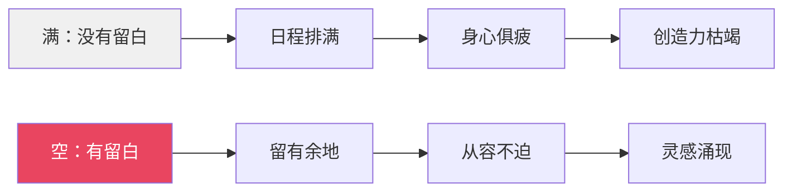
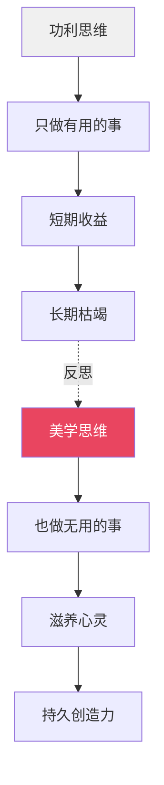
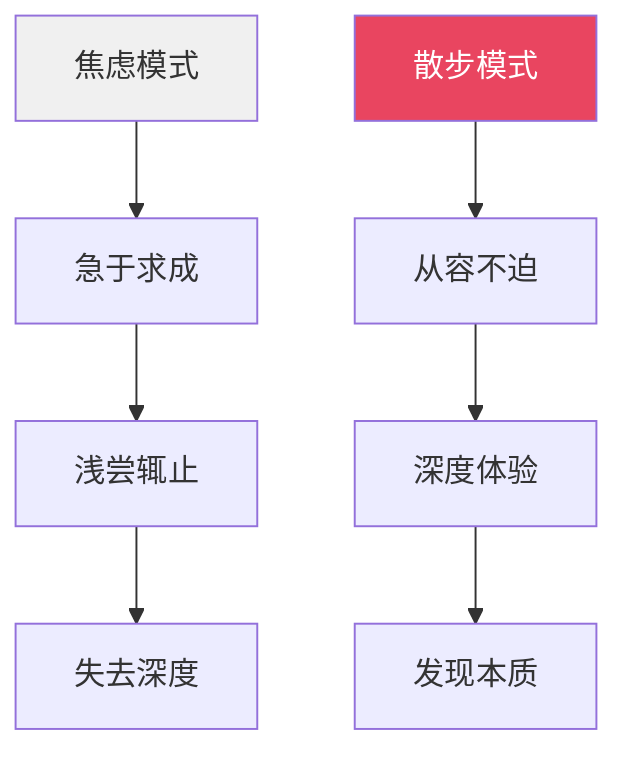
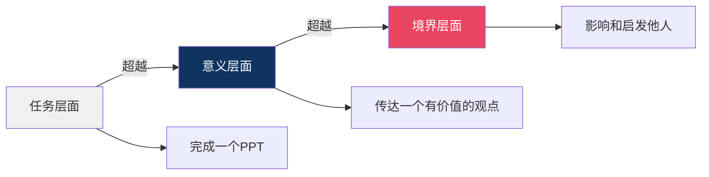
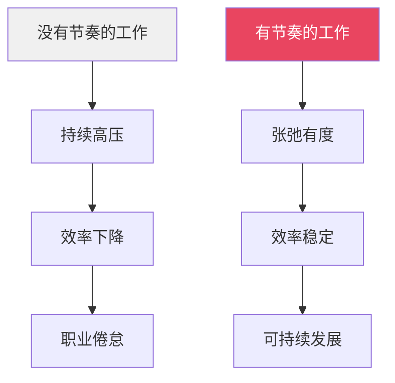
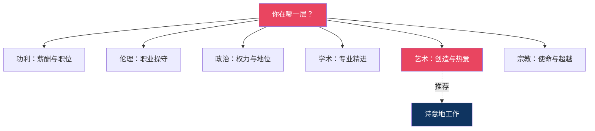

# 把日子过成一首诗｜《美学散步》给职场人的六个启示

---

> **系列导航**
> 
> ◆ 《人类文明经典阅读计划》第 7 辑 · 艺术美学
> ◇ 本期书目：宗白华《美学散步》
> ○ 上一篇：《核心思想精读》| 下一篇：《行动挑战》

---

## ◇ 引子：职场人的"散步"时刻

你有没有过这样的体验？

加班到深夜，走出写字楼，抬头看见一轮明月。那一刻，疲惫突然消散了大半。

这就是美的力量。它不能帮你完成KPI，不能替你写PPT，但它能在你最疲惫的时候，给你一丝喘息的空间。

宗白华先生的《美学散步》，看似是一本讲艺术、谈美学的书，但细细品味，里面藏着**给职场人的深刻启示**。

---

## ◆ 启示一：留白的智慧——给日程表留出"空白"

中国画讲究留白，职场同样需要留白。

**如何在职场中实践"留白"？**

○ 每天留出30分钟的"空白时间"，不安排任何会议和任务
◇ 每周留出半天的"散步时间"，离开办公桌，去走走看看
● 在每个项目之间留出"缓冲期"，不急于跳到下一个任务

宗白华说："虚实相生，无画处皆成妙境。"在职场中，那些看似"无用"的空白，恰恰是创造力涌现的土壤。

---

## ◇ 启示二：虚实相生——在"有用"与"无用"之间找到平衡

职场人最容易陷入的误区是：**只做"有用"的事**。

读书只读工具书，社交只做功利社交，学习只学能升职的技能。一切以"有用"为尺度，结果反而失去了最珍贵的东西。

**什么是职场中的"无用之用"？**

○ 读一本与工作无关的书
◇ 看一场与行业无关的展览
● 学一门与升职无关的爱好
◆ 发一会儿与工作无关的呆

宗白华告诉我们：正是这些看似"无用"的事，滋养了我们的灵魂，让我们在长期的职业发展中保持活力和创造力。

---

## ● 启示三：散步式思维——用从容取代焦虑

现代职场人最大的敌人是什么？不是竞争对手，不是市场变化，而是**焦虑**。

焦虑让我们失去了从容，失去了深度思考的能力，失去了发现美的眼睛。

**如何将"散步式思维"带入职场？**

**在决策时**

不要急于下结论。像宗白华散步一样，多角度观察，多层面思考。俯仰往还，远近取与。

**在执行时**

不要被deadline追赶着奔跑。给自己留出思考和调整的空间，让工作有节奏地进行。

**在面对挫折时**

不要立刻陷入焦虑。停下来，退一步，换一个视角看问题。也许"山重水复"之后，就是"柳暗花明"。

> "散步是自由自在、无拘无束的行动。它的要点是没有意定的目标，没有预定的计划。"
> ——宗白华

在职场中，这种"自由自在"不是散漫，而是一种从容的智慧。

---

## ◆ 启示四：意境思维——在工作中创造"意义感"

很多职场人感到疲惫，不是因为工作本身太累，而是因为**工作失去了意义感**。

每天做着重复的事情，看不到价值，找不到热情。这就是宗白华所说的"功利境界"的困境。

**如何用"意境思维"重新定义工作？**

**第一层：任务层面**

"我要完成这个PPT。"这是最基础的认知，工作是任务，完成即可。

**第二层：意义层面**

"我要通过PPT传达一个有价值的观点。"工作不再只是任务，而是有意义的创造。

**第三层：境界层面**

"我希望通过我的工作影响和启发他人。"工作成为一种使命，一种美的创造。

当你从第三层看待工作时，再琐碎的事情也有了意义。再枯燥的任务也有了诗意。

---

## ◇ 启示五：线的艺术——在职场中保持"节奏感"

宗白华先生说中国艺术是"线的艺术"，线的特质之一是**韵律感**。

职场同样需要韵律感。

**如何找到职场的节奏感？**

○ **急与徐**：紧急任务快速处理，重要任务慢慢打磨
◇ **顿与挫**：遇到瓶颈时停下来，不要硬扛，换个思路再出发
● **流畅与凝滞**：顺境时乘势而上，逆境时沉淀积累

好的职场人，不是一直在奔跑的人，而是懂得什么时候该快、什么时候该慢的人。

就像一根好的书法线条，有急有徐，有顿有挫，有流畅有凝滞。这才是有生命力的节奏。

---

## ● 启示六：六重境界——在职场中追求更高的"人生坐标"

宗白华的六重境界论，给职场人提供了一个**自我审视的坐标系**。

**大多数职场人停留在哪一层？**

很多人停留在第一层"功利境界"——工作就是为了赚钱。这没有错，但如果只停留在这层，工作就会变成纯粹的消耗。

**宗白华推荐的是哪一层？**

艺术境界。因为艺术境界既不离现实，又超越了现实。它让你在赚钱的同时，找到热爱；在完成任务的同时，创造美。

**如何从"功利"走向"艺术"？**

○ 在工作中找到让你兴奋的那个点
◇ 把每一项任务当作一次创作的机会
● 在平凡的岗位上，创造不平凡的价值

> "艺术境界的创造，是人的生命体验的最高表达。"
> ——宗白华

职场不只是谋生的场所，更是实现生命价值的舞台。当你用艺术的眼光看待工作时，每一天都可以是一首诗。

---

## ◆ 结语：把职场变成你的"园林"

苏州园林的精妙在于，在有限的空间里创造出无限的意趣。

职场也是如此。在有限的时间和资源里，你可以选择：

○ 把它变成一个牢笼，每天重复着枯燥的工作
◇ 把它变成一座园林，在忙碌中发现诗意，在压力中找到从容

宗白华先生的《美学散步》，教给我们的不是如何逃避职场，而是如何**在职场中诗意地栖居**。

> "美从何处寻？美就在你的心里。"

---

> **互动话题**
> 
> ◇ 六个启示中，哪一个最戳中你的职场痛点？
> ○ 在评论区分享你的职场"散步"故事
> ◆ 我们将选出最有共鸣的故事，送出本期推荐好书

---

> **系列导航卡片**
> 
> ┌─────────────────────────────────┐
> │ ◆ 《人类文明经典阅读计划》系列导航 │
> │                                  │
> │ ◇ 第07辑 · 艺术美学 ◄ 当前所在    │
> │                                  │
> │ 本期书目：                        │
> │ ◇ 《美学散步》宗白华              │
> │ ◆ 《美的历程》李泽厚              │
> │ ○ 《艺术的故事》贡布里希          │
> │                                  │
> │ 职场启示：                        │
> │ ● 留白智慧  ● 虚实平衡            │
> │ ● 散步思维  ● 意境工作            │
> │ ● 线的节奏  ● 境界坐标            │
> └─────────────────────────────────┘

---

**标签**：#诗意美学 #虚实相生 #意境理论 #人生境界 #职场美学 #宗白华 #职场成长
