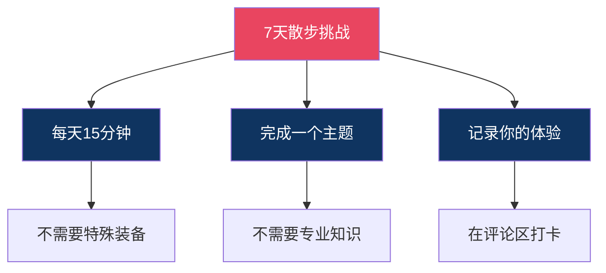
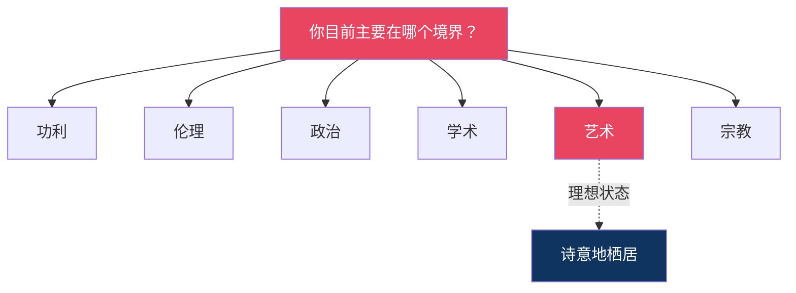

# 7天散步计划｜《美学散步》行动挑战：用一周时间重新发现美

---

> **系列导航**
> 
> ◆ 《人类文明经典阅读计划》第 7 辑 · 艺术美学
> ◇ 本期书目：宗白华《美学散步》
> ○ 上一篇：《职场中的美学智慧》| 下一篇：《美的历程》

---

## ◇ 引子：不止于阅读

读了这么多关于美的文字，看了这么多关于美的图谱。但宗白华先生告诉我们：

**美不是用来"读"的，而是用来"体验"的。**

所以，这一期我们不谈理论，只做一件事：

**邀请你参加一次7天的"美学散步"行动挑战。**

不需要你请假远行，不需要你花费重金。只需要你每天花15分钟，按照下面的指引，去感受、去体验、去发现。

---

## ◆ 挑战规则

**参与方式**：
1. 每天完成一个主题任务
2. 在评论区用文字记录你的体验
3. 连续完成7天即算挑战成功

**你需要准备**：
- 一颗愿意慢下来的心
- 一双愿意发现美的眼睛
- 一支笔（用于记录感受）

---

## ● Day 1：留白之日——给自己一段"空白"

**任务**：今天，给自己留出15分钟的空白时间。

**做什么**：
- 不看手机，不刷资讯
- 不处理工作，不回复消息
- 只是安静地坐着，或者慢慢地走

**宗白华的指引**：
> "虚实相生，无画处皆成妙境。"

**思考问题**：
- 在空白中，你想到了什么？
- 你的内心出现了什么感觉？
- 这15分钟的"留白"，和你平时的忙碌有什么不同？

**打卡模板**：
> Day 1 留白打卡：今天我在（时间/地点）留白了15分钟。我感受到了（描述你的感受）。

---

## ◇ Day 2：虚实之日——发现身边的"虚实相生"

**任务**：今天，在你的生活中找到3个"虚实相生"的例子。

**提示**：
- 建筑中的虚实：一堵墙和一扇窗
- 自然中的虚实：一棵树和它周围的空间
- 生活中的虚实：忙碌和闲适的交替

**宗白华的指引**：
> "中国画最重空白处。空白处并非真空，乃灵气往来生命流动之处。"

**思考问题**：
- 这些虚实关系是如何相互依存的？
- 如果只有"实"没有"虚"，会怎样？
- 如果只有"虚"没有"实"，又会怎样？

**打卡模板**：
> Day 2 虚实打卡：今天我发现了3个虚实相生的例子：（1）___（2）___（3）___。我的感悟是：___。

---

## ◆ Day 3：意境之日——创造你的"诗意瞬间"

**任务**：今天，用一首诗或一段文字，记录一个让你心动的瞬间。

**做什么**：
- 可以是窗外的一朵云
- 可以是路边的一朵花
- 可以是傍晚的一抹晚霞
- 可以是陌生人的一次微笑

**宗白华的指引**：
> "意境是情与景的交融，是心与物的合一。"

**思考问题**：
- 那个瞬间为什么打动了你？
- 你的情感是如何与那个场景交融的？
- 如果用一幅画来表现这个瞬间，会是什么样子？

**打卡模板**：
> Day 3 意境打卡：今天让我心动的瞬间是（描述场景）。我用（诗/文字）记录如下：（你的创作）。

---

## ● Day 4：线条之日——感受"线的韵律"

**任务**：今天，观察并感受生活中的"线"。

**去哪里找**：
- 书法中的线：笔画的起承转合
- 建筑中的线：屋檐的弧线、栏杆的直线
- 自然中的线：树枝的分叉、河流的弯曲
- 身体中的线：舞蹈的姿态、走路的步伐

**宗白华的指引**：
> "中国艺术是线的艺术。线的韵律，就是生命的韵律。"

**思考问题**：
- 哪一根线最让你有感觉？为什么？
- 这根线传递了什么样的节奏和情感？
- 如果这根线有声音，它会发出什么样的声音？

**打卡模板**：
> Day 4 线条打卡：今天让我印象最深的线是（描述）。它让我感受到了（描述节奏和情感）。

---

## ○ Day 5：空间之日——体验"移动视点"

**任务**：今天，用"散点透视"的方式，重新走一遍你熟悉的路。

**怎么做**：
- 选择一条你每天走的路（上下班的路上、小区里的散步路线）
- 今天，不要低头看手机，不要戴着耳机
- 边走边看，从不同的角度观察熟悉的事物
- 俯看、仰看、远看、近看

**宗白华的指引**：
> "俯仰往还，远近取与。这是中国人特有的空间观照方式。"

**思考问题**：
- 你发现了哪些平时忽略的细节？
- 同一个场景，从不同角度看有什么不同？
- 移动视点给你带来了什么新的体验？

**打卡模板**：
> Day 5 空间打卡：今天我重新走了（路线）。从新视角我发现了（描述新发现）。移动视点让我感受到（你的感悟）。

---

## ◇ Day 6：境界之日——反思你的"人生坐标"

**任务**：今天，用宗白华的六重境界论，审视自己的工作与生活。

**六重境界回顾**：
- 功利境界：以利害得失为尺度
- 伦理境界：以善恶是非为准则
- 政治境界：以权力秩序为依归
- 学术境界：以求真知理为目标
- 艺术境界：以审美体验为核心
- 宗教境界：以超越解脱为归宿

**宗白华的指引**：
> "艺术境界，既使心灵和宇宙净化，又使心灵和宇宙深化。"

**思考问题**：
- 你目前主要停留在哪一层境界？
- 你最想提升到哪一层？
- 从今天开始，你可以做一件什么小事来提升自己的境界？

**打卡模板**：
> Day 6 境界打卡：我目前主要在（境界）层。我想提升到（境界）层。从今天起，我会（具体行动）。

---

## ◆ Day 7：回归之日——总结你的"散步收获"

**任务**：今天，回顾过去6天的体验，写下你的总结。

**回顾问题**：
- 这7天中，哪一天的体验最让你难忘？
- 你对"美"的理解发生了什么变化？
- 你会把哪些"散步"的习惯带到未来的生活中？

**宗白华的指引**：
> "散步是自由自在、无拘无束的行动。但每一次散步，都会让你的心灵有所收获。"

**最终思考**：
- 美不是遥远的理想，而是日常的选择
- 诗意不是诗人的专利，而是每个人的权利
- 散步不是浪费时间，而是投资心灵

**打卡模板**：
> Day 7 总结打卡：7天散步挑战完成！最大的收获是（总结）。未来我会坚持（具体行动）。感谢这次挑战，让我重新发现了（感悟）。

---

## ◇ 挑战奖励

完成7天挑战的读者，将获得：

○ **"诗意美学践行者"电子徽章**
◇ **下期推荐书目优先试读资格**
● **精选感悟将出现在下期推文中**

**参与方式**：
在每一期的评论区完成打卡，连续7天即可。

---

## ◆ 结语：让散步成为一种习惯

7天的挑战只是一个开始。

宗白华先生用他的一生告诉我们：**美不是偶尔的造访，而是日常的修行。**

当你学会了留白，学会了在虚实之间看见美，学会了用散步的姿态面对生活——

你会发现，每一天都是一首诗，每一步都是一幅画。

> "行到水穷处，坐看云起时。"
> ——王维

---

> **互动话题**
> 
> ◇ 7天挑战，你最期待哪一天？
> ○ 在评论区立下你的挑战宣言
> ◆ 让我们一起，诗意地栖居

---

> **系列导航卡片**
> 
> ┌─────────────────────────────────┐
> │ ◆ 《人类文明经典阅读计划》系列导航 │
> │                                  │
> │ ◇ 第07辑 · 艺术美学 ◄ 当前所在    │
> │                                  │
> │ 本期书目：                        │
> │ ◇ 《美学散步》宗白华              │
> │ ◆ 《美的历程》李泽厚              │
> │ ○ 《艺术的故事》贡布里希          │
> │                                  │
> │ 7天挑战：                         │
> │ ● 留白  ● 虚实  ● 意境            │
> │ ● 线条  ● 空间  ● 境界  ● 回归    │
> │                                  │
> │ 下期预告：《美的历程》            │
> │ 李泽华的中华美学巡礼              │
> └─────────────────────────────────┘

---

**标签**：#诗意美学 #虚实相生 #意境理论 #人生境界 #行动挑战 #7天打卡 #宗白华 #美学散步
