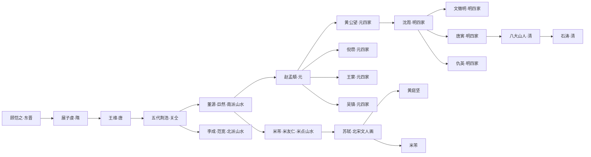
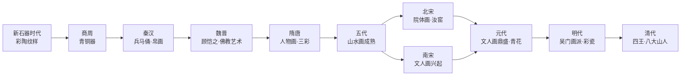
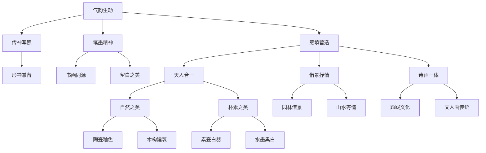

# 一张图看懂中国美术史：千年脉络可视化

> 从彩陶到水墨，从青铜到陶瓷，用四张图谱理清五千年审美长河。

---

## ◆ 导语：为什么需要一张图谱

中国美术史太长了。

上下五千年，朝代更迭，风格演变，名家辈出。光记住那些朝代名字就已经够费劲了，更别说还要理清不同时期的艺术特色、代表作品和审美理念。

这就是为什么我们需要一张图谱。

知识图谱的作用，不是替代你读《写给大家的中国美术史》，而是帮你在阅读之前，先搭一个框架。有了这个框架，再读蒋勋的文字，你就会像拿着一张地图走进一片森林，不会迷路。

下面四张图，分别从中国美术的**分类体系、人物脉络、时间路径和内在关联**四个维度，帮你建立全局认知。

---

## ◆ 图谱一：中国美术分类树

中国美术门类繁多，但大致可以分为以下几大体系。这张树状图帮你快速建立认知框架。

```mermaid
graph TD
    A["中国美术"] --> B["陶瓷艺术"]
    A --> C["书画艺术"]
    A --> D["建筑园林"]
    A --> E["工艺美术"]
    A --> F["雕塑艺术"]

    B --> B1["彩陶·新石器时代"]
    B --> B2["青铜·商周"]
    B --> B3["青瓷·魏晋至唐"]
    B --> B4["名窑·宋代五大窑"]
    B --> B5["青花·元代"]
    B --> B6["彩瓷·明清"]

    C --> C1["人物画·顾恺之至唐代"]
    C --> C2["山水画·五代至宋元"]
    C --> C3["花鸟画·宋代工笔至明清写意"]
    C --> C4["文人画·苏轼至清代"]
    C --> C5["书法·篆隶楷行草"]

    D --> D1["宫殿建筑·故宫"]
    D --> D2["园林建筑·苏州园林"]
    D --> D3["民居建筑·徽派·土楼"]
    D --> D4["宗教建筑·寺庙·石窟"]

    E --> E1["玉器"]
    E --> E2["漆器"]
    E --> E3["织绣"]
    E --> E4["文房四宝"]

    F --> F1["石窟造像·敦煌·云冈·龙门"]
    F --> F2["陵墓雕塑·兵马俑"]
    F --> F3["宗教造像"]
```



**阅读提示：** 蒋勋的书中，陶瓷和书画是重头戏，建筑和雕塑也有精彩讲述。建议先顺着分类树的骨架读，再深入到每个分支的细节。

---

## ◆ 图谱二：关键人物关系网

中国美术史上有一些绕不开的名字。他们不仅是艺术家，更是审美理念的引领者。



**阅读提示：** 人物图谱不是要你背诵名字，而是理解传承关系。每一条连线，都是审美理念的传递。从顾恺之的"传神写照"，到苏轼的"文人画"理念，再到八大山人的"写意精神"，这是一条越来越注重内心表达的路。

---

## ◆ 图谱三：时间演进路径

按时间顺序梳理，你会看到中国美术风格的演变轨迹。



**阅读提示：** 注意几个关键转折点：
- 魏晋时期，佛教艺术传入，带来了新的造型语言
- 宋代是中国美术的巅峰，无论是院体画还是陶瓷，都达到了极高的水准
- 元代文人画成为主流，从此中国画的审美方向发生了根本转变
- 明清时期，工艺美术大放异彩，陶瓷走向世界

---

## ◆ 图谱四：美学概念网络图

中国美术不只是器物和画作，更是一整套美学理念。这些概念相互交织，构成了中国独特的审美体系。



**阅读提示：** 这张图是四张图中最抽象的，但也最重要。"气韵生动"是谢赫六法之首，几乎贯穿了整个中国美术史。理解了这些概念，你看任何一件中国艺术品，都能看出门道。

---

## ◆ 如何使用这四张图谱

**第一步：分类树打底**
先了解中国美术有哪些门类，知道自己要学什么。

**第二步：人物图助理清传承**
不用背名字，但要知道谁影响了谁，审美理念是怎么一代代传下来的。

**第三步：时间路径建立全局观**
把零散的知识点串成一条线，看到演变的趋势和转折点。

**第四步：概念网络图深入灵魂**
这是最关键的一步。中国美术之所以独特，不在于画了什么、做了什么，而在于背后那套关于美的理解。

---

## ◆ 系列导航

```
┌──────────────────────────────────────┐
│    人类文明经典阅读计划 · 艺术美学    │
├──────────────────────────────────────┤
│  ◈ 01 读后感：在陶瓷与书画之间       │
│  ◈ 02 知识图谱（本篇）               │
│  ◇ 03 图谱逻辑：如何看懂中国美术史   │
│  ◇ 04 核心思想：美的本质是什么       │
│  ◇ 05 职场指南：从美术史学做人做事   │
│  ◇ 06 行动挑战：让美回到你的生活     │
└──────────────────────────────────────┘
```

---

## ◆ 互动话题

**四张图谱中，哪一张对你最有帮助？**

是分类树帮你理清了门类？人物图谱让你看到了传承？时间路径让你有了全局观？还是概念网络图让你触及了中国美学的内核？

在留言区告诉我们你的感受吧。如果这四张图谱帮到了你，欢迎**转发**给需要的朋友。

**下一期，我们将深入讲解这些图谱背后的底层逻辑，教你用自己的方式看懂中国美术史。**
