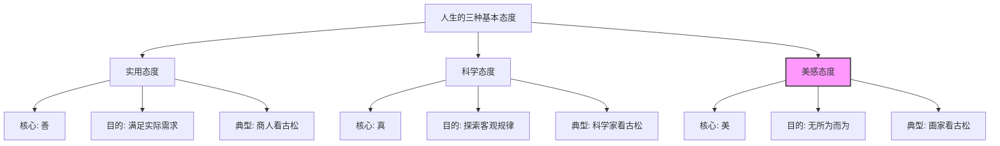
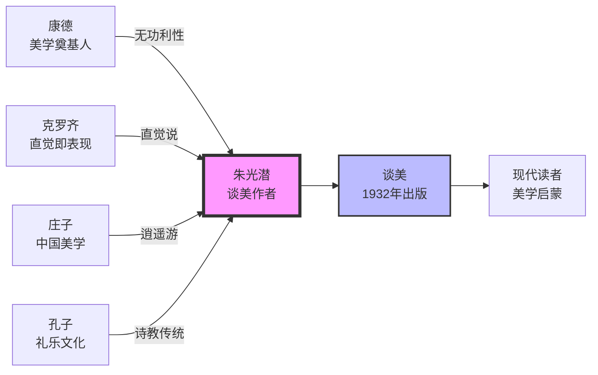
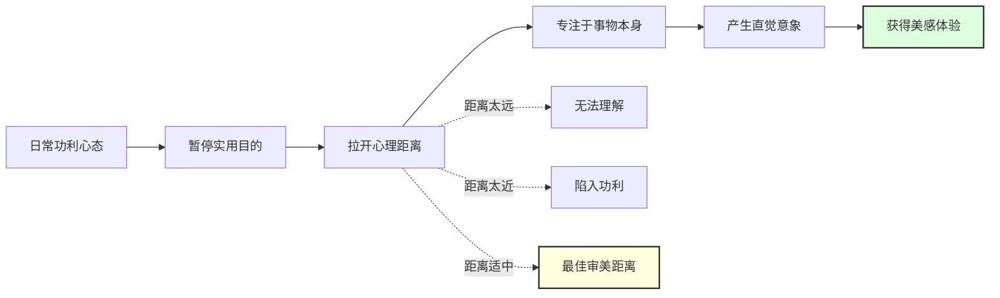
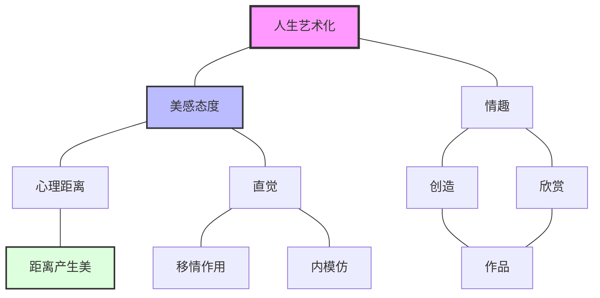

# 02-知识图谱图片描述

## ◆ 图片一：人生的三种态度（分类树）

> **图表说明**：此图展示了朱光潜《谈美》中对人生基本态度的分类，帮助读者理解"美感态度"与"实用态度"、"科学态度"的本质区别。

**排版提示**：在公众号编辑器中插入上述 Mermaid 渲染后的图片，建议配色以淡雅的莫兰迪色为主，突出"美感态度"分支。

---

## ◆ 图片二：美学核心人物图谱（人物关系图）

> **图表说明**：梳理了影响朱光潜美学思想的中外关键人物，以及他们在《谈美》中的角色定位。

**排版提示**：人物图谱建议横向排版，突出朱光潜作为中西美学桥梁的核心地位。

---

## ◆ 图片三：从功利到自由的审美路径（流程图）

> **图表说明**：展示了如何通过"心理距离"的建立，从日常的功利心态走向自由的审美体验。

**排版提示**：此图重点突出"距离适中"这一最佳审美状态，可用高亮色块标注。

---

## ◆ 图片四：美学概念网络（关联网络图）

> **图表说明**：将《谈美》中的核心概念编织成网络，展示它们之间的内在逻辑联系。

**排版提示**：网络图建议使用力导向布局，让"人生艺术化"位于中心，其他概念向四周发散，体现其统领地位。

---

### ◇ 系列导航

| 上一篇 | 下一篇 |
| :--- | :--- |
| [01-读后感：慢慢走，欣赏啊](./01-公众号排版文稿_读后感.md) | [03-图谱逻辑：一张图读懂谈美](./03-公众号排版文稿_图谱逻辑.md) |

> ◆ 核心标签：#朱光潜 #谈美 #人生艺术化 #美学入门 #美感态度 #距离美学
