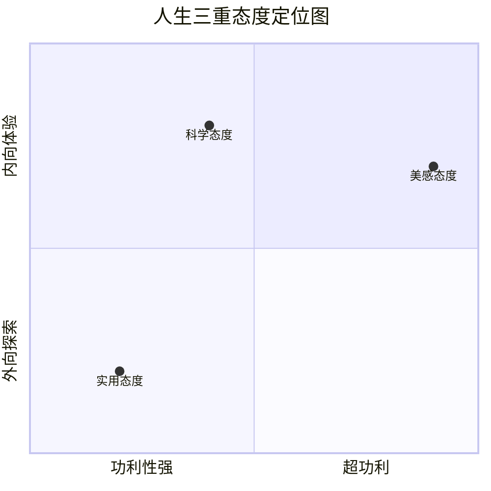

# 03-图谱逻辑：一张图读懂《谈美》

> "理清脉络，比死记概念更重要。今天，我们用几张图把《谈美》的骨架搭起来。"

## ◆ 前言：为什么需要图谱？

很多读者翻开《谈美》，会被朱光潜先生娓娓道来的散文风格吸引，但读完后又觉得"好像懂了，又好像没懂"。

这是因为美学概念之间有着紧密的逻辑关联。如果不理清脉络，很容易陷入概念的迷雾中。

今天这篇文章，我们不谈深奥的理论，只用几张图，帮你把《谈美》的核心逻辑一次性看清楚。

---

## ◆ 逻辑图一：全书的"起承转合"

《谈美》共十五封信，看似散漫，实则有一条清晰的主线：

```mermaid
graph TD
    Start[起：我们为什么要谈美?] --> Step1[承：什么是美感态度?]
    Step1 --> Step2[转：美感是如何产生的?]
    Step2 --> End[合：如何让人生艺术化?]
    
    Start -.-> 开篇: 三种态度
    Step1 -.-> 核心: 无所为而为
    Step2 -.-> 机制: 心理距离、移情、内模仿
    End -.-> 归宿: 慢慢走欣赏啊
```

- **起**：从"一棵古松"的例子切入，指出人生的三种态度（实用的、科学的、美感的）。
- **承**：定义美感的本质——无所为而为的直觉体验。
- **转**：深入剖析美感的产生机制，引入了"心理距离"、"移情作用"和"内模仿"等核心概念。
- **合**：最后回到人生，提出"人生艺术化"的理想，以"慢慢走，欣赏啊"作结。

---

## ◆ 逻辑图二：核心概念的逻辑链

美感的产生，不是玄学，而是一套可以拆解的心理过程：


1. **拉开距离**：这是第一步。你必须从实用的利害关系中抽身出来。正如海上雾海，船上的人只担心危险，岸上的人却能欣赏那"仙境"般的美。
2. **摆脱功利**：不再问"这有什么用"，而是问"这看起来怎么样"。
3. **专注形象**：你的注意力完全集中在事物的形式、色彩、声音上。
4. **移情入物**：你把自己的情感投射到事物上，觉得"云在流泪"、"花在笑"。
5. **内模仿**：你的身体在内部模仿事物的姿态，看跑马时肌肉也在隐隐用力。
6. **美感诞生**：物我两忘，情景交融，美的体验就此产生。

---

## ◆ 逻辑图三：三重态度的对比与进阶

朱光潜并非要我们抛弃"实用"和"科学"，而是指出它们的局限，并邀请我们补上"美感"这一课。



- **实用态度**追求"善"，关注事物对我们的好处，是生存的基础。
- **科学态度**追求"真"，关注事物的客观规律，是认知的工具。
- **美感态度**追求"美"，关注事物本身的形象，是心灵的自由。

**真正完整的人生，是这三种态度的和谐统一。** 只是在现代生活中，我们太过于偏重"实用"，而遗忘了"美感"。

---

## ◆ 结语：图谱之外，是生活

图谱只是地图，不是风景。

理解《谈美》的逻辑，最终是为了在生活中实践。当你下次看一朵花时，试着切换到"美感态度"，不去想它的花期、价格、用途，只是看它。

你会发现，世界突然变得不一样了。

---

### ◇ 系列导航

| 上一篇 | 下一篇 |
| :--- | :--- |
| [01-读后感：慢慢走，欣赏啊](./01-公众号排版文稿_读后感.md) | [04-核心思想：人生艺术化指南](./04-公众号排版文稿_核心思想.md) |

> ◆ 核心标签：#朱光潜 #谈美 #人生艺术化 #美学入门 #美感态度 #距离美学
