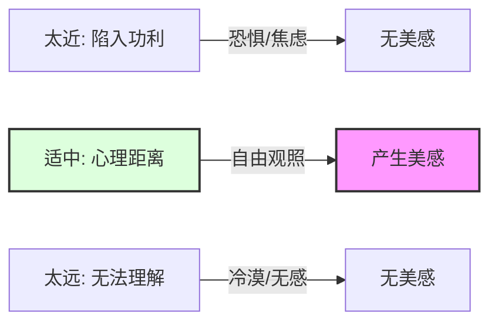

# 04-核心思想：什么是"人生艺术化"？

> "生命史就是作品。你是庸匠，还是大师？"

## ◆ 前言：美学的终极答案

如果说《谈美》是一棵树，那么前面的所有概念——态度、距离、移情——都只是枝叶，而树干和根，只有三个字：

**人生艺术化。**

这不仅是朱光潜美学的归宿，也是他给每一个普通人的生活解药。

---

## ◆ 核心一：你的人生，就是你的作品

朱光潜有一个振聋发聩的比喻：

> "每个人都是自己的艺术家。你的生命史，就是你的作品。"

有的人活成了一首跌宕起伏的史诗，有的人活成了一杯白开水。这其中的差距，不是金钱，不是地位，而是**情趣**。

所谓情趣，不是矫揉造作的文艺病，而是一种对生活的热爱和敏感。有情趣的人，能从一碗白粥里喝出米香，能从一阵秋风里听到诗意。

**没有情趣，再好的物质条件也只是华丽的牢笼。**

---

## ◆ 核心二：距离产生美

"距离产生美"这句话，你一定听过。但在朱光潜这里，它不是一个浪漫的金句，而是一个严肃的美学原理。

### 什么是"心理距离"？

朱光潜举了一个绝妙的例子：**海上遇雾**。

- 对船上的水手来说，雾意味着迷航和危险，他们只感到恐惧。
- 对岸上的游客来说，雾创造了一个朦胧的世界，他们感到如临仙境。

同样的雾，为什么感受截然不同？因为水手的距离太近，被利害关系束缚；而游客拉开了距离，进入了审美的状态。

**"距离"是一种选择。** 你可以选择被情绪淹没，也可以选择退后一步，静静欣赏。

### 职场应用：把焦虑变成风景

工作中遇到不讲理的客户，你暴跳如雷——这是距离太近。

如果你能想象自己是一个编剧，正在观察一个名叫"愤怒的打工人"的角色，你可能就会觉得这场景有些荒诞的喜剧感了。

这不是阿 Q 精神，而是一种心理防御和升华。拉开距离，不是为了逃避，而是为了更清醒地面对。

---

## ◆ 核心三：移情与内模仿

美感不仅仅是"看"，更是一种深度的"参与"。

- **移情作用**：把自己的情感投射到外物上。"感时花溅泪，恨别鸟惊心"，花不会流泪，鸟不会惊心，是你把自己的悲伤移给了它们。
- **内模仿**：看到美的东西，身体内部会不自觉地模仿。看人跑马，你的腿肚子会隐隐发酸；看人举重，你的胳膊会暗暗用力。

这说明：**美不是被动的接受，而是主动的创造。**

在欣赏美的过程中，我们实际上是在创造一个新的意象世界。这也是为什么同样一首曲子，不同的人听会有不同的感受。

---

## ◆ 核心四：免俗，从心开始

朱光潜说："**艺术是情趣的活动，艺术的生活也就是情趣丰富的生活。**"

所谓"俗"，就是缺乏情趣，就是被实用主义牵着鼻子走。一个"俗"人，看山不是山，看水不是水，只看得到山能卖多少钱，水能发多少电。

免俗，不是要你穿奇装异服、故作清高，而是要**在内心保留一块不被功利侵蚀的自留地**。

这块自留地，可以是一盆花、一本书、一段音乐，或者仅仅是一分钟的发呆。

---

## ◆ 结语：慢慢走，欣赏啊

人生太匆忙，我们总是盯着远方，却忘了脚下的风景。

朱光潜先生用整本书告诉我们：**美，就在你看待世界的方式里。**

从今天起，试着做一个生活的艺术家。不必才华横溢，只需情趣盎然。

**慢慢走，欣赏啊。**

---

### ◇ 系列导航

| 上一篇 | 下一篇 |
| :--- | :--- |
| [03-图谱逻辑：一张图读懂谈美](./03-公众号排版文稿_图谱逻辑.md) | [05-职场指南：美学如何拯救打工人](./05-公众号排版文稿_职场指南.md) |

> ◆ 核心标签：#朱光潜 #谈美 #人生艺术化 #美学入门 #美感态度 #距离美学
