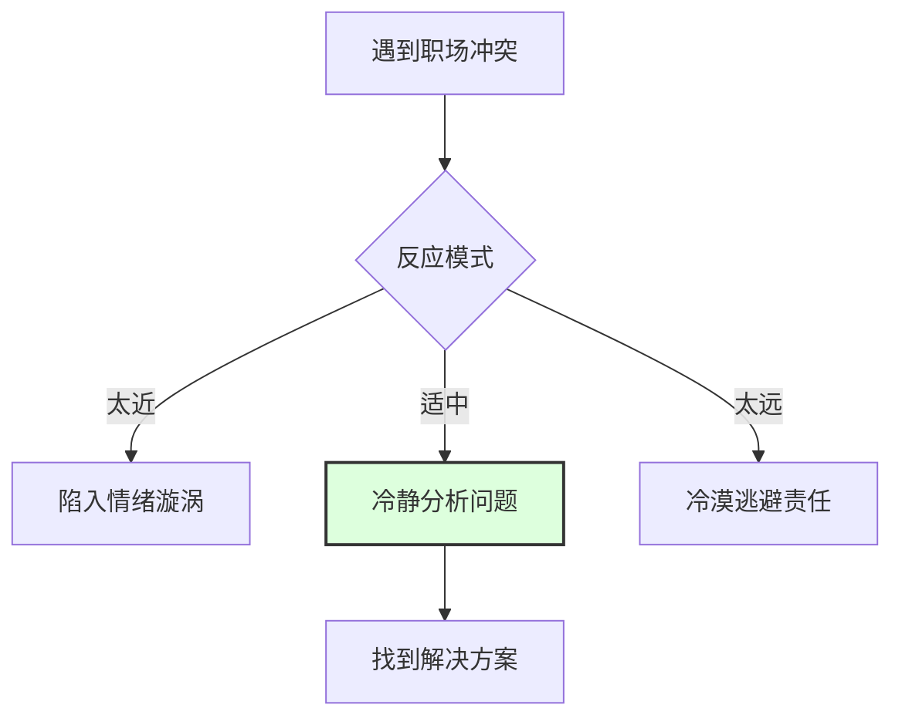

# 05-职场指南：用美学思维拯救"打工人"

> "工作不只是谋生，也可以是创作。你是螺丝钉，还是手艺人？"

## ◆ 前言：职场倦怠的解药

每天打卡、开会、回消息、赶 Deadline...现代职场人最常挂在嘴边的词是"累"和"烦"。

我们总觉得，工作是工作，生活是生活。工作就是出卖时间换钱，等下班了、退休了，才能去追求"诗和远方"。

但朱光潜在《谈美》中给出的答案是：**把艺术精神带入工作，才是对抗倦怠的终极解药。**

今天，我们用《谈美》的核心思想，给职场人开一剂"美学处方"。

---

## ◆ 处方一：用"心理距离"化解情绪内耗

职场最大的痛苦，往往不是事情本身，而是情绪内耗。

被领导批评了，你一整天都在自我怀疑；同事一个白眼，你脑补了一部宫斗剧。

**美学解药：拉开心理距离**

朱光潜说，美感来源于"心理距离"。在工作中，我们同样可以用这个技巧来管理情绪。

当冲突发生时，试着把自己从"当事人"切换成"观察者"。想象你是一个人类学家，正在研究"现代办公室的社交行为"。

**实操技巧：**
1. 深呼吸三次，在脑子里对自己说："这是一个有趣的案例。"
2. 把问题写下来，像分析别人的事情一样分析它。
3. 问自己：如果不带情绪，这件事的客观事实是什么？

距离不是冷漠，而是为了更清醒地解决问题。

---

## ◆ 处方二：把任务当成"作品"来打磨

很多职场人觉得工作无聊，是因为他们只看到了"任务"，没看到"作品"。

木匠如果只想着"赶紧锯完这棵树拿工钱"，他就是苦力。但如果他想着"我要做一把最漂亮的椅子"，他就是艺术家。

**美学解药：人生艺术化**

朱光潜说："**有情趣的人，在平凡中也能发现美。**"

你写的代码、做的 PPT、设计的海报，都可以是你的作品。区别在于，你是敷衍了事，还是注入情趣。

| 普通员工 | 艺术型员工 |
| :--- | :--- |
| 做完就行 | 追求更好 |
| 被动执行 | 主动创造 |
| 抱怨环境 | 改善体验 |
| 机械重复 | 寻找新意 |

当你开始用"创作"的心态面对工作，你会发现：加班不一定是痛苦，也可能是一次沉浸的"心流"体验。

---

## ◆ 处方三：用"移情"提升沟通力

职场是人与人的协作。沟通不顺，往往是缺乏"移情"。

朱光潜讲的"移情作用"，在美学中是指把情感投射到外物上。在职场中，移情就是**换位思考**。

- 对同事移情：理解他的压力和难处，而不是只看结果。
- 对客户移情：体会他的痛点，而不是只想着卖产品。
- 对领导移情：明白他的目标和焦虑，而不是只在背后吐槽。

**好的沟通，本质上是一种审美体验。** 当双方都能感受到被理解，合作就变成了一种愉悦的共鸣。

---

## ◆ 处方四：在忙碌中保留"无所为而为"的时间

现代人最大的奢侈，是拥有"无用"的时间。

如果连发呆、看云、听雨都觉得是浪费生命，那你的精神世界已经干涸了。

**美学解药：每天给自己一段"美感时间"**

这段时光里，不要想 KPI，不要回消息，不要计划未来。

只是做一件"无用但美好"的事：
- 泡一杯茶，慢慢看茶叶舒展
- 听一首纯音乐，什么都不想
- 下班路上，抬头看看晚霞

朱光潜说："**无所为而为，才是真自由。**"

这些看似无用的片刻，恰恰是给你精神充电的时刻。充好电的你，回到工作中会更有创造力。

---

## ◆ 结语：做职场里的生活艺术家

工作不该是灵魂的监狱，而是展现创造力的舞台。

你不需要辞职去流浪，也不需要顿悟出家。你只需要在现有的生活里，注入一点美感的态度。

**把每一件小事，都当成艺术来对待。**

这才是真正的"人生艺术化"。

---

### ◇ 系列导航

| 上一篇 | 下一篇 |
| :--- | :--- |
| [04-核心思想：人生艺术化指南](./04-公众号排版文稿_核心思想.md) | [06-行动挑战：今天就开始变美](./06-公众号排版文稿_行动挑战.md) |

> ◆ 核心标签：#朱光潜 #谈美 #人生艺术化 #美学入门 #美感态度 #距离美学
