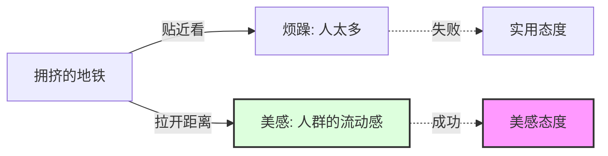

# 06-行动挑战：7天美学觉醒计划

> "读万卷书，不如行一步路。今天，让我们一起练习'看'。"

## ◆ 前言：美学不是知识，是练习

看完了《谈美》的解读，你可能点头称是，但合上手机，生活照旧。

这很正常。因为**美不是一种可以背诵的知识，而是一种需要练习的能力。**

就像学游泳，你看再多教程，不下水永远学不会。美感也一样，你必须去"看"、去"听"、去"感受"。

今天，我们为你设计了一个"7 天美学觉醒挑战"。每天一个小练习，帮你找回感知美的本能。

---

## ◆ 挑战规则

- 每天只需 5-10 分钟
- 不需要任何设备，一部手机即可
- 记录你的感受，哪怕只是一句话
- 允许自己"做得不好"，这本身就是审美的一部分

---

## ◆ Day 1：古松练习

**朱光潜的入门课**

今天，请在路边选一棵树，或者一盆植物。

盯着它看三分钟。在这三分钟里，不要想它的学名，不要想它值多少钱，不要想它有什么用。

**只看它的样子。**

看它的叶子是什么形状？光线在上面是怎么反射的？风吹过的时候，它是怎么摇摆的？

> 挑战目标：体验从"实用态度"切换到"美感态度"。

---

## ◆ Day 2：距离练习

**海上遇雾的现代版**

找一张你曾经觉得"很烦"的照片（比如拥挤的地铁、杂乱的桌面、难看的建筑）。

现在，试着退后一步，或者把图片缩小。

你能从中发现一些有趣的几何图案、色彩对比或者光影效果吗？

> 挑战目标：体会"距离产生美"的力量。

---

## ◆ Day 3：移情练习

**让万物有情**

今天，挑一个没有生命的物体（比如一把椅子、一个杯子、一盏灯）。

试着给它写一句"拟人化"的描述。

不是"杯子在桌子上"这种无聊的陈述，而是："那个白色的陶瓷杯子，孤零零地坐在窗台上，像是在等谁把它带走。"

> 挑战目标：练习移情作用，让死物活起来。

---

## ◆ Day 4：内模仿练习

**用身体感受美**

找一段舞蹈视频，或者看一段体育运动（篮球、滑冰、冲浪都可以）。

在看的时候，注意你的身体反应。你的肌肉有没有不自觉地绷紧？你的呼吸有没有跟着节奏变化？

这就是朱光潜说的"内模仿"。**美不仅仅在眼睛里，它还在你的肌肉里。**

> 挑战目标：觉察身体与美的共鸣。

---

## ◆ Day 5：情趣练习

**给平凡加点料**

今天，做一件你每天都要做的事，但换一种方式。

比如：
- 喝水时，慢慢感受水流过喉咙的温度和触感
- 走路时，注意脚底与地面接触的感觉
- 吃饭时，不看手机，专心咀嚼每一口的味道

> 挑战目标：培养日常生活中的情趣。

---

## ◆ Day 6：创造练习

**人人都是艺术家**

朱光潜说，美是欣赏，也是创造。

今天，用你最不擅长的方式，做一个小小的"创作"。

- 不会画画？用手机拍一张你觉得最美的光影照片
- 不会写诗？写三行你觉得顺口的句子
- 不会唱歌？随便哼一段旋律，录下来

记住：**完成比完美重要。** 你的目的是体验创造的乐趣，不是拿诺贝尔奖。

> 挑战目标：从欣赏者变成创作者。

---

## ◆ Day 7：分享练习

**美，需要共鸣**

把你这 7 天的感受，整理成一段话，或者几张照片。

分享给你的朋友、家人，或者发在社交网络上。

美是一种共鸣。当你把感受分享出去，美就在人与人之间流动起来了。

> 挑战目标：让美成为连接你和他人的桥梁。

---

## ◆ 结语：慢慢走，欣赏啊

7 天结束后，你可能会发现，世界没有变，但你看世界的方式变了。

**美，一直都在。** 只是你以前走得太快，错过了它。

现在，你已经拿到了钥匙。剩下的，就是去实践。

慢慢走，欣赏啊。

---

### ◇ 系列导航

| 上一篇 | 系列目录 |
| :--- | :--- |
| [05-职场指南：美学如何拯救打工人](./05-公众号排版文稿_职场指南.md) | [返回：艺术美学系列](../../07-艺术美学/) |

### ○ 互动话题

**你完成了 7 天挑战中的哪一个？感受如何？**

欢迎在评论区打卡，分享你的"美学觉醒"时刻。我们会选出 3 位走心留言，送出精美小礼物。

> ◆ 本期核心：7天挑战 | 行动指南 | 人生艺术化 | 美感练习
> ◇ 标签：#朱光潜 #谈美 #人生艺术化 #美学入门 #美感态度 #距离美学
