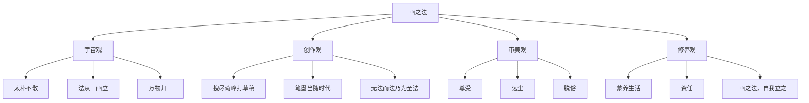
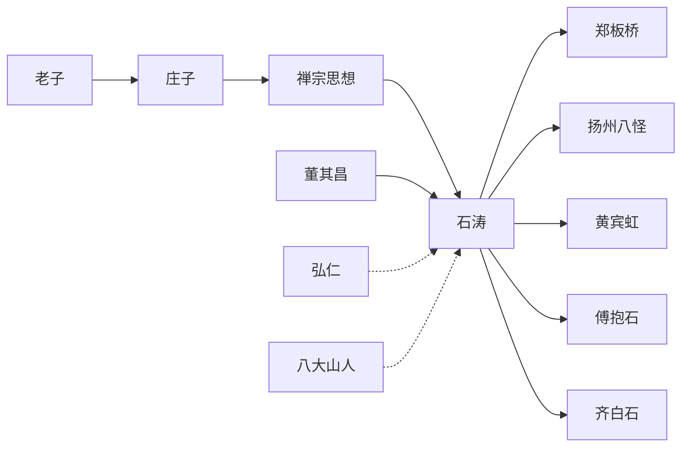
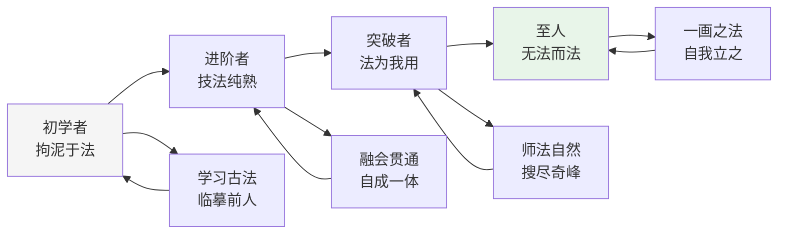
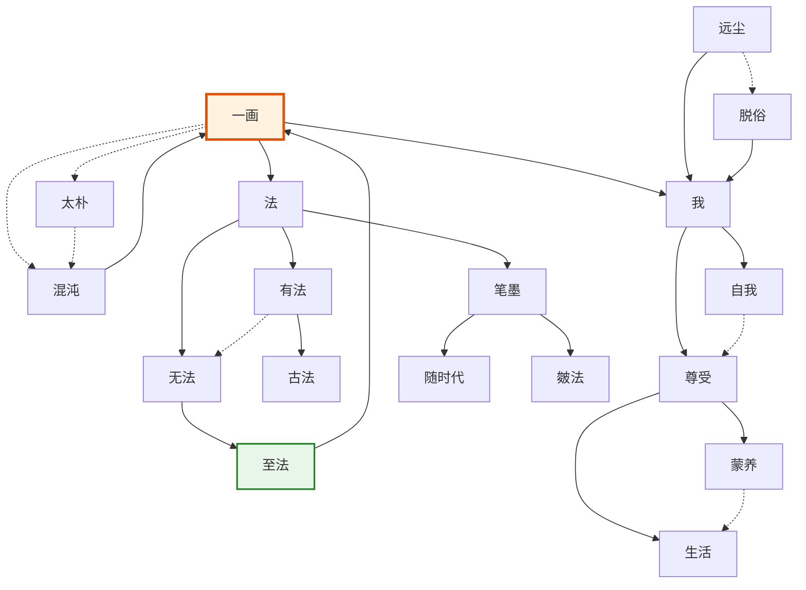

# 石涛《画语录》知识图谱图片描述

## 图谱一：《画语录》思想体系分类树

### 图表说明

这是一棵以"一画之法"为根节点的思想体系树状图。整体采用自上而下的层级结构，共四层。

### 层级结构

### 视觉设计说明

- 根节点"一画之法"使用最大字号，居中置顶
- 第二层四个主干节点使用同等大小，横向排列
- 第三层子节点使用较小字号，分布于对应父节点下方
- 整体配色以黑白灰为主，辅以淡墨色点缀，体现中国画美学风格
- 每个节点使用圆角矩形，线条简洁流畅

---

## 图谱二：石涛交游与思想传承人物图谱

### 图表说明

此图谱展示石涛与其时代的重要人物关系网络，包括师承、交游、思想渊源三个维度。

### 人物关系

### 视觉设计说明

- 左侧为思想渊源，中间为石涛核心节点，右侧为后世影响
- 实线箭头表示明确的师承或直接影响关系
- 虚线箭头表示同时代交流或精神共鸣关系
- 石涛节点使用特殊标记（如加粗或不同颜色）突出核心地位
- 整体布局从左到右，呈现思想的传承脉络

### 图例说明

| 符号 | 含义 |
|------|------|
| 实线箭头 | 师承关系或直接影响 |
| 虚线箭头 | 同时代交流或精神共鸣 |
| 核心节点 | 石涛（加粗标记） |
| 左侧节点 | 思想渊源（先秦至明代） |
| 右侧节点 | 后世影响（清代至近现代） |

---

## 图谱三：从"有法"到"无法而法"的修行路径图

### 图表说明

此图谱展示了画家从初学者到大师境界的修行路径，是一个从左到右的阶段性演进图。

### 修行路径

### 视觉设计说明

- 主路径由四个阶段组成，从左到右依次递进
- 每个阶段下方有对应的修行方法说明
- 颜色从浅灰逐渐过渡到淡绿，象征境界的提升
- 整体风格简约，符合禅意美学

### 各阶段详解

| 阶段 | 境界 | 核心特征 | 代表状态 |
|------|------|----------|----------|
| 初学者 | 见山是山 | 拘泥于法，被规则束缚 | 临摹古人，不敢越雷池一步 |
| 进阶者 | 技法纯熟 | 技法精熟，但仍在法的框架内 | 能画古人风格，但缺乏个人特色 |
| 突破者 | 见山不是山 | 开始突破，法为我用 | 师法自然，开始形成个人风格 |
| 至人 | 见山还是山 | 无法而法，自由创造 | 一画之法，自我立之 |

---

## 图谱四：《画语录》核心概念网络图

### 图表说明

此图谱展示《画语录》中核心概念之间的复杂关联网络。每个概念都是网络中的一个节点，概念之间的关系用不同类型的连线表示。

### 概念网络

### 视觉设计说明

- "一画"节点作为核心，使用醒目的橙色边框和加粗线条
- "至法"节点使用绿色，象征最高境界
- 实线表示直接的逻辑推导关系
- 虚线表示辩证的关联关系（如有法与无法的辩证）
- 节点大小根据概念重要程度有所区分
- 整体布局呈现放射状，"一画"位于中心

### 核心概念释义

| 概念 | 含义 |
|------|------|
| 一画 | 宇宙万物的本源，一切法则的起点 |
| 太朴 | 混沌未分的原始状态 |
| 法 | 规则、法则、技法 |
| 无法而法 | 超越法度的最高法度 |
| 尊受 | 尊重个人的感受和体验 |
| 蒙养 | 涵养、修养的功夫 |
| 生活 | 鲜活的生命体验 |
| 远尘 | 远离尘俗的干扰 |
| 脱俗 | 超越世俗的审美追求 |

---

## 图谱使用建议

1. **分类树图谱**：适合用于理解《画语录》的整体思想架构
2. **人物图谱**：适合用于把握石涛在思想史上的定位
3. **路径图**：适合用于指导个人学习和修行的方向
4. **网络图**：适合用于深入理解核心概念之间的复杂关系

四张图谱配合阅读，能够从宏观到微观、从横向到纵向，全方位地把握《画语录》的思想精髓。

---

**标签：** #画语录 #石涛 #知识图谱 #一画之法 #禅画合一 #笔墨随时代 #无法而法
