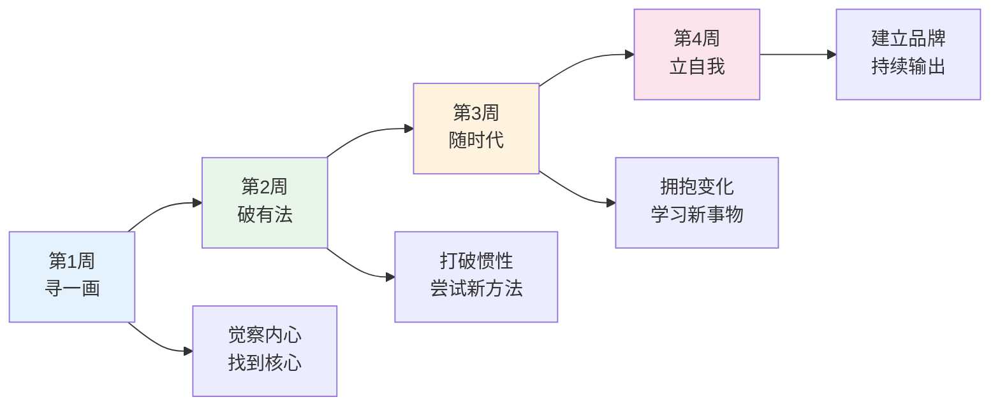

# 30 天践行"一画之法"：石涛《画语录》行动挑战

> 一画之法，乃自我立。

## 引言：从读到做，只差一个开始

读完《画语录》，你最大的感受是什么？

震撼？

启发？

还是……

"道理我都懂，然后呢？"

是的，经典的阅读，如果只停留在"懂了"的层面，那就只是一次精神上的愉悦。

真正的收获，来自于**践行**。

为此，我们设计了这个 30 天的行动挑战。

用一个月，把《画语录》的智慧，融入你的日常生活。

---

## 挑战总览

---

## 第一周：寻一画

**主题：找到你的"一画"**

石涛说，一切法则始于"一画"。

在开始任何行动之前，你必须先找到那个最核心的"一"。

### 第 1 天：静坐觉察

花 15 分钟，什么都不做。

闭上眼睛，只关注自己的呼吸。

在这 15 分钟里，你会注意到脑海中浮现的各种念头。

不要评判它们，只是观察。

**目标**：培养觉察力，这是所有修行的起点。

### 第 2 天：写下你的"太朴"

"太朴"是混沌未分的状态。

你的"太朴"是什么？

是你内心最原始、最纯粹的那份渴望。

用一支笔，一张纸，写下以下问题的答案：

- 如果不需要考虑金钱和别人的看法，你最想做什么？
- 小时候的你，最喜欢做什么？
- 你觉得自己与生俱来的特质是什么？

**目标**：接近内心最真实的渴望。

### 第 3 天：识别你的核心优势

回顾过去一年的工作和学习经历。

找出三件让你最有成就感的事情。

分析这三件事情的共同点：

- 它们需要什么能力？
- 你在其中扮演了什么角色？
- 为什么你做这些事会觉得轻松而有效？

**目标**：找到你的核心竞争力，这就是你的"一画"。

### 第 4 天：写下你的"一画宣言"

用一句话，描述你的"一画"。

格式参考：

> 我的"一画"是______，因为我______。

示例：

> 我的"一画"是把复杂的信息讲清楚，因为我天生擅长把抽象的东西具象化。

把它写下来，贴在你每天都能看到的地方。

**目标**：让你的"一画"成为你行动的指引。

### 第 5 天：清理"散落的法"

"太朴一散而法立矣。"

但有时候，我们被太多的"法"（规则、习惯、期望）所束缚。

今天，找出三个你正在遵循但已经不再适用的"法"。

它们可能是：

- 一个过时的信念（"我不擅长公开演讲"）
- 一个无效的习惯（"每天早上第一件事就是看手机"）
- 一个外人的期望（"你应该找一个稳定的工作"）

对每一个"法"，问自己：

**这真的是我的法吗？还是别人强加给我的？**

**目标**：识别并清理不属于自己的规则。

### 第 6 天：回归简单

石涛的"一画"极其简单。

但我们的生活往往过于复杂。

今天，尝试做减法：

- 删除手机里不常用的 5 个 App
- 清理书桌上不需要的物品
- 取消一个不必要的社交承诺

**目标**：体验简单带来的自由。

### 第 7 天：周复盘

回顾这一周的觉察和发现。

回答以下问题：

- 我的"一画"是否更加清晰了？
- 我在清理"散落的法"时有什么感受？
- 下周我需要在哪些方面继续努力？

写下一周的收获和感悟。

**目标**：通过复盘，巩固第一周的成果。

---

## 第二周：破有法

**主题：打破惯性，尝试新方法**

石涛说："至人无法，非无法也，无法而法，乃为至法。"

在打破之前，你必须先有法。

但现在，是时候突破了。

### 第 8 天：换一条路

今天，故意做一些跟平时不一样的事：

- 换一条路去上班
- 尝试一种你没吃过的早餐
- 用非惯用手刷牙

**目标**：打破惯性思维，体验"不同"的可能。

### 第 9 天：用新方法解决老问题

选择一个你经常遇到的问题。

用你从未尝试过的方法去解决它。

如果以前是自己解决，今天试试请教别人。

如果以前是直接上手，今天先做调研。

**目标**：练习跳出固有框架。

### 第 10 天：学习一个"无用"的技能

石涛的画论之所以深刻，是因为他广泛涉猎了哲学、禅学、文学。

今天，花 30 分钟学习一个与你的专业无关的技能。

可能是：

- 折纸
- 书法
- 一个外语的发音
- 一种乐器的基本指法

**目标**：拓宽思维的边界。

### 第 11 天：挑战一个舒适区

做一些让你轻微不适的事情：

- 在会议上主动发言
- 向一个你欣赏的人请教
- 公开发表一个观点

不适的程度应该是"有点紧张但可控"。

**目标**：在安全范围内扩大舒适区。

### 第 12 天：复盘失败

回想一次你过去的失败经历。

重新审视它：

- 你从中学到了什么？
- 如果重来一次，你会怎么做？
- 这次失败给你带来了哪些意想不到的收获？

**目标**：把失败转化为成长的养分。

### 第 13 天：创造性地解决问题

选择一个当前面临的挑战。

用以下三种方法尝试解决：

- 类比法：找一个类似领域，看看别人怎么解决的
- 逆推法：从理想的结果倒推步骤
- 组合法：把两个不相关的方法结合起来

**目标**：练习创造性思维。

### 第 14 天：周复盘

回顾这一周的突破体验。

- 打破惯性时，你最大的感受是什么？
- 新方法带来了哪些意外的收获？
- 你在挑战舒适区时发现了什么？

**目标**：巩固突破的勇气。

---

## 第三周：随时代

**主题：拥抱变化，学习新事物**

石涛说："笔墨当随时代。"

真正的创造者，永远与时代同行。

### 第 15 天：趋势扫描

花一小时，了解你所在行业的最新趋势。

阅读行业报告、技术博客、市场分析。

找出三个你认为会影响你未来发展的趋势。

**目标**：建立对时代的敏感度。

### 第 16 天：学习一个新工具

选择一个你一直想了解但没有时间学的工具或技术。

今天，花 30 分钟入门。

不需要精通，只需要了解它能做什么。

**目标**：扩展你的工具箱。

### 第 17 天：与年轻人对话

找一个比你年轻 10 岁以上的人，聊聊天。

问问他们：

- 他们如何看待你的行业？
- 他们在用什么新方法解决问题？
- 他们对未来有什么期待？

**目标**：通过年轻人的视角感知时代。

### 第 18 天：跨界思考

选择一个与你的领域完全不同的行业。

研究它的运作模式。

然后思考：

**这个行业的方法，能不能用到我的领域？**

**目标**：练习跨界思维。

### 第 19 天：更新你的认知

找出一个你深信不疑但可能已经过时的观点。

主动寻找反面证据。

如果证据充分，勇敢地改变你的看法。

**目标**：保持认知的开放性。

### 第 20 天：尝试新媒介

如果你习惯用文字表达，试试用图片或视频。

如果你习惯用数据分析，试试用故事讲述。

**目标**：拓展表达方式。

### 第 21 天：周复盘

回顾这一周的时代感知之旅。

- 哪些趋势让你感到兴奋？
- 哪些趋势让你感到焦虑？
- 你打算如何应对这些趋势？

**目标**：将趋势认知转化为行动方向。

---

## 第四周：立自我

**主题：建立个人品牌，持续输出**

石涛说："一画之法，乃自我立。"

最终，你要建立属于自己的法则。

### 第 22 天：定义你的价值主张

用以下格式写一段话：

> 我帮助______（目标人群），通过______（你的方法），实现______（他们想要的结果）。

**目标**：清晰表达你的独特价值。

### 第 23 天：输出第一篇文章

在你的"一画"领域，写一篇 800 字以上的文章。

发表在任何你常用的平台上。

**目标**：开始建立你的影响力。

### 第 24 天：帮助一个人

在你的擅长领域，主动帮助一个人解决问题。

可以是一个同事、朋友，甚至是一个陌生人。

**目标**：通过帮助他人，巩固自己的专业地位。

### 第 25 天：建立你的"奇峰"数据库

像石涛"搜尽奇峰打草稿"一样，建立一个你的素材库。

收集：

- 优秀案例
- 好的文章
- 有用的工具
- 灵感的记录

**目标**：为你的持续输出积累素材。

### 第 26 天：做一次分享

在你的团队或社群中，做一个 15 分钟的小分享。

分享你在《画语录》中学到的东西，或者你在"一画"领域的经验。

**目标**：通过分享，扩大你的影响力。

### 第 27 天：制定你的"法"

经过三周的探索，你应该对自己的"一画"有了更深的理解。

现在，制定你自己的"法"：

- 你的工作原则是什么？
- 你的质量标准是什么？
- 你与别人合作的方式是什么？

写下来，这就是你的"一画之法"。

**目标**：建立你的个人法则体系。

### 第 28 天：规划下一个 30 天

30 天是一个开始，不是终点。

基于这 28 天的体验，规划你接下来的行动：

- 继续深耕你的"一画"领域？
- 拓展到相关领域？
- 开始一个新的挑战？

**目标**：让改变持续下去。

### 第 29 天：感恩与回馈

回顾这 29 天的旅程。

感谢那些帮助过你的人。

向帮助你的人表达感谢。

**目标**：培养感恩之心，建立正向循环。

### 第 30 天：终极大复盘

用一个小时，完整地回顾这 30 天。

回答以下问题：

- 我的"一画"是什么？它清晰了吗？
- 我在哪些方面打破了旧有的"法"？
- 我如何做到了"随时代"？
- 我的"自我"是否更加坚定了？
- 接下来，我要做什么？

写下一封给自己的信，记录这 30 天的蜕变。

**目标**：为这 30 天画上圆满的句号，同时开启新的旅程。

---

## 挑战成果展示

完成 30 天挑战后，你应该获得：

| 成果 | 说明 |
|------|------|
| 一画宣言 | 一句话定义你的核心竞争力 |
| 清理清单 | 你识别并放下的过时规则 |
| 新技能 | 至少一项跨界学习的收获 |
| 趋势报告 | 你对行业趋势的最新认知 |
| 价值主张 | 清晰表达你的独特价值 |
| 输出作品 | 至少一篇文章或一次分享 |
| 个人法则 | 你自己的"一画之法" |
| 复盘信件 | 写给自己的 30 天总结 |

---

## 互动话题

你准备开始这个 30 天挑战吗？

你的"一画"是什么？

在评论区写下你的"一画宣言"，让我们一起见证彼此的成长。

---

## 系列导航

| 序号 | 文章 | 核心内容 |
|------|------|----------|
| 01 | 读后感 | 为什么这本薄薄的小册子能改变中国绘画史 |
| 02 | 知识图谱 | 一图读懂《画语录》的思想体系 |
| 03 | 图谱逻辑 | 石涛如何构建"一画之法"的哲学大厦 |
| 04 | 核心思想 | 一画之法、禅画合一、无法而法、笔墨随时代 |
| 05 | 职场指南 | 从画语录中学到的职场智慧 |
| 06 | 行动挑战 | 30 天践行"一画之法" |

---

> "一画之法，乃自我立。"
>
> 现在，轮到你立你的"法"了。

---

**标签：** #画语录 #石涛 #行动挑战 #一画之法 #禅画合一 #笔墨随时代 #无法而法 #30天挑战
