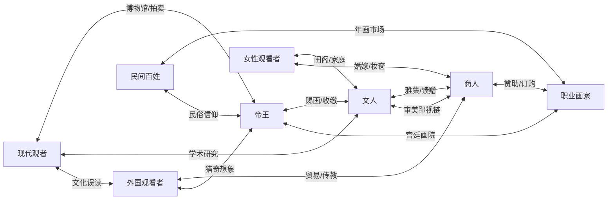
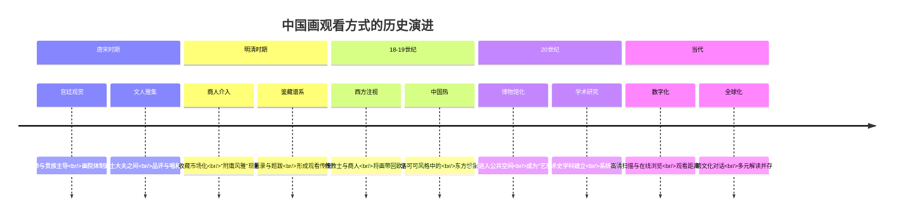
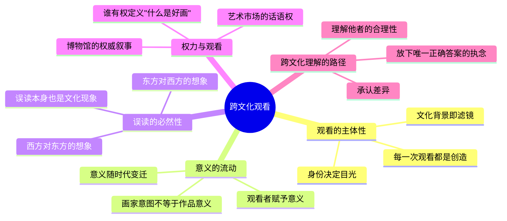
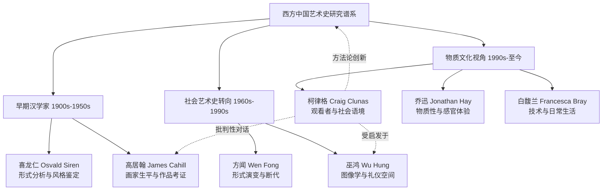

# 知识图谱：《谁在看中国画》的观看之道

---

> ◆ 一幅画，七种目光，千年流转。以下图谱帮你理清柯律格笔下的"观看者宇宙"。

---

## ◇ 图谱一：观看者身份分类树

以下树状图展示了柯律格划分的七类主要观看者及其特征维度：

```mermaid
graph TD
    ROOT["《谁在看中国画》观看者分类"]

    ROOT --> IMP["帝王观看者"]
    ROOT --> LITERATI["文人观看者"]
    ROOT --> MERCHANT["商人观看者"]
    ROOT --> WOMEN["女性观看者"]
    ROOT --> COMMONER["民间百姓"]
    ROOT --> FOREIGN["外国观看者"]
    ROOT --> MODERN["现代观者"]

    IMP --> IMP1["看正统与祥瑞"]
    IMP --> IMP2["看江山与天命"]
    IMP --> IMP3["宫廷画院体制"]

    LITERATI --> LIT1["看格调与逸气"]
    LITERATI --> LIT2["南北宗论"]
    LITERATI --> LIT3["不求形似的精神"]

    MERCHANT --> MER1["看身份与社交"]
    MERCHANT --> MER2["附庸风雅的资本"]
    MERCHANT --> MER3["明清商帮收藏"]

    WOMEN --> WOM1["闺阁中的目光"]
    WOM --> WOM2["被边缘化的经验"]
    WOM --> WOM3["画中人亦是看画人"]

    COMMONER --> COM1["年画与门神"]
    COMMONER --> COM2["画是实用而非欣赏"]
    COMMONER --> COM3["吉祥驱邪的功能"]

    FOREIGN --> FOR1["异国的想象"]
    FOREIGN --> FOR2["文化滤镜下的观看"]
    FOREIGN --> FOR3["从马可波罗到中国热"]

    MODERN --> MOD1["博物馆里的凝视"]
    MODERN --> MOD2["画册与屏幕前的观看"]
    MODERN --> MOD3["与古人完全不同的方式"]
```

---

## ◇ 图谱二：观看者关系网络

不同观看者之间并非孤立存在，他们通过画作产生了复杂的互动与张力：

---

## ◇ 图谱三：观看方式的历史演进路径

从古代到当代，"如何看画"的方式经历了深刻的变化：

---

## ◇ 图谱四：跨文化观看的核心概念网络

柯律格的分析框架中，几个关键概念构成了理解"观看"的理论基础：

---

## ◇ 图谱五：柯律格与同时代汉学家的学术谱系

柯律格的研究并非孤立存在，他的方法与观点在西方汉学传统中有清晰的脉络：

---

## ◇ 如何使用这些图谱

1. **分类树**帮你快速了解书中涉及的七类观看者
2. **关系网络**展示不同观看者之间的互动与张力
3. **历史路径**呈现"观看方式"如何随时代变化
4. **概念网络**提炼柯律格的理论框架核心
5. **学术谱系**将本书放入更广阔的汉学传统中理解

---

## ◇ 系列导航

| 上一篇 | 当前文章 | 下一篇 |
|:---:|:---:|:---:|
| [读后感：谁在看中国画？](#) | **知识图谱** | [图谱逻辑深度解析](#) |

---

**本文是「人类文明经典阅读计划」系列文章之一。**

◆ 西方汉学 ◆ 观看方式 ◆ 文化差异 ◆ 跨文化解读 ◆
