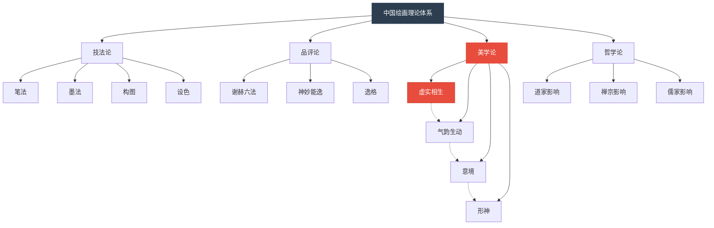
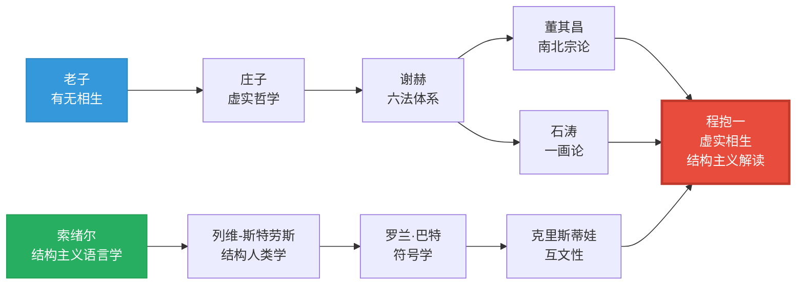
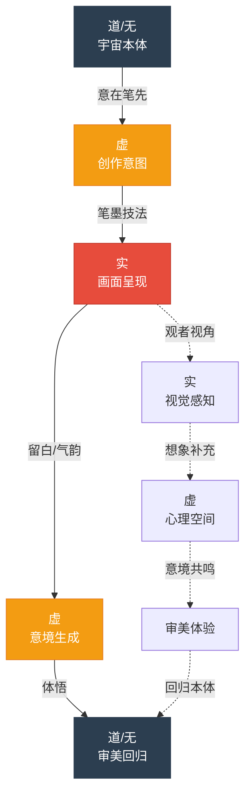
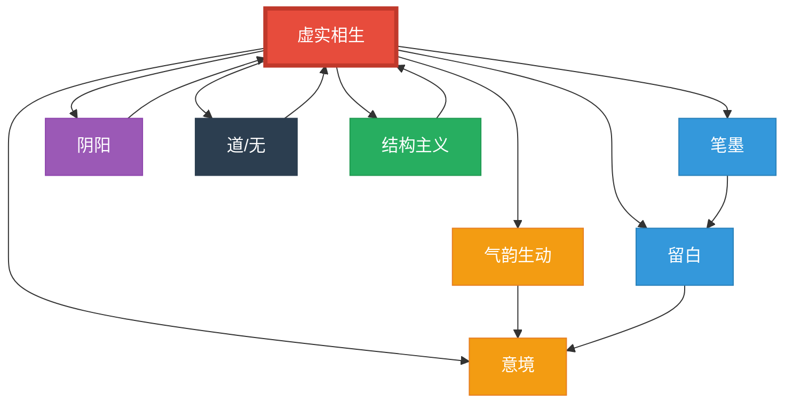

# 知识图谱图片描述：《虚与实中国绘画语言研究》

> 本文包含四张知识图谱，请配合正文阅读

---

## ◆ 图谱一：中国绘画理论体系分类树

### 图说

本图以树状结构展示了中国绘画理论的完整体系。根节点为"中国绘画理论"，向下分出四大分支：

**技法论**——涵盖笔法、墨法、构图、设色等技术层面的理论

**品评论**——涵盖谢赫六法、神妙能逸等品评标准

**美学论**——涵盖虚实相生、气韵生动、意境、形神等核心美学范畴

**哲学论**——涵盖道家、禅宗、儒家对绘画思想的影响

其中，"美学论"分支进一步细化，将"虚实相生"置于核心位置，与"气韵生动""意境""形神"并列，显示其在中国美学体系中的关键地位。

程抱一的研究正是聚焦于"美学论"这一分支，用结构主义的方法重新解读这些传统范畴。

### 图表代码

---

## ◆ 图谱二：东西方思想影响人物关系图

### 图说

本图展示了程抱一学术思想的双重来源。左侧是中国传统思想脉络，右侧是西方学术传统，程抱一居于中间，成为两者的交汇点。

**中国脉络**中，老子提出"有无相生"，庄子发展出"虚实"的哲学基础，谢赫将其引入绘画理论，董其昌和石涛分别从不同角度丰富了虚实的美学内涵。

**西方脉络**中，索绪尔开创结构主义语言学，列维-斯特劳斯将结构主义应用于人类学，罗兰·巴特发展出符号学理论，克里斯蒂娃提出"互文性"概念。

程抱一将这两条线索创造性地融合，用西方的结构主义和符号学方法，重新解读中国的虚实美学，形成了独特的跨文化研究范式。

### 图表代码

---

## ◆ 图谱三：虚实相生路径图

### 图说

本图以路径图的形式，展示了"虚实相生"在中国绘画创作与欣赏过程中的动态流转。

**创作阶段**：画家从宇宙本体（道/无）出发，通过"意在笔先"将虚转化为创作意图，再经由笔墨技法将意图落实为画面之实，最终在实中再次生成虚（留白），完成一个循环。

**欣赏阶段**：观者从画面之实出发，通过留白处的虚触发想象力，进而在心中生成完整的意境，最终体悟到画作背后的宇宙之道。

这两条路径在"虚实"这个关键节点交汇，体现了中国绘画"创作-欣赏"的完整美学循环。

### 图表代码

---

## ◆ 图谱四：核心概念关系网络图

### 图说

本图以网络图的形式，展示了《虚与实中国绘画语言研究》中核心概念之间的相互关系。

**中心节点"虚实相生"**与所有其他概念直接相连，显示其在中国绘画美学中的核心地位。

**气韵生动**是虚实相生的直接产物——只有在虚实之间的动态张力中，气韵才能流动，画面才能生动。

**意境**是虚实相生所指向的终极目标——虚实之间的空间，正是意境生成之处。

**留白**是虚的视觉呈现方式，是虚实相生最直观的表现手段。

**笔墨**是实的物质载体，是画家将意图转化为画面的技术工具。

**阴阳**是虚实相生的哲学根源，二者在结构上完全同构。

**道/无**是虚实相生的宇宙论基础，虚之所以有意义，正因为它与"道"相通。

**结构主义**是程抱一的解读方法，用二元对立与动态生成的框架，重新激活了传统美学的理论活力。

### 图表代码

---

## ◆ 使用说明

以上四张知识图谱，建议在公众号排版时：

◇ 图一置于"中国绘画理论体系"介绍之后，帮助读者建立整体框架认知

◇ 图二置于"中法双重视角"部分，直观展示程抱一的学术渊源

◇ 图三置于"虚实相生路径"分析处，辅助理解创作与欣赏的双向过程

◇ 图四置于全文结尾的"核心概念总结"处，作为全文知识的收束

每张图谱建议单独成图，宽度适配移动端屏幕，保持清晰可读。

---

*知识图谱基于程抱一《虚与实中国绘画语言研究》核心内容生成*

*标签：#结构主义 #虚实相生 #气韵生动 #宇宙哲学 #知识图谱*
