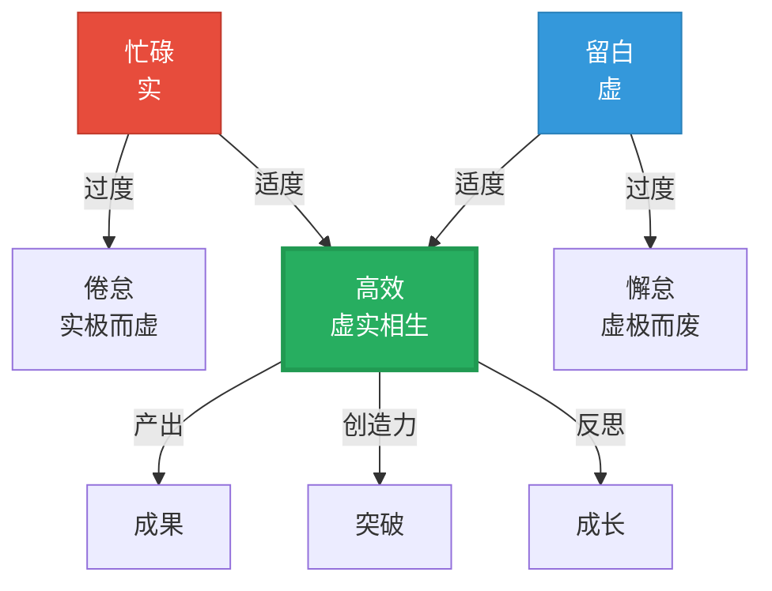
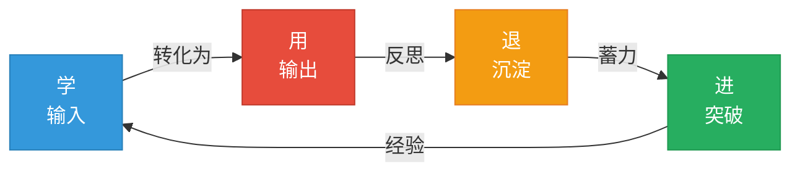

# 虚实相生的职场智慧：从程抱一的中国绘画哲学看现代工作艺术

> "好的管理，不是填满每一个空格，而是留出让人成长的空间。"

---

## ◆ 引子：当古典美学遇见现代职场

你可能会问：一本关于中国绘画的学术著作，与现代职场有什么关系？

答案出乎意料地近。

程抱一所揭示的"虚实相生"的智慧，不仅是理解中国绘画的钥匙，更是应对现代职场复杂性的思维工具。

在信息过载、节奏飞快、竞争激烈的当代职场，我们恰恰需要从中国古典美学中，找回那种"留白"的智慧、"气韵"的节奏和"虚实"的平衡。

---

## ◆ 虚实相生与时间管理

### ◇ 实：被填满的日程表

现代职场人的典型状态：

○ 早上九点到晚上九点，日程表排得满满当当
○ 会议、邮件、即时消息，不断切割着注意力
○ "忙"成了身份的勋章，"闲"成了罪恶的代名词

这是"有实无虚"的状态。

### ◇ 虚：有意识的留白

中国绘画告诉我们：留白不是空白，而是意义的生成空间。

在时间管理中，"留白"意味着：

○ 每天留出 30 分钟的"无计划时间"——不安排任何会议，不处理任何邮件
○ 每周留出半天"深度工作时间"——关掉所有通知，专注于一件最重要的事
○ 每年留出几天"空白假期"——不安排旅行计划，不设定任何目标

### ◇ 相生：忙碌与留白的动态平衡

真正的时间管理，不是把每一分钟都填满，而是找到"忙"与"闲"的节奏——就像中国绘画中笔墨与留白的节奏一样。

---

## ◆ 气韵生动与领导力

### ◇ 什么是职场中的"气韵生动"？

在绘画中，"气韵生动"是评价一幅画好坏的最高标准。

在职场中，"气韵生动"同样是评价一个团队好坏的最高标准：

○ "气"——团队的能量、士气、凝聚力
○ "韵"——团队的节奏、协作的流畅度、沟通的和谐感
○ "生动"——团队的创造力、活力、自组织能力

### ◇ 传统管理的"死板"

很多管理者犯的错误是：把团队管得太"死"。

○ 过度流程化——每个动作都要按 SOP 来
○ 过度指标化——每个行为都要用 KPI 来衡量
○ 过度控制化——每个决策都要层层审批

这种管理方式，就像一个画家把画面填得满满当当——没有留白，就没有气韵，就没有生动。

### ◇ 虚实相生的领导力

程抱一启示我们：**好的领导者，是懂得"留白"的领导者。**

具体来说：

○ 在制度上留白——给团队留出自主决策的空间
○ 在目标上留白——给执行留出灵活调整的空间
○ 在沟通上留白——给反馈留出倾听和反思的空间
○ 在成长上留白——给试错留出学习和成长的空间

> "管理的最高境界，不是让员工按你说的做，而是让他们自己找到该做的事。"

---

## ◆ 阴阳结构与职业发展

### ◇ 职业生涯的"阴阳交替"

中国哲学中的"阴阳"概念，与虚实结构完全同构。

在职业生涯中，"阴阳交替"表现为：

○ "进"与"退"——有时需要积极争取，有时需要退让观察
○ "刚"与"柔"——有时需要坚持己见，有时需要灵活妥协
○ "显"与"隐"——有时需要站出来，有时需要隐入幕后
○ "学"与"用"——有时需要输入学习，有时需要输出实践

### ◇ 失衡的警示

当职业生涯出现以下状态时，说明"阴阳"失衡了：

○ 一直"进"不"退"——容易树敌过多，缺乏战略纵深
○ 一直"刚"不"柔"——容易碰壁受伤，缺乏韧性
○ 一直"显"不"隐"——容易过度暴露，缺乏积累
○ 一直"学"不"用"——容易纸上谈兵，缺乏实战

### ◇ 动态平衡的策略

健康的职业发展，应该像中国绘画中的气韵流动一样，是一个持续的循环过程。

---

## ◆ 意境与职场意义感

### ◇ 为什么很多人觉得工作"没意思"？

现代职场的一个普遍困境是：意义感的缺失。

○ 日复一日的重复劳动，让人找不到价值感
○ KPI 和 OKR 的压力，让人忘记了工作的初衷
○ 职场政治和人际关系，让人产生倦怠和怀疑

### ◇ 从"实"到"虚"的视角转换

程抱一告诉我们：中国绘画的终极追求不是"形似"，而是"意境"。

同样，工作的终极意义也不是"完成多少任务"，而是"创造了什么价值"。

如何找到工作中的"意境"？

○ 从"做事"到"做意义"——不只是完成任务，而是思考这件事对他人、对社会的价值
○ 从"执行"到"创造"——不只是按流程办事，而是思考如何做得更好、更有价值
○ 从"岗位"到"使命"——不只是把工作当饭碗，而是思考这份工作如何与你的核心价值观相连

### ◇ 职场意境的三个层次

| 层次 | 状态 | 特征 |
|------|------|------|
| 第一层 | 生存 | 为钱工作，为职位奔波 |
| 第二层 | 成就 | 为成长工作，为认可努力 |
| 第三层 | 意义 | 为价值工作，为使命投入 |

从第一层到第三层的跃迁，本质上就是从"实"到"虚"的跃迁——从关注有形的回报，到关注无形的意义。

---

## ◆ 结构主义思维与问题解决

### ◇ 什么是结构主义思维？

程抱一使用的结构主义方法，核心是：**意义产生于关系，而非实体本身。**

这种思维方式，对解决职场问题有极大的帮助。

### ◇ 案例分析：团队冲突

传统思维：

○ A 和 B 有冲突，是因为 A 有问题
○ 或者，是因为 B 有问题
○ 解决办法：找有问题的那个人谈话

结构主义思维：

○ A 和 B 的冲突，不是因为某个人有问题
○ 而是因为 A 和 B 之间的"关系结构"有问题
○ 解决办法：重新设计 A 和 B 的协作方式、沟通机制、责任划分

### ◇ 结构主义思维的三个要点

○ 关注关系而非个体——问题往往不在某个人身上，而在关系结构中
○ 关注系统而非局部——问题往往不是局部的，而是系统性问题
○ 关注动态而非静态——问题往往不是固定的，而是在动态变化中

这种思维方式，能让你在职场中看得更深、更远、更透。

---

## ◆ 行动指南：将"虚实相生"融入日常工作

### ◇ 每日练习

○ 晨间留白：每天开始工作前，留出 10 分钟冥想或思考的时间
○ 会议留白：每次会议结束前，留出 5 分钟的"无议程时间"，让参会者自由发言
○ 沟通留白：与他人沟通时，留出沉默的空间，让对方有机会表达

### ◇ 每周练习

○ 深度工作半天：每周安排半天时间，关掉所有通知，专注于一件最重要的事
○ 复盘时间：每周末花 30 分钟，回顾一周的工作，思考"虚"与"实"的平衡
○ 关系经营：每周主动与一位同事进行一次非工作性质的交流

### ◇ 每月练习

○ 学习新技能：每月花一天时间，学习与当前工作无关的新技能
○ 创造性输出：每月写一篇文章、做一次分享、或完成一个创意项目
○ 意义反思：每月问自己一次："我这段时间的工作，创造了什么价值？"

---

## ◆ 系列导航

◆ 上一篇：06-《艺术与错觉》| 贡布里希的视觉革命

● **本篇：13-《虚与实中国绘画语言研究》| 职场智慧指南**

◇ 下一篇：14-《艺术的慰藉》| 阿兰·德波顿的心灵处方

---

## ◆ 互动话题

在以上职场建议中，哪一条最触动你？你打算从哪一条开始实践？

欢迎在评论区立下你的"留白承诺"。

---

*本文系"人类文明经典阅读计划"系列第 13 期，将中国绘画哲学应用于现代职场实践。*

*标签：#结构主义 #虚实相生 #气韵生动 #宇宙哲学 #职场智慧*
