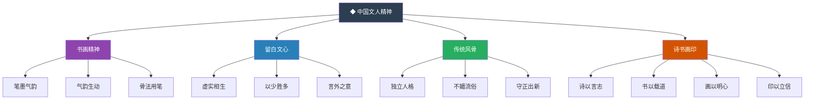
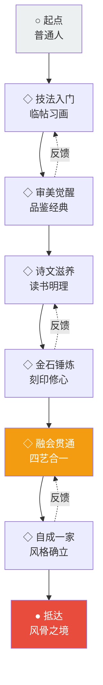
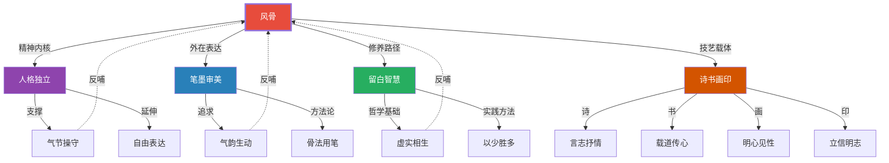

# 02-知识图谱图片描述

---

## 知识图谱视觉体系 · 总览

> 以下四幅图谱，以可视化方式呈现《中国风骨》的核心知识架构。

---

### 图谱一：分类树 · 中国文人精神的层级结构

**图表标题**：中国文人精神分类树

**图表说明**：以启功《中国风骨》为核心，展示中国文人精神的四大维度及其子项。

**设计意图**：分类树帮助读者快速建立全局认知框架，理解"中国风骨"不是单一概念，而是多层次、多维度的精神体系。

---

### 图谱二：人物图谱 · 历代风骨传承谱系

**图表标题**：中国风骨传承人物谱系

**图表说明**：梳理从魏晋至近现代，代表中国文人风骨的核心人物及其师承、影响关系。

**设计意图**：人物谱系以时间轴为主线，展示中国文人风骨的代际传承，让读者感受到这是一种跨越千年的精神接力。

---

### 图谱三：路径图 · 从技艺到境界的修习之路

**图表标题**：文人修养进阶路径

**图表说明**：描绘一个普通人如何通过诗书画印的修习，逐步抵达"风骨"境界的完整路径。

**设计意图**：路径图强调"风骨"不是天赋，而是可以通过系统修习逐步达成的境界，给予读者可操作的信心。

---

### 图谱四：网络图 · 核心概念的关联网络

**图表标题**：中国风骨概念关联网络

**图表说明**：展示《中国风骨》中核心概念之间的多维关联，揭示传统文人精神的内在逻辑。

**设计意图**：网络图打破线性思维，以网状结构呈现概念间的复杂关联，帮助读者建立立体化的认知模型。

---

### 视觉设计规范

| 元素 | 规范 |
|------|------|
| 主色调 | 黛青、朱砂、宣纸白 |
| 字体 | 标题用宋体/楷体，正文用思源宋体 |
| 符号系统 | ◆ 核心概念，◇ 次级概念，○ 起点，● 终点 |
| 连线风格 | 实线表示直接关系，虚线表示间接影响 |
| 背景纹理 | 浅淡宣纸纹理或水墨晕染 |

---

**◆ 四图合一，构建完整的知识视觉体系**
