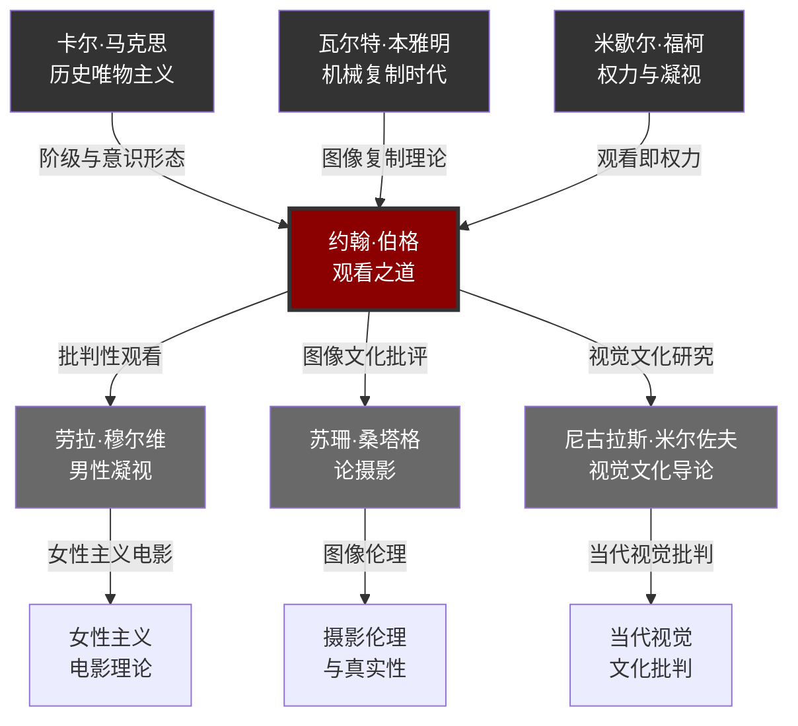
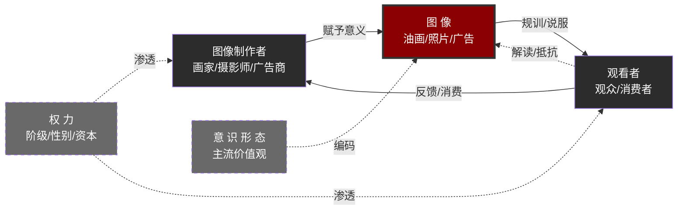

# 《观看之道》知识图谱图片描述

> ◆ 本文用于公众号知识图谱配图的文字描述与设计指引
> ◇ 对应文件：03-公众号排版文稿_图谱逻辑.md
> ○ 用途：指导设计师或AI绘图工具生成知识图谱配图

---

## ◇ 图谱一：《观看之道》核心概念分类树

### 设计说明

这是一张**自上而下的树状分类图**，用于呈现伯格理论的核心概念层级。

### 视觉要求

- **主色调**：深灰 + 暗红（体现批判与解构感）
- **背景**：浅灰渐变，模拟旧照片的颗粒质感
- **节点样式**：圆角矩形，一级节点使用粗边框，二级节点使用细边框
- **连接线**：使用细实线，颜色为暗灰色

### 层级结构

```
                    ┌─────────────────────────┐
                    │      观 看 之 道        │
                    │   Ways of Seeing        │
                    └───────────┬─────────────┘
                                │
              ┌─────────┬───────┼───────┬─────────┐
              ▼         ▼       ▼       ▼         ▼
        ┌──────────┐┌──────┐┌──────┐┌──────┐┌──────────┐
        │ 图像与权力│ │ 女性 │ │ 广告 │ │ 复制 │ │ 观看政治 │
        │  Image   │ │ 形象 │ │广告  │ │ 时代 │ │ 观看即   │
        │  & Power │ │ Nude │ │与油画│ │复制  │ │ 权力实践 │
        └────┬─────┘└──┬───┘└──┬───┘└──┬───┘└────┬─────┘
             │         │       │       │         │
        ┌────┴────┐  ┌─┴──┐  ┌┴───┐  ┌┴──┐  ┌──┴────┐
        │油画=财产│  │裸体│  │文化│  │机械│  │质疑者│
        │宣示    │  │vs  │  │魅力│  │复制│  │夺回  │
        │        │  │裸像│  │    │  │    │  │眼睛  │
        └────────┘  └────┘  └────┘  └────┘  └───────┘
```

### 配色方案

| 元素 | 色值 | 说明 |
|------|------|------|
| 主标题背景 | #2C2C2C | 深灰，沉稳批判感 |
| 一级节点 | #8B0000 | 暗红，核心概念 |
| 二级节点 | #696969 | 中灰，从属概念 |
| 连接线 | #A9A9A9 | 浅灰，不喧宾夺主 |
| 背景渐变 | #F5F5F5 → #E8E8E8 | 旧照片质感 |

---

## ● 图谱二：约翰·伯格思想影响网络图

### 设计说明

这是一张**中心辐射式的网络关系图**，展示伯格与前后思想家的承继与影响关系。

### 视觉要求

- **主色调**：黑白灰为主，关键连接使用暗红
- **背景**：纯白或极浅灰
- **节点样式**：圆形节点，大小按影响力程度区分
- **连接线**：
  - 实线 = 直接影响
  - 虚线 = 思想呼应
  - 箭头方向 = 影响方向

### 网络结构（Mermaid 格式）



---

## ○ 图谱三：从古典油画到现代广告的演变路径图

### 设计说明

这是一张**从左到右的时间轴路径图**，展示图像如何从"财产宣示"演变为"消费承诺"。

### 视觉要求

- **主色调**：深棕（古典）→ 亮红（现代）的渐变过渡
- **背景**：从左到右由暗到亮，暗示"从古典到现代"
- **节点样式**：每个时代用图标 + 文字组合
- **时间轴**：底部一条贯穿的水平线

### 演变节点

| 时代 | 代表形式 | 核心功能 | 权力逻辑 |
|------|---------|---------|---------|
| 15-17世纪 | 宗教绘画 | 神权规训 | 信仰即服从 |
| 17-18世纪 | 贵族肖像 | 阶级宣示 | 血统即合法性 |
| 18-19世纪 | 静物画/风俗画 | 财产展示 | 占有即身份 |
| 20世纪 | 摄影/电影 | 大众传播 | 影像即现实 |
| 当代 | 广告/社交媒体 | 消费驱动 | 欲望即市场 |

---

## ◆ 图谱四：观看的权力关系网络图

### 设计说明

这是一张**三角关系网络图**，展示"制作者—图像—观看者"之间的权力流动。

### 视觉要求

- **主色调**：暗红三角关系图，标注权力流动方向
- **背景**：纯白
- **核心元素**：三个顶点 + 中间的"图像"节点
- **箭头**：双向箭头表示权力是流动的，但不对称

### 关系结构（Mermaid 格式）



---

## ◇ 设计总则

### 排版原则

1. **留白充足**：移动端阅读，留白比内容更重要
2. **层次分明**：一级标题 > 二级标题 > 正文 > 注释
3. **对比强烈**：深色文字配浅色背景，关键信息用暗红突出

### 移动端适配

- 宽度：最大 677px（微信公众号标准宽度）
- 字号：正文 15px，标题 18px，注释 12px
- 行高：1.8 倍
- 段间距：1.5em

### 符号规范

- 使用 ◆◇○● 等文字符号替代 emoji
- 避免使用彩色 emoji 字符
- 保持整体色调统一

---

*以上描述可用于指导设计师使用 Figma/Sketch/AI 工具制图，也可直接作为 AI 绘图的 prompt 参考。*
