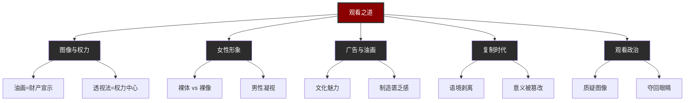
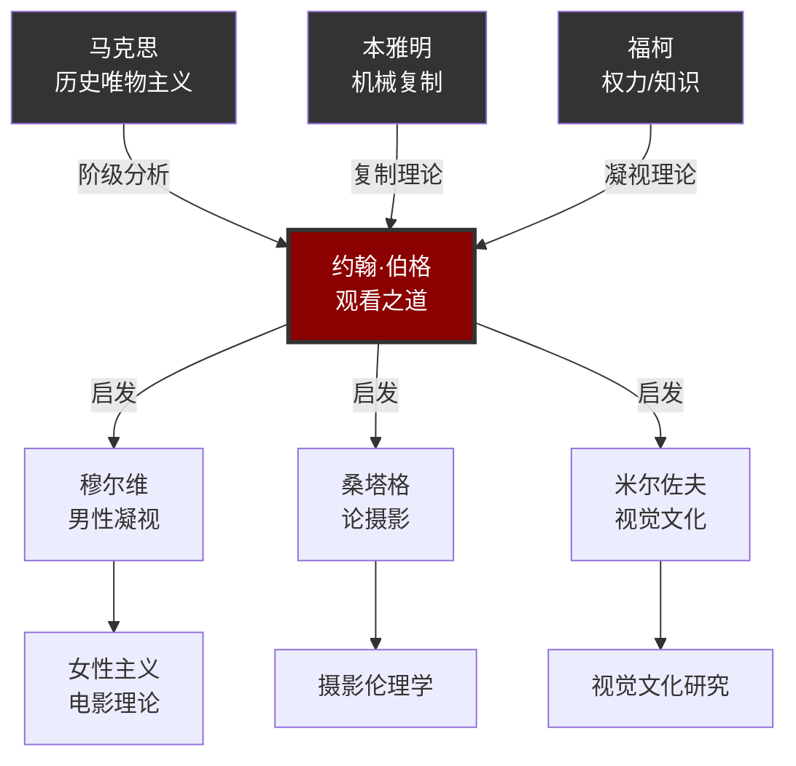
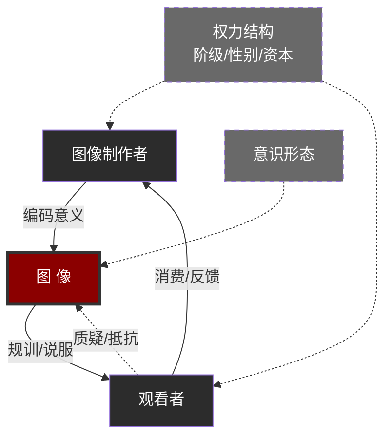

# 图像如何塑造你——《观看之道》图谱逻辑解读

> ◆ 约翰·伯格《观看之道》知识图谱深度解析
> ◇ 系列：人类文明经典阅读计划 · 艺术美学篇
> ○ 核心标签：图像权力 | 意识形态 | 批判观看 | 女性形象

---

## ◇ 为什么需要一张图谱？

伯格在《观看之道》中做的事，可以概括为四个字：**拆解图像**。

他把我们习以为常的"看"，拆解成了一套权力运作的机制。

但文字是线性的，而伯格的理论是网状的——它涉及阶级、性别、媒介、消费主义等多个维度。

所以我们需要一张图谱，把这张网**可视化**。

---

## ● 图谱一：核心概念树——伯格的理论骨架

### 逻辑起点：观看不是中立的

伯格全书的逻辑起点，是一句看似简单却极具破坏力的话：

> "观看先于语言。"

婴儿在会说话之前就会看。但问题在于——**看的方式，是被后天塑造的**。

所以"观看之道"（Ways of Seeing）这个书名本身就有两层含义：

- 第一层：观看的"方式"——我们如何看？
- 第二层：观看的"道路"——谁为你铺设了这条观看之路？

### 五大概念支柱

### 逻辑关系解读

这张树状图的核心逻辑是：

**从一个元问题出发（观看是否中立），衍生出五个维度的分析，每个维度又指向具体的批判对象。**

这棵树不是分类学意义上的"知识树"，而是一棵"批判树"——每一个分叉，都是对既有认知的瓦解。

---

## ○ 图谱二：思想网络——伯格站在谁的肩膀上？

### 伯格的思想谱系

伯格不是一个孤立的天才。他的理论，深深扎根于二十世纪欧洲批判传统的土壤中。

### 三条思想脉络

从这张网络图，我们可以梳理出三条脉络：

**第一条：马克思主义脉络**

马克思揭示了经济基础的意识形态功能。伯格将其延伸到视觉领域——图像也是意识形态的载体。

**第二条：媒介理论脉络**

本雅明在 1936 年就预言了"机械复制"对艺术"灵光"（aura）的消解。伯格接续了这个思考：复制不仅改变了艺术的物质性，更改变了观看的方式。

**第三条：权力理论脉络**

福柯对"凝视"（gaze）的分析——观看不是中立的，而是一种权力实践——与伯格的理论形成了共振。

这三条脉络交汇于伯格，又从伯格出发，启发了后续的女性主义电影理论、摄影伦理学和视觉文化研究。

---

## ◆ 图谱三：演变路径——从油画到小红书

### 图像功能的五百年演变

伯格的深刻之处在于，他不仅分析了古典油画，更洞见了油画的"现代继承者"——广告。

### 不变的底层逻辑

在这条演变路径上，形式千变万化，但底层逻辑从未改变：

**图像始终是权力的载体。**

| 时代 | 谁拥有图像？ | 图像为谁服务？ |
|------|-------------|---------------|
| 宗教绘画 | 教会 | 信仰规训 |
| 贵族肖像 | 贵族 | 阶级合法性 |
| 静物画 | 资产阶级 | 财产宣示 |
| 摄影/电影 | 资本/国家 | 大众传播 |
| 广告/社交媒体 | 平台/品牌 | 消费驱动 |
| AI生成图像 | 算法/科技公司 | ？？？ |

最后一个问号，是伯格留给我们的思考题。

---

## ● 图谱四：权力关系——谁在操控你的眼睛？

### 三方博弈模型

这是理解伯格理论最核心的图谱。它揭示了一个三角关系：

### 这张图告诉你什么？

**第一层：图像不是自然生成的。**

它是由"制作者"有意识地编码的。每一个构图、色彩、角度的选择，都承载着某种意图。

**第二层：观看者不是被动的。**

理论上，观看者可以质疑、可以抵抗、可以"反读"图像。但问题是——**大多数人没有接受过"批判性观看"的训练**。

**第三层：权力和意识形态是无形的推手。**

它们不直接出现在图像中，但它们渗透在制作者的假设和观看者的预期中。

这就是为什么伯格说：

> "图像不再是被观看的对象，而是一种观看的方式。"

---

## ◇ 图谱的逻辑，就是批判的逻辑

这四张图谱不是孤立的插图，它们共同构成了一个**批判性思维框架**：

1. **概念树**：告诉你伯格在批判什么
2. **思想网络**：告诉你伯格的理论从何而来、去向何方
3. **演变路径**：告诉你图像的权力逻辑如何穿越五百年而不朽
4. **权力关系图**：告诉你当下每一次"观看"背后隐藏的博弈

读懂了这四张图，你就拥有了伯格的"眼睛"——

一双不再轻易被图像欺骗的眼睛。

---

## ○ 互动话题

> **今日思考**：
> 
> 如果"观看先于语言"，那么在你学会说话之前，你的眼睛已经被什么"教育"过了？
> 
> 评论区聊聊你的第一个"视觉记忆"。

---

## ◆ 系列导航

| 上一篇 | 下一篇 |
|--------|--------|
| 《美的分析》——形式与审美的哲学追问 | 《艺术的故事》——西方艺术的文明叙事 |

---

**人类文明经典阅读计划 · 第15期**

*让经典照亮日常，让阅读成为行动。*
