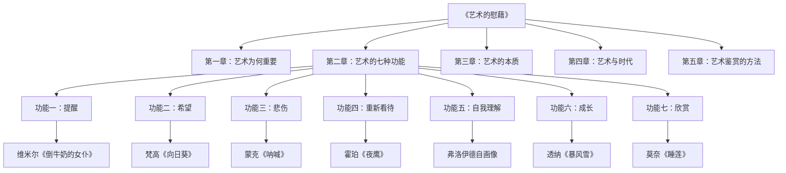
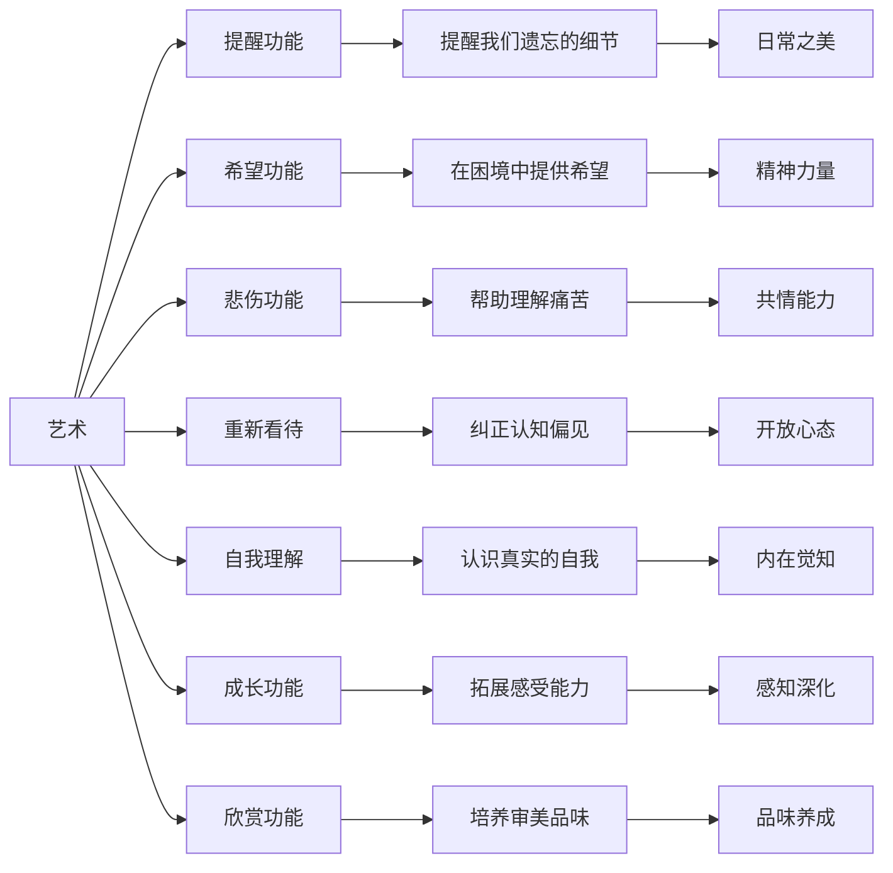
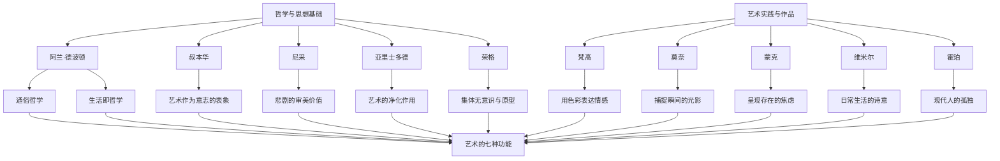
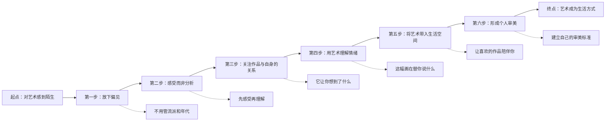
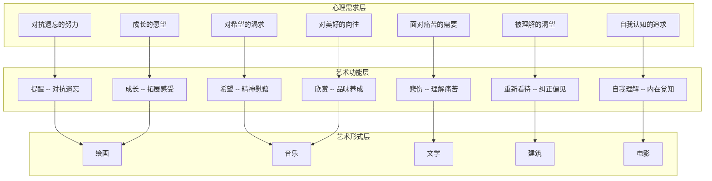

# 一幅图读懂《艺术的慰藉》| 知识图谱

> 本文配合 Mermaid 图表使用，建议在支持 Mermaid 渲染的编辑器中查看。

---

## 01 全书结构总览

《艺术的慰藉》以"艺术的七种功能"为核心主线，贯穿全书。以下是整体知识结构的分类树：

---

## 02 七种功能详解图谱

以下是艺术七种功能的详细展开及其与人类情感需求的对应关系：

---

## 03 核心人物与思想关联图

德波顿在书中引用了大量艺术家和哲学家的思想，以下是主要人物及其与核心观点的关系：

---

## 04 从艺术到生活的实践路径图

艺术如何从理论走向日常实践？以下是德波顿建议的应用路径：

---

## 05 艺术功能与心理需求网络图

以下图谱展示了艺术七种功能与人类心理需求之间的映射关系：

---

## 06 图谱使用建议

以上五张 Mermaid 图表分别展示了：

1. **分类树** -- 全书章节结构与核心概念
2. **功能详解图** -- 七种功能的逐层展开
3. **人物关联图** -- 思想基础与艺术实践的交汇
4. **实践路径图** -- 从陌生到精通的学习路径
5. **网络映射图** -- 心理需求、艺术功能与艺术形式的三元关系

建议配合公众号正文使用，帮助读者建立全局认知框架。

---

## 互动话题

> **你最喜欢书中的哪一种艺术功能？**
> 
> 是"提醒我们遗忘的美好"，还是"在困境中提供希望"？
> 
> 在评论区分享你的答案，我们一起探讨。

---

**标签：** `艺术功能` `心灵慰藉` `知识图谱` `Mermaid`

**系列：** 人类文明经典阅读计划 - 07 艺术美学 - 16 艺术的慰藉
