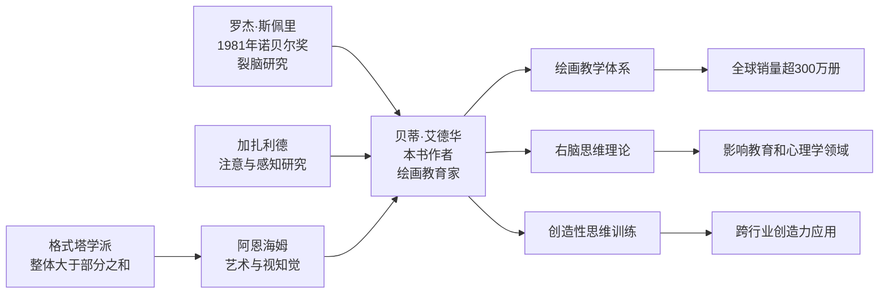
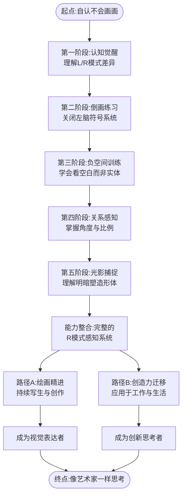
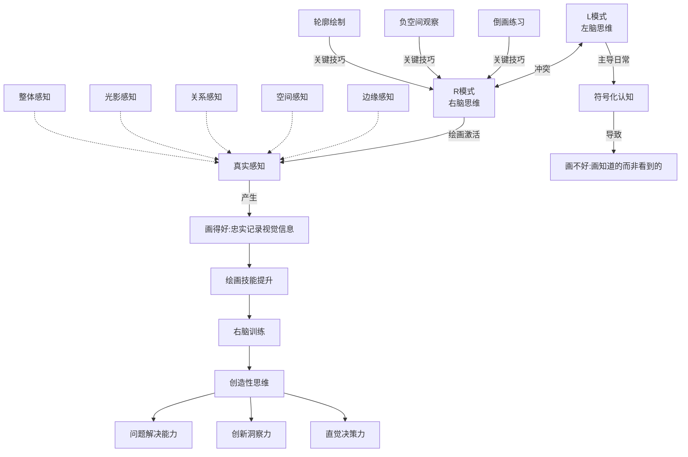

# 02-知识图谱图片描述

> 本文描述《像艺术家一样思考》知识图谱的四个核心视图，用于公众号排版中的插图展示。

◆ **系列导航**

本文属于「人类文明经典阅读计划」第 17 期，艺术美学系列第 7 部。

---

## 视图一：全书知识结构分类树

**用途说明**：用于展示全书内容的层级结构和知识脉络，帮助读者快速把握全书框架。

```mermaid
graph TD
    ROOT["像艺术家一样思考"]
    
    ROOT --> T1["理论基石"]
    ROOT --> T2["五种核心技能"]
    ROOT --> T3["十天绘画课程"]
    ROOT --> T4["创造性思维应用"]
    
    T1 --> T1A["裂脑研究:斯佩里诺贝尔奖"]
    T1 --> T1B["L模式:左脑逻辑语言符号"]
    T1 --> T1C["R模式:右脑空间感知整体"]
    T1 --> T1D["认知模式切换理论"]
    
    T2 --> T2A["感知边缘:轮廓线观察"]
    T2 --> T2B["感知空间:负空间识别"]
    T2 --> T2C["感知关系:角度与比例"]
    T2 --> T2D["感知光影:明暗与形体"]
    T2 --> T2E["感知整体:格式塔感知"]
    
    T3 --> T3A["第一天:基线自画像"]
    T3 --> T3B["第二天:倒过来画"]
    T3 --> T3C["第三天:感知负空间"]
    T3 --> T3D["第四天:感知关系与比例"]
    T3 --> T3E["第五天:感知光影"]
    T3 --> T3F["第六至十天:综合练习"]
    
    T4 --> T4A["创造性问题解决"]
    T4 --> T4B["R模式直觉决策"]
    T4 --> T4C["日常创造力训练"]
    T4 --> T4D["跨领域应用迁移"]
```

**设计要点**：
- 根节点使用加粗圆角样式
- 四大分支用不同颜色区分
- 叶子节点用灰色文字标注
- 整体布局从上到下，宽度控制在移动端 100% 可视范围

---

## 视图二：关键人物与理论传承图谱

**用途说明**：展示本书背后的学术传承和关键人物关系，增强内容权威性。

**设计要点**：
- 左侧为学术源头，右侧为影响扩散
- 核心人物节点放大显示
- 影响力分支用虚线连接
- 适合横向滚动或压缩为竖向展示

---

## 视图三：学习路径图

**用途说明**：为读者提供清晰的学习进阶路线，从零基础到创造性思维的完整路径。

**设计要点**：
- 主路径用实线箭头，分支选择用不同颜色
- 每个阶段节点包含简短说明
- 适合竖向展示，每个阶段作为一个卡片区块
- 终点节点用特殊样式突出

---

## 视图四：概念关系网络图

**用途说明**：展示核心概念之间的交叉关联，帮助读者理解知识的整体性。

**设计要点**：
- 核心冲突关系用最醒目的颜色
- 感知能力的五个维度用相同色系
- 创造性思维的三个应用方向用另一种色系
- 实线表示强关联，虚线表示弱关联
- 适合在深色背景上展示

---

## 排版建议

### 移动端适配

1. **图片宽度**：设置为 100% 宽度，最大宽度 680px
2. **字体大小**：Mermaid 渲染后的文字不小于 12px
3. **留白**：图片上下各留 16px 间距
4. **图注**：每张图片下方添加 12px 灰色图注文字

### 颜色方案

建议使用以下配色方案以保持系列一致性：

- 主色调：深灰 #333333
- 强调色：暖橙 #E8751A
- 辅助色：浅灰 #999999
- 背景色：米白 #FAF8F5

### 插入位置

- 分类树图：放在文章开篇，帮助读者建立全局认知
- 人物图谱：放在理论背景介绍处
- 学习路径图：放在行动指南部分
- 概念网络图：放在文末总结处

---

标签：`#知识图谱` `#Mermaid` `#右脑训练` `#创造性思维` `#艺术美学`
