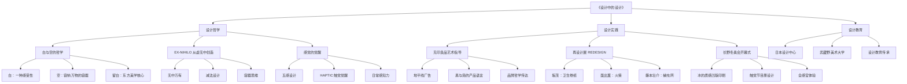
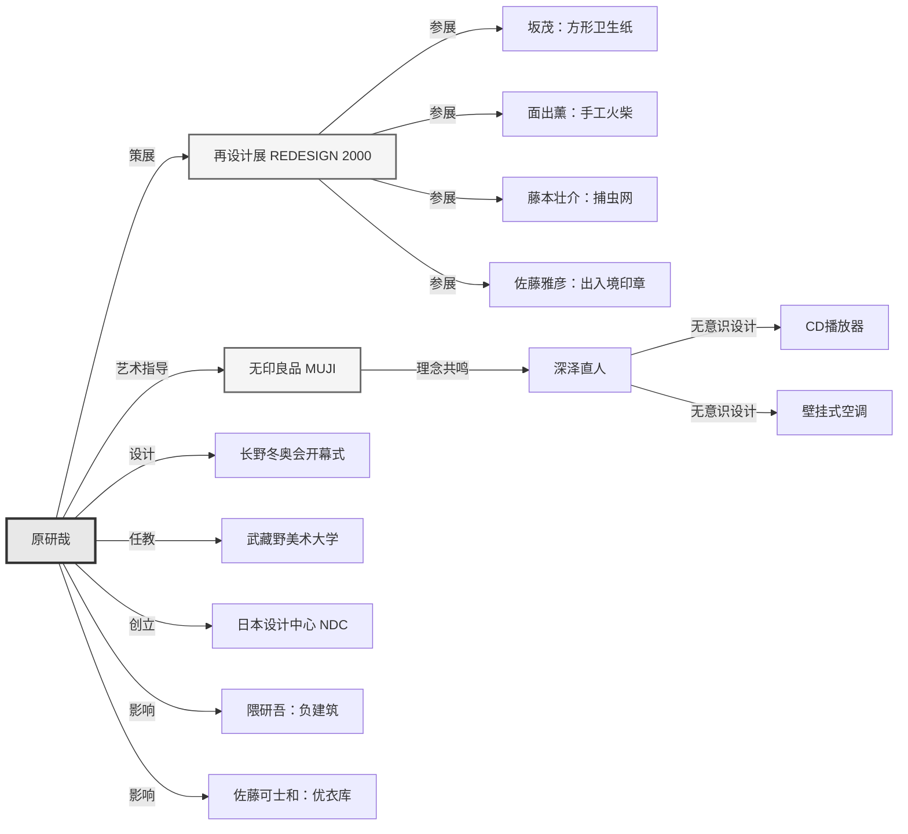
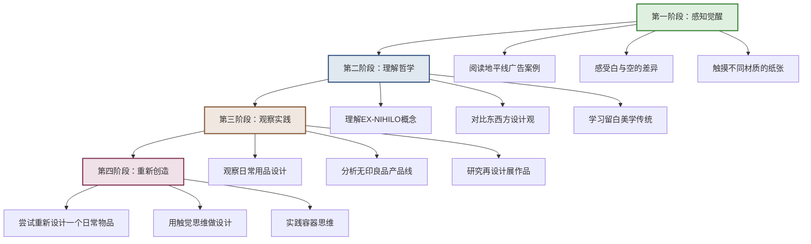
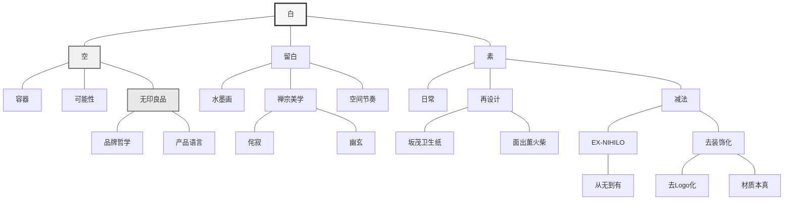

# 知识图谱图片描述：《设计中的设计》全景图谱

> 本文描述《设计中的设计》知识图谱的可视化结构，包含分类树、人物关系、学习路径和网络关联四个维度。

---

## 图谱一：知识分类树

**图谱说明：**
此分类树从三个维度展开《设计中的设计》的知识体系。设计哲学层面，核心是"白与空"的东方哲学，以及"从无到有"的创造观和"感觉觉醒"的感知论。设计实践层面，涵盖无印良品的品牌艺术指导、"再设计"展览的日常物品重构，以及长野冬奥会的感官设计实践。设计教育层面，体现原研哉在日本设计中心和武藏野美术大学的传承使命。

---

## 图谱二：核心人物关系图谱

**图谱说明：**
此人物关系图以原研哉为核心，向外辐射出他在品牌艺术指导、展览策划、大型项目设计、教育传承和设计机构创立五个维度的影响力。特别标注了"再设计展"中四位设计师的代表作品，以及与原研哉理念共鸣的深泽直人的无意识设计案例。同时展示了原研哉对隈研吾、佐藤可士和等新一代设计师的影响关系。

---

## 图谱三：学习路径图

**图谱说明：**
此路径图分为四个递进阶段。第一阶段从感官体验入手，通过具体案例和材质感受建立直觉认知。第二阶段深入到哲学层面，理解"从无到有"的东方创造观。第三阶段回归现实观察，用新的眼光审视日常设计。第四阶段是实践创造，将理论转化为自己的设计行动。四个阶段形成"感知-理解-观察-创造"的完整闭环。

---

## 图谱四：概念关联网络图

**图谱说明：**
此网络图以"白"为核心节点，向外发散出"空""留白""素"三个关联概念，再进一步延伸到具体的设计实践、文化传统和哲学思想。图中可以看到"白"与无印良品的品牌哲学直接相连，"留白"与中国水墨画和禅宗美学相通，"素"则与日常再设计和减法理念紧密相关。最终这些概念汇聚到EX-NIHILO的创造哲学中，形成完整的概念网络。

---

## 互动话题

◆ 四个图谱中，哪一个对你理解这本书帮助最大？
◆ 你觉得还有哪些概念应该加入这个知识网络？

欢迎在评论区分享你的想法。

---

## 系列导航

| 上一篇 | 当前篇 | 下一篇 |
|--------|--------|--------|
| [读后感：在白与空之间](01-公众号排版文稿_读后感.md) | 知识图谱描述 | [核心思想解读](04-公众号排版文稿_核心思想.md) |

---

*本文是「人类文明经典阅读计划」系列第18篇，专注艺术美学与设计哲学。*
