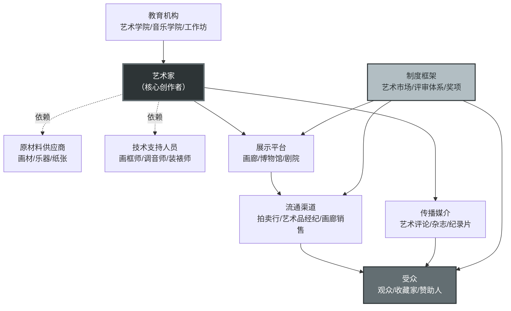
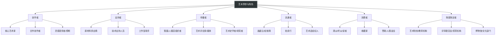
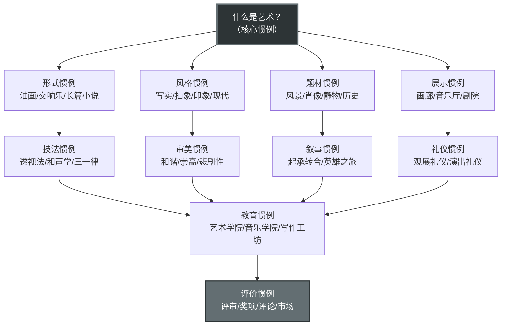

# 知识图谱图片描述 —— 《艺术界》核心概念网络

---

## 图一：艺术界协作网络图（核心总览）

### Mermaid 代码

### 图片描述

这是一张以"艺术家"为中心的网络关系图，展示了贝克尔"艺术界"理论中各参与角色之间的协作关系。

- **中心节点**为"艺术家"，用深色突出显示，代表传统叙事中的核心角色。
- **上游节点**包括"原材料供应商"和"技术支持人员"，用虚线连接，表示它们是隐形的、常被忽视的协作环节。
- **下游节点**包括"展示平台""传播媒介""流通渠道"和"受众"，形成从创作到消费的完整链条。
- **外围节点**包括"教育机构"和"制度框架"，它们对整个网络起到规范和塑造的作用。

这张图的核心信息是：**艺术家并非孤立存在，而是嵌入在一个庞大的协作网络之中。**

---

## 图二：艺术界角色分类树

### Mermaid 代码

### 图片描述

这是一张树状分类图，将艺术界的参与角色划分为六大类：

1. **创作者**：直接参与艺术品生产的个体，包括核心艺术家、合作者和灵感提供者。
2. **支持者**：提供物质和技术支持的隐形角色，他们的贡献往往不被观众察觉。
3. **传播者**：负责将艺术作品推向公众，赋予其意义和阐释的群体。
4. **流通者**：连接创作与消费的中间环节，决定了艺术品的市场价值。
5. **消费者**：艺术品的最终接收者，他们的接受与否决定了艺术品的社会生命。
6. **制度制定者**：制定规则、标准和评价体系的权威机构。

这张图的价值在于：**它让我们看到，艺术界是一个高度分工的社会系统，每个角色都承担着不可替代的功能。**

---

## 图三：从原材料到艺术品 —— 价值生产路径图

### Mermaid 代码

### 图片描述

这是一张从左到右的线性路径图，展示了艺术品从原材料到经典化的完整价值生产链条。

每个节点代表一个阶段，箭头上的标签标明了该阶段所创造的价值类型：

- **物理价值**：原材料被加工为艺术品，获得物质形态。
- **展示价值**：作品进入展示空间，获得被观看的机会。
- **符号价值**：评论和媒体赋予作品意义和阐释。
- **市场价值**：流通环节确定作品的经济价格。
- **文化价值**：收藏行为确认作品的社会地位。
- **历史价值**：经典化过程将作品纳入艺术史叙事。

这张图揭示了贝克尔理论的一个核心观点：**艺术品的价值不是天生的，而是在社会过程中被逐步建构的。**

---

## 图四：艺术界惯例网络图

### Mermaid 代码

### 图片描述

这是一张自上而下的层级网络图，展示了艺术界"惯例"系统的结构。

- **顶层**是核心惯例——"什么是艺术？"，这是所有其他惯例的出发点。
- **第二层**分为形式、风格、题材、展示四类惯例，它们规定了艺术的基本框架。
- **第三层**是更具体的技法、审美、叙事和礼仪惯例，它们深入到艺术实践的细节。
- **第四层**是教育惯例，负责将上述惯例传授给新一代参与者。
- **底层**是评价惯例，它决定了什么样的作品能够被认可和流传。

这张图的核心洞见是：**惯例是艺术界运转的"操作系统"，它规定了谁能参与、如何参与、什么样的产出算作"艺术"。**

---

## 图谱使用说明

以上四张图谱可作为微信公众号文章中的配图使用，建议：

1. 将 Mermaid 代码渲染为 SVG 或 PNG 格式后插入文章
2. 每张图片下方附上简短说明文字，帮助读者理解
3. 图片风格建议统一使用深色主题，与系列整体排版风格一致
4. 移动端浏览时，确保图片宽度适配屏幕，文字清晰可读
