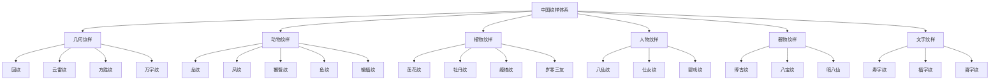
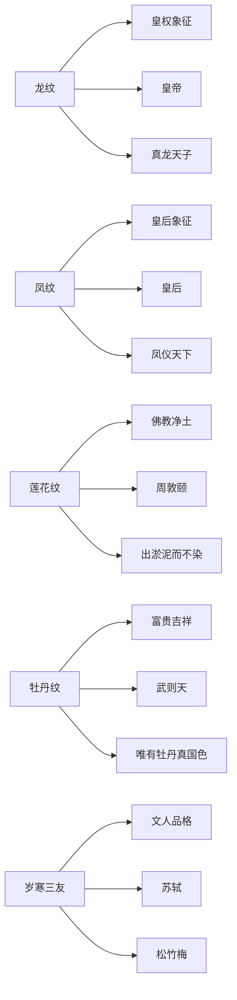
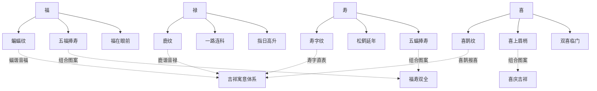

# 02-知识图谱图片描述

---

## 《纹饰之美》知识图谱：一图看懂中国纹样体系

**文 / 人类文明经典阅读计划**

---

### 图谱一：中国纹样分类树

本图谱以树状结构展示中国纹样的完整分类体系，帮助读者建立全局认知。

**图谱说明**：中国纹样体系按题材可分为七大类别，每一类别下又有众多经典纹样。几何纹样是最早出现的类型，动物纹样承载了最多的权力与信仰内涵，植物纹样则体现了古人对自然的细腻观察与人格化投射。

---

### 图谱二：纹样寓意人物关系图谱

本图谱展示经典纹样与其寓意、历史人物、文化典故之间的关联网络。

**图谱说明**：每一个经典纹样都不是孤立存在的，它与特定的历史人物、文化典故、哲学思想紧密相连。理解这些关联，才能真正读懂纹样的文化密码。

---

### 图谱三：纹样演变路径图

本图谱展示中国纹样从新石器时代到清代的历史演变脉络。

**图谱说明**：中国纹样经历了从朴拙到精致、从神秘到世俗、从单一到多元的演变过程。每个时代的纹样都带有鲜明的时代特征，同时也继承了前代的传统。

---

### 图谱四：纹样寓意关系网络图

本图谱展示不同纹样之间寓意关联的网络关系，揭示吉祥图案的组合逻辑。

**图谱说明**：中国传统吉祥图案的核心逻辑是"谐音取意"与"组合寓意"。蝙蝠因"蝠"谐音"福"而成为吉祥符号，鹿因"鹿"谐音"禄"而象征仕途顺利。多个吉祥元素组合在一起，便形成了"福寿双全"、"喜上眉梢"等经典图案。

---

### 图谱解读总结

四张图谱从不同维度揭示了中国纹样体系的内在逻辑：

- **分类树**：展示纹样的类型学框架
- **关系图**：揭示纹样与人物、典故的文化关联
- **路径图**：梳理纹样的历史演变脉络
- **网络图**：呈现吉祥图案的组合逻辑与寓意体系

通过这四张图谱，读者可以从全局视角理解中国纹样，而不仅仅是停留在"认识某个纹样"的层面。

---

### 互动话题

你最想了解哪一类纹样的详细故事？欢迎在评论区留言，我们将在后续文章中为你解读。

---

### 系列导航

◇ 上一篇：《01-读后感：在纹路之间，看见文明的呼吸》
◆ 下一篇：《03-图谱逻辑：纹样体系的解码方法》
○ 系列首页：人类文明经典阅读计划 · 艺术美学

---

*本文系"人类文明经典阅读计划"第20期，欢迎转发分享，让更多人感受经典之美。*
