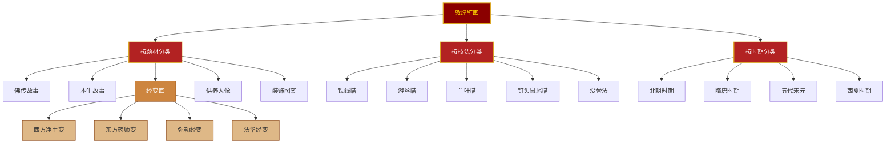
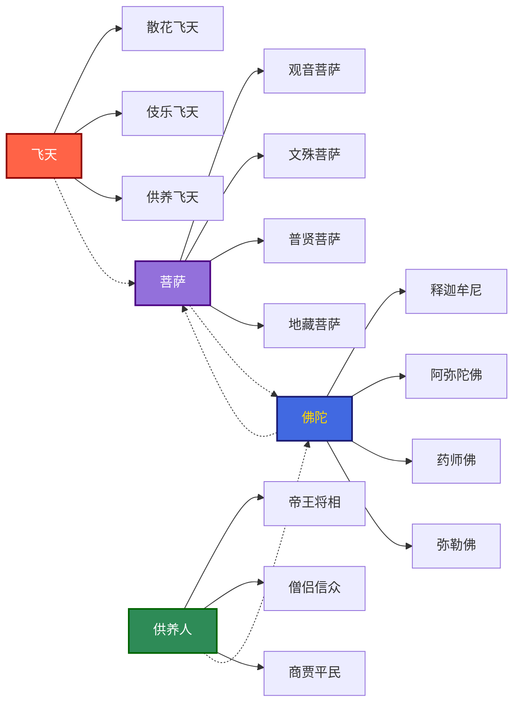
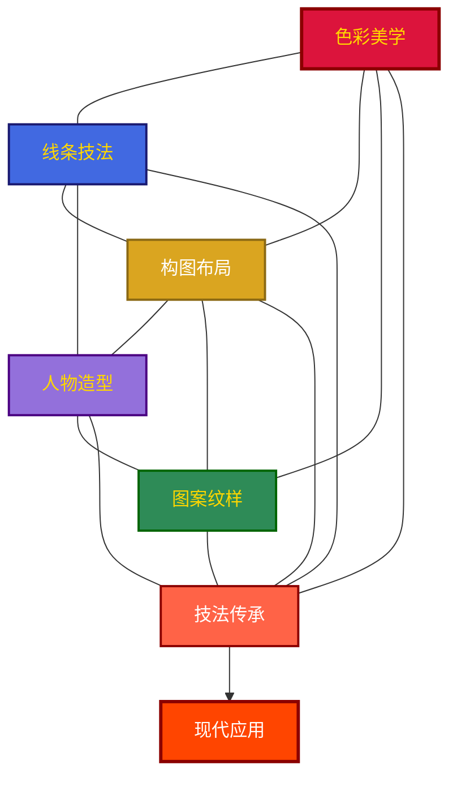

# 02-知识图谱图片描述.md

# 《敦煌如是绘》知识图谱

---

## 图谱一：敦煌壁画分类树

### 图谱描述

**整体结构**：这是一张三级分类树状图，根节点为「敦煌壁画」，向下分为三个主维度。

**颜色体系**：
- 根节点：深红底金色边框，配金色文字，象征敦煌壁画的庄严与瑰丽
- 一级分类：殷红底金色边框，体现学术分类的层级感
- 二级分类：浅棕色底深棕边框，表示细分领域
- 三级分类：米黄色底，用于经变画的四种类型

**视觉层次**：从中心向两侧展开，左右对称，左为题材、中为技法、右为时期，符合移动端竖屏阅读习惯。

---

## 图谱二：敦煌壁画人物关系图谱

### 图谱描述

**整体结构**：横向布局的人物关系图谱，四大类人物体系平行排列，辅以虚线表示关联。

**色彩编码**：
- 飞天：珊瑚红色系，象征轻盈与热烈
- 佛陀：皇家蓝色系，象征庄严与智慧
- 菩萨：紫色系，象征慈悲与神圣
- 供养人：海绿色系，象征人间烟火

**关联逻辑**：
- 实线表示隶属关系（如飞天分为散花、伎乐、供养三种）
- 虚线表示互动关系（如飞天围绕菩萨飞舞、供养人礼敬佛陀）

---

## 图谱三：临摹体验路径图

### 图谱描述

**整体结构**：从左到右的八步流程图，呈现临摹敦煌壁画的完整工作流。

**阶段划分**：
- 准备阶段（蓝）：阅读研究、选择底稿，强调学术基础
- 勾勒阶段（粉）：打稿起形、勾线定型，强调线条功底
- 设色阶段（金）：矿物设色、晕染过渡，强调色彩技法
- 完成阶段（红）：贴金描边、完成作品，强调最终呈现

**流程节奏**：前期重研究，中期重技法，后期重呈现，形成递进式的学习曲线。

---

## 图谱四：敦煌艺术元素网络图

### 图谱描述

**整体结构**：中心辐射式网络图，展现敦煌艺术各元素之间的有机联系。

**节点含义**：
- 色彩美学：朱砂、石青、石绿等矿物色彩的运用体系
- 线条技法：铁线描、游丝描等传统线描方法
- 构图布局：经变画的对称式、叙事式构图法则
- 图案纹样：莲花、忍冬、宝相花等装饰纹样
- 人物造型：佛陀、菩萨、飞天的比例与姿态规范
- 技法传承：从古至今的技艺传递路径
- 现代应用：当代设计、时尚、建筑中的敦煌元素

**关系网络**：各元素两两互联，体现敦煌艺术是一个完整的美学系统，而非孤立的技法集合。

---

━━━ ◆ ━━━

<strong>图谱说明</strong> 
以上四张图谱分别从分类体系、人物关系、临摹流程、元素网络四个维度 
构建《敦煌如是绘》的知识框架，帮助读者系统理解敦煌壁画的艺术体系 ◆

━━━ ◇ ━━━

<strong>系列导航</strong>

| 上一篇 | 下一篇 |
|--------|--------|
| [01-读后感](./01-公众号排版文稿_读后感.md) | [03-图谱逻辑](./03-公众号排版文稿_图谱逻辑.md) |
