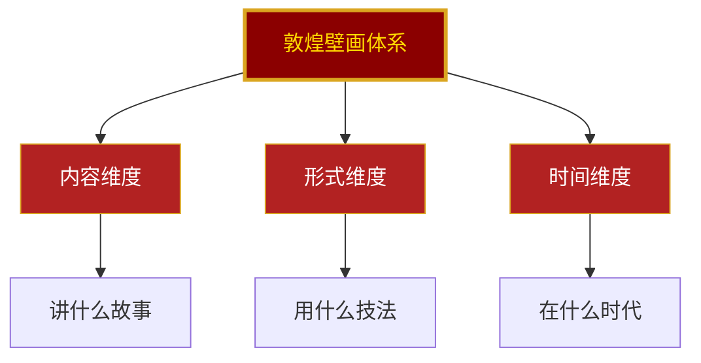
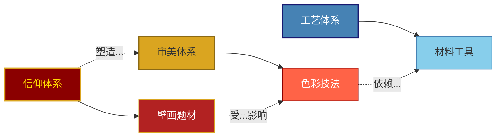

# 03-公众号排版文稿_图谱逻辑.md

<strong>◆ 人类文明经典阅读计划 ◆</strong> 
第 21 期 · 艺术美学系列

---

## 敦煌壁画的底层逻辑
### 一张图谱看懂千年艺术体系

—— 不是零散的技法，而是完整的美学系统

---

### 一、为什么要画知识图谱？

很多人读敦煌相关的书，最大的困惑是：

**信息太多，太碎，太散。**

色彩有几十种，线条有十几种，题材有上百种，时期跨越一千多年……

如果没有一个框架把这些内容串起来，读到最后只会觉得「好看，但记不住」。

这本书最独特的地方，就是它提供了一个**系统性的认知框架**。

> ◇ 知识图谱不是为了好看，而是为了「看懂」。
> ◇ 图谱不是为了展示信息量，而是为了揭示关系。

今天这篇文章，我就带你梳理这套图谱的底层逻辑。

---

### 二、第一层：分类的逻辑

敦煌壁画的分类，不是随便分的。

这个分类框架的逻辑是：

**从三个正交的维度，把复杂的壁画体系拆解成可理解的模块。**

- **内容维度**：解决「画的是什么」的问题
- **形式维度**：解决「怎么画的」的问题
- **时间维度**：解决「什么时候画的」的问题

这三个维度彼此独立，又互为补充。

> ● 同一题材，在不同时代有不同的画法。
> ● 同一技法，在不同题材中有不同的运用。
> ● 同一时代，不同题材有不同的审美倾向。

这就是分类的价值——不是割裂，而是建立关联的起点。

---

### 三、第二层：关系的逻辑

分类只是第一步，更重要的是**关系**。

敦煌壁画不是一个一个孤立的画面，而是一个有机的整体。

这个关系图谱揭示了一个更深层的逻辑：

**敦煌壁画是信仰、审美、工艺三大体系共同作用的产物。**

- 信仰体系决定了画什么
- 审美体系决定了怎么美
- 工艺体系决定了怎么画

三者缺一不可。

> ◇ 没有信仰，壁画就失去了灵魂。
> ◇ 没有审美，壁画就失去了美感。
> ◇ 没有工艺，壁画就失去了载体。

这就是为什么敦煌壁画能跨越千年依然动人——它不是某一个人的创作，而是三大体系共同孕育的结晶。

---

### 四、第三层：演进的逻辑

敦煌壁画不是一成不变的。

从北朝到隋唐，从五代到西夏，壁画在演进。

这个演进图谱揭示了一个更宏观的逻辑：

**壁画风格的变迁，是时代精神的镜像。**

- 北朝的粗犷雄浑，对应着乱世的坚韧
- 隋唐的华丽丰盈，对应着盛世的自信
- 五代宋元的简约内敛，对应着文化的沉淀

读懂了风格的演进，就读懂了历史的脉络。

> ● 壁画不只是画，是时代的表情。
> ● 色彩不只是色，是文明的记忆。

---

### 五、图谱的使用方式

知识图谱不是用来「看」的，是用来「用」的。

这里提供三种使用方式：

**1. 入门读者：按图索骥**

按照分类图谱的框架，逐层了解敦煌壁画的基本概念，建立初步的认知框架。

**2. 进阶读者：顺藤摸瓜**

从感兴趣的一个节点出发（比如「飞天」），顺着关系图谱探索与之相关的技法、题材、时代，形成知识网络。

**3. 专业读者：交叉验证**

将分类、关系、演进三张图谱叠加使用，验证不同维度之间的对应关系，发现新的研究视角。

---

### 六、总结：图谱的本质

知识图谱的本质，不是信息的堆砌，而是**认知的脚手架**。

> ◇ 它帮你把碎片化的信息组织成结构化的知识。
> ◇ 它帮你把表面的现象连接到深层的逻辑。
> ◇ 它帮你把静态的画面还原为动态的历史。

《敦煌如是绘》最珍贵的，不是它告诉了你多少关于敦煌的知识，而是它给了你一套**理解敦煌的思维工具**。

有了这套工具，你不需要记住所有的色彩名称、所有的线条技法、所有的题材分类。

你只需要知道——

**它们之间是如何关联的，它们是如何演进的，它们共同构成了一个怎样的美学体系。**

这，才是读懂敦煌的钥匙。

---

━━━ ◆ ━━━

<strong>互动话题</strong> 
你觉得敦煌壁画中最吸引你的是哪个维度？ 
内容、技法、还是时代风格？在评论区聊聊 ◆

━━━ ◇ ━━━

<strong>系列导航</strong>

| 上一篇 | 下一篇 |
|--------|--------|
| [02-知识图谱](./02-知识图谱图片描述.md) | [04-核心思想](./04-公众号排版文稿_核心思想.md) |

<strong>◆ 人类文明经典阅读计划 ◆</strong>

