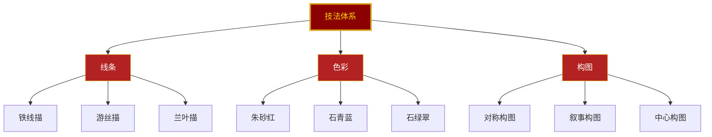
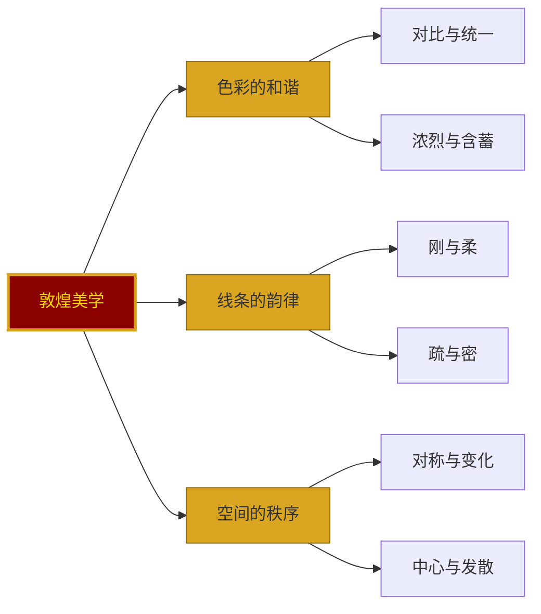
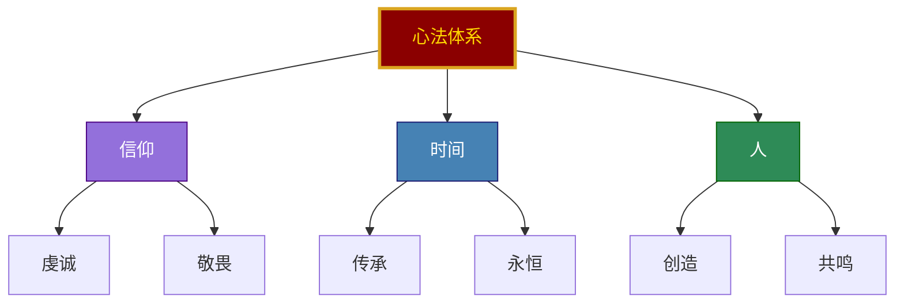
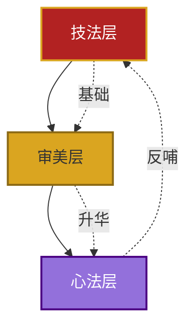

# 04-公众号排版文稿_核心思想.md

<strong>◆ 人类文明经典阅读计划 ◆</strong> 
第 21 期 · 艺术美学系列

---

## 敦煌壁画的三重境界
### 《敦煌如是绘》核心思想解读

—— 从技法到心法，从眼看到心到

---

### 一、核心思想是什么？

如果用一句话概括《敦煌如是绘》的核心思想，那就是：

> 「敦煌壁画的价值，不在于它是什么，而在于它让我们看见了什么。」

这本书不是在教你「认识敦煌」，而是在教你「通过敦煌认识美」。

它提出了一个三层递进的认知模型：

**技法层 → 审美层 → 心法层**

---

### 二、第一层：技法——看见「怎么画」

技法层是最表层的，也是最容易被看到的。

这一层的核心要义是：

**每一种技法都不是偶然，而是选择。**

- 铁线描的刚劲，是因为要表现佛陀的庄严
- 朱砂的沉稳，是因为要传递信仰的重量
- 对称构图的秩序，是因为要营造神圣的氛围

技法是手段，不是目的。

> ◇ 技法告诉你「怎么做」，但不告诉你「为什么这么做」。
> ◇ 技法是可以学习的，但技法背后的选择逻辑，才是值得思考的。

---

### 三、第二层：审美——看见「为什么美」

审美层比技法层更深一层。

它不再关注「怎么画」，而是关注「为什么这样画是美的」。

这一层的核心要义是：

**美不是感觉，是规律。**

敦煌壁画的美，不是随机的，而是遵循着一套内在的美学规律：

- **色彩的和谐**：浓烈的朱砂与深沉的石青并置，不是冲突，而是对比中的统一
- **线条的韵律**：刚劲的铁线描与柔韧的游丝描交替，不是混乱，而是节奏的变化
- **空间的秩序**：对称的构图与变化的细节并存，不是呆板，而是秩序中的灵动

> ● 审美层要解决的问题是：为什么这样的画面让人觉得美？
> ● 审美层要达成的目标是：把「感觉美」升级为「理解美」。

---

### 四、第三层：心法——看见「画的是什么」

心法层是最深层的，也是最容易被忽略的。

它不再关注「怎么画」和「为什么美」，而是关注**「画的是什么」**。

不是画面内容上的「什么」，而是精神层面的「什么」。

这一层的核心要义是：

**壁画是载体，精神才是内核。**

- 信仰层：每一笔都是虔诚的投射，不是技巧的炫耀
- 时间层：每一色都是永恒的尝试，不是瞬间的冲动
- 人的层：每一幅都是人心的映照，不是冰冷的复制

> ◇ 技法可以学习，审美可以培养，但心法需要感悟。
> ◇ 心法不是教出来的，是你在与壁画对话时，自己体会到的。

---

### 五、三层关系的本质

这三层不是孤立的，而是递进的、嵌套的。

它们之间的关系是：

**技法是基础，审美是升华，心法是归宿。**

- 没有技法，审美是空中楼阁
- 没有审美，技法是匠人之术
- 没有心法，一切都是空壳

但更重要的是：

**心法会反哺技法。**

当你理解了壁画背后的虔诚，你下笔的时候，线条会不一样。
当你感受到了千年前的审美，你设色的时候，色彩会不一样。

> ● 技法让你「能画」，审美让你「会画」，心法让你「画得动人」。
> ● 这三层，就是敦煌壁画教给我们的全部。

---

### 六、核心思想的现实意义

你可能觉得，这些都是「艺术」层面的东西，跟日常生活有什么关系？

但这本书真正想说的是：

**敦煌壁画的三层认知模型，适用于一切创造性的工作。**

- 做产品：技法是功能实现，审美是用户体验，心法是解决真正的需求
- 做设计：技法是软件操作，审美是视觉表达，心法是传递正确的信息
- 做内容：技法是写作技巧，审美是叙事节奏，心法是触动人心的力量

> ◇ 任何领域的高手，都是在三层之间自由穿梭的人。
> ◇ 任何领域的突破，都是从技法走向心法的旅程。

这就是《敦煌如是绘》的核心思想——

**它不是一本讲敦煌的书，而是一本讲「如何理解美、如何创造美、如何让美有力量」的书。**

敦煌只是一个入口，真正的目的地，是你自己对美的理解与创造。

---

━━━ ◆ ━━━

<strong>互动话题</strong> 
在你的工作或生活中，有没有经历过从「技法」到「心法」的突破？ 
在评论区分享你的故事 ◆

━━━ ◇ ━━━

<strong>系列导航</strong>

| 上一篇 | 下一篇 |
|--------|--------|
| [03-图谱逻辑](./03-公众号排版文稿_图谱逻辑.md) | [05-职场指南](./05-公众号排版文稿_职场指南.md) |

<strong>◆ 人类文明经典阅读计划 ◆</strong>

