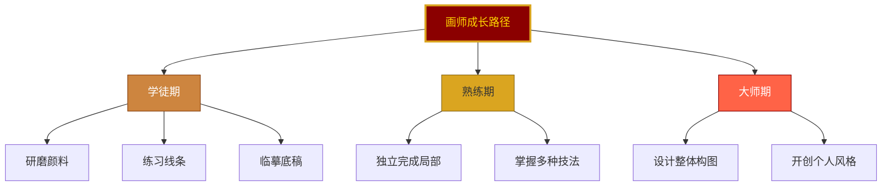
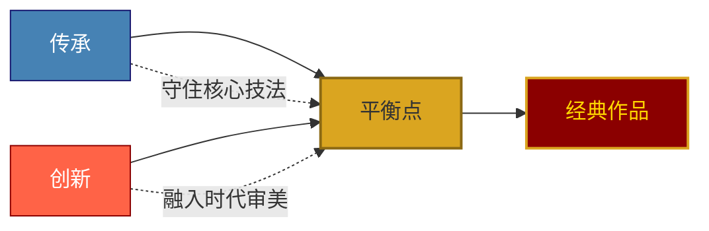

# 05-公众号排版文稿_职场指南.md

<strong>◆ 人类文明经典阅读计划 ◆</strong> 
第 21 期 · 艺术美学系列

---

## 从敦煌壁画学职场之道
### 《敦煌如是绘》给现代人的 5 条工作启示

—— 千年前的画师，比你想的更懂「职场」

---

### 一、一个意想不到的视角

说到敦煌，你想到的是旅游、是艺术、是历史。

但如果你换个角度——

**把敦煌壁画看作一个持续了一千多年的「项目」，把画师看作这个项目的「执行者」。**

你会发现，这里面藏着很多现代人职场中正在面对的问题：

- 如何在漫长的周期中保持品质？
- 如何在有限的资源下做出惊艳的作品？
- 如何在团队协作中保持一致的风格？
- 如何在传承中实现创新？

这本书虽然讲的是艺术，但给我的职场启发，可能比任何一本「职场攻略」都深。

---

### 二、启示一：把基本功练到极致

敦煌壁画的画师，不是一上来就画整面墙的。

他们要从最基础的研磨颜料开始，练线条，临底稿，几年甚至十几年才能独立作画。

**职场启示：**

> ◇ 不要急于表现，先扎实基本功。
> ◇ 真正的高手，都是在别人看不见的地方下了足够的功夫。

现代职场中，太多人急于「做出成绩」，却忽略了基本功的积累。

但敦煌的画师告诉我们：**慢，就是快。**

---

### 三、启示二：在限制中创造自由

敦煌壁画有很多限制——

- 洞窟的空间是固定的
- 颜料的种类是有限的
- 宗教的题材是有约束的

但正是在这些限制中，画师们创造出了令人惊叹的艺术。

**职场启示：**

> ● 限制不是障碍，是创造的起点。
> ● 真正的创意，不是天马行空，而是在约束中找到最优解。

现代职场中，我们总是抱怨：预算不够、时间不够、资源不够。

但敦煌的画师连现代工具都没有，他们靠的是什么？

**在限制中把每一分资源用到极致。**

---

### 四、启示三：团队协作的千年范本

一个洞窟的壁画，不是一个人完成的。

它是一个团队的成果：

设计者负责构图，起稿师负责打底，勾线师负责线条，设色师负责上色，描金师负责点睛。

每个人各司其职，但最终呈现的作品，风格高度统一。

**职场启示：**

> ◇ 好的团队不是没有分工，而是分工之后还能保持一致性。
> ◇ 协作的核心不是「各做各的」，而是「朝着同一个目标」。

现代职场中，跨部门协作常常出现「风格不统一」「信息不拉齐」的问题。

敦煌的画师团队一千年前就给出了答案：

**有明确的流程，有严格的交接标准，有统一的美学追求。**

---

### 五、启示四：传承与创新的平衡

敦煌壁画跨越一千多年，但风格一直在变化。

北朝的粗犷、隋唐的华丽、五代的简约……

每一代画师都在传承前人的技法，同时加入自己的理解。

**职场启示：**

> ● 只做传承，你会被时代淘汰。
> ● 只做创新，你会失去根基。
> ● 传承与创新的平衡点，才是长青之道。

现代职场中，我们常常陷入两个极端：要么守旧不变，要么盲目追新。

敦煌的画师告诉我们：

**守住核心的「道」，在「术」的层面大胆创新。**

---

### 六、启示五：用「长期主义」对抗焦虑

敦煌壁画最震撼我的一点是——

**它不是一个人画的，不是一代人画的，甚至不是一个朝代画的。**

它是无数无名画师，在一千多年的时间里，一笔一笔累积出来的。

他们中的大多数人，连名字都没有留下。

但他们知道，自己画的每一笔，都会成为千年后的一部分。

**职场启示：**

> ◇ 不要把目光局限在「这一份工作」上，要看「这一份事业」。
> ◇ 不要焦虑于「短期有没有回报」，要问「长期有没有积累」。

现代职场人最大的焦虑，来自于「短期反馈」——

这个月有没有涨薪？今年有没有升职？这个项目有没有被认可？

但敦煌的画师告诉我们：

**真正的价值，不是即时反馈，而是长期积累。**

你做的每一个项目、学的每一项技能、积累的每一次经验，都是在为「未来的你」添砖加瓦。

---

### 七、总结：敦煌壁画的职场哲学

| 敦煌画师的做法 | 现代职场的应用 |
|----------------|----------------|
| 从研磨颜料开始练基本功 | 扎实基础能力，不急功近利 |
| 在有限资源中创造极致美 | 在约束中寻找最优解 |
| 分工明确但风格统一 | 团队协作要有共同目标 |
| 传承技法、融入时代 | 守住核心，持续创新 |
| 千年积累、不求留名 | 长期主义，对抗焦虑 |

> ◇ 敦煌壁画教给我们的，不是怎么画画，而是怎么做事。
> ◇ 它不是艺术史，而是职场哲学。

下一次当你面对工作中的挑战时，不妨想一想：

**一千年前的画师，在没有现代工具、没有即时反馈、甚至没有留下名字的情况下，是如何一笔一笔创造出千年不朽的杰作的？**

答案也许就在其中。

---

━━━ ◆ ━━━

<strong>互动话题</strong> 
敦煌画师的哪一条职场启示最触动你？ 
在评论区分享你的感悟 ◆

━━━ ◇ ━━━

<strong>系列导航</strong>

| 上一篇 | 下一篇 |
|--------|--------|
| [04-核心思想](./04-公众号排版文稿_核心思想.md) | [06-行动挑战](./06-公众号排版文稿_行动挑战.md) |

<strong>◆ 人类文明经典阅读计划 ◆</strong>

