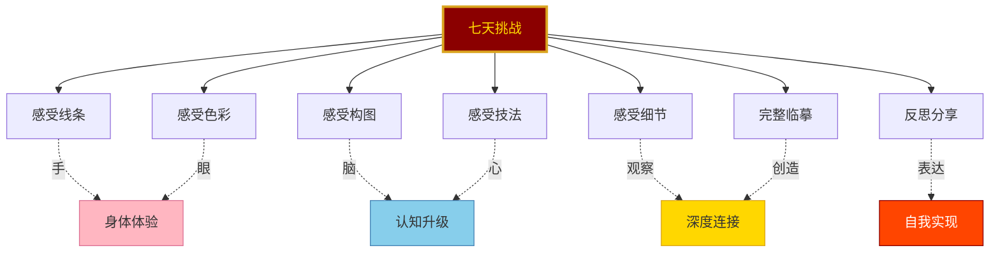

# 06-公众号排版文稿_行动挑战.md

<strong>◆ 人类文明经典阅读计划 ◆</strong> 
第 21 期 · 艺术美学系列

---

## 七天敦煌临摹挑战
### 用一周时间，体验千年壁画的温度

—— 不是画画，是一场与自己的对话

---

### 一、为什么要做这个挑战？

读完《敦煌如是绘》，你可能会有种冲动——

**想拿起笔，试一试。**

但你可能不知道怎么开始，也可能觉得自己「不会画画」。

这个七天挑战，就是为了解决这个问题。

> ◇ 不需要任何绘画基础。
> ◇ 不需要专业的画材工具。
> ◇ 只需要一支笔、一张纸，和七天的时间。

挑战的目的不是让你成为画师，而是让你**体验一次「与千年前的美对话」的过程**。

---

### 二、挑战总览

七天，七个阶段，从简单到完整，从技法到心法。

每一天的任务控制在 30-60 分钟内，适合忙碌的现代人。

---

### 三、每日挑战详情

#### 第一天：线条初体验

**目标**：感受敦煌线条的韵律

**材料**：铅笔、白纸

**任务**：
1. 在书中找到一幅飞天的图片
2. 用铅笔轻轻描出飞天的外轮廓
3. 重点练习手臂和飘带的曲线
4. 重复画 5 条不同弧度的飘带

> ◇ 不要追求完美，追求手感。
> ◇ 每一根线条都是呼吸的延伸。

**思考**：画的过程中，你的手和书里的线条，有没有某个瞬间产生了「共鸣」？

---

#### 第二天：色彩的感知

**目标**：感受敦煌色彩的层次

**材料**：彩色铅笔或水彩笔

**任务**：
1. 选择书中一个局部图案（莲花或火焰纹）
2. 用三种相近的颜色做渐变练习
3. 尝试用朱砂红、石青蓝、石绿绿的搭配
4. 观察三种颜色叠加后的效果

> ● 敦煌的色彩之美，在于叠加，不在于单一。
> ● 颜色的层次，就是时间的层次。

**思考**：三种颜色的组合，让你想到了什么？

---

#### 第三天：构图的拆解

**目标**：理解壁画的布局逻辑

**材料**：铅笔、白纸、直尺

**任务**：
1. 选择一幅经变图的页面
2. 用铅笔和直尺画出画面的中轴线
3. 标出画面的中心、左右对称的元素
4. 在旁边画出简化版的布局草图

> ◇ 敦煌壁画的对称不是死板的，是秩序中的灵动。
> ◇ 构图的本质，是引导观者的视线。

**思考**：这幅经变图的视觉中心在哪里？为什么？

---

#### 第四天：技法的尝试

**目标**：体验壁画的绘制步骤

**材料**：铅笔、彩色铅笔、白纸

**任务**：
1. 打稿：用铅笔轻轻画出一个莲花图案
2. 勾线：用深色笔沿着铅笔稿勾勒轮廓
3. 设色：用彩色铅笔填充颜色
4. 晕染：用手指或纸巾轻轻揉搓边缘，制造渐变效果

> ● 每一步都要慢，慢到你能感受到笔尖的力度。
> ● 技法不是目的，体验过程才是。

**思考**：哪一步让你最有感觉？为什么？

---

#### 第五天：细节的凝视

**目标**：训练观察力

**材料**：书、放大镜（可选）、笔记

**任务**：
1. 选择书中你最感兴趣的一个画面
2. 用放大镜或凑近仔细观察一个局部
3. 记录你发现的所有细节（笔触的方向、颜色的过渡、线条的粗细变化）
4. 用文字描述这些细节给你的感受

> ◇ 细节是壁画最迷人的地方。
> ◇ 观察细节，就是与画师对话。

**思考**：你发现的细节中，哪一个最让你惊讶？

---

#### 第六天：完整临摹

**目标**：完成一幅完整的临摹作品

**材料**：铅笔、彩色铅笔、白纸、橡皮

**任务**：
1. 选择书中一幅相对简单的图案
2. 按照前五天的练习步骤，从打稿到完成
3. 不要追求与原图完全一致
4. 在角落写下日期和你的感受

> ◇ 这是你的作品，不是复制品。
> ◇ 临摹的意义，在于过程中的感悟。

**思考**：完成作品的那一刻，你心里是什么感觉？

---

#### 第七天：反思与分享

**目标**：整合七天的体验

**材料**：笔记、手机

**任务**：
1. 回顾七天的练习作品和笔记
2. 写下一段 100-200 字的感受
3. 拍摄你的作品，分享到社交媒体
4. 标注话题 #敦煌如是绘七天挑战

> ◇ 七天不是终点，是起点。
> ◇ 分享不是炫耀，是邀请更多人加入这场与美的对话。

---

### 四、挑战的延伸

完成七天的基础挑战后，你可以：

**1. 进阶挑战**
- 尝试更复杂的图案（飞天、佛陀、经变图局部）
- 尝试使用更接近古法材料（矿物颜料、宣纸）
- 尝试临摹不同时期的壁画风格

**2. 社群挑战**
- 组建线上临摹小组，每周分享作品
- 互相点评，交流感受
- 积累作品后，策划一次线上展览

**3. 实地挑战**
- 带着七天的体验，去敦煌实地参观
- 在洞窟前，感受与临摹时完全不同的震撼
- 理解「为什么有些美，只能在现场才能体会」

---

### 五、写给犹豫的你

你可能在想：

「我没有绘画基础，能做吗？」

「我工作很忙，有时间吗？」

「我画不好，分享出去会不会丢脸？」

我的回答是：

> ◇ 这个挑战不是关于「画得好不好」，而是关于「你有没有尝试」。
> ◇ 每天 30 分钟，七天就是三个半小时。你刷短视频的时间远不止这些。
> ◇ 没有人会嘲笑一个真诚尝试的人。

敦煌壁画的画师们，最初也是从不会画开始的。

他们也是一笔一笔练出来的。

你不需要成为画师，你只需要**开始**。

---

### 六、行动号召

现在，就做三件事：

**1. 准备好材料**
一支铅笔，一张白纸，一本《敦煌如是绘》。

**2. 设定时间**
在日历上标记接下来的七天，每天留出 30 分钟。

**3. 开始第一天**
不要等「完美的时机」，今天就是最好的开始。

> ● 千年前的画师在洞窟里，举着油灯，一笔一画。
> ● 今天，你在书桌前，拿起笔，开始你的第一天。

这不是模仿，是传承。

不是复制，是对话。

不是画画，是体验。

**你，准备好了吗？**

---

━━━ ◆ ━━━

<strong>参与方式</strong> 
完成每日任务后，在评论区打卡你的进度 
带话题 #敦煌如是绘七天挑战 分享你的作品 ◆

━━━ ◇ ━━━

<strong>系列导航</strong>

| 上一篇 | 回到首页 |
|--------|----------|
| [05-职场指南](./05-公众号排版文稿_职场指南.md) | [艺术美学系列](../../) |

<strong>◆ 人类文明经典阅读计划 ◆</strong>

