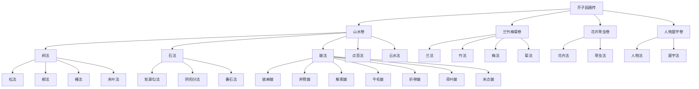
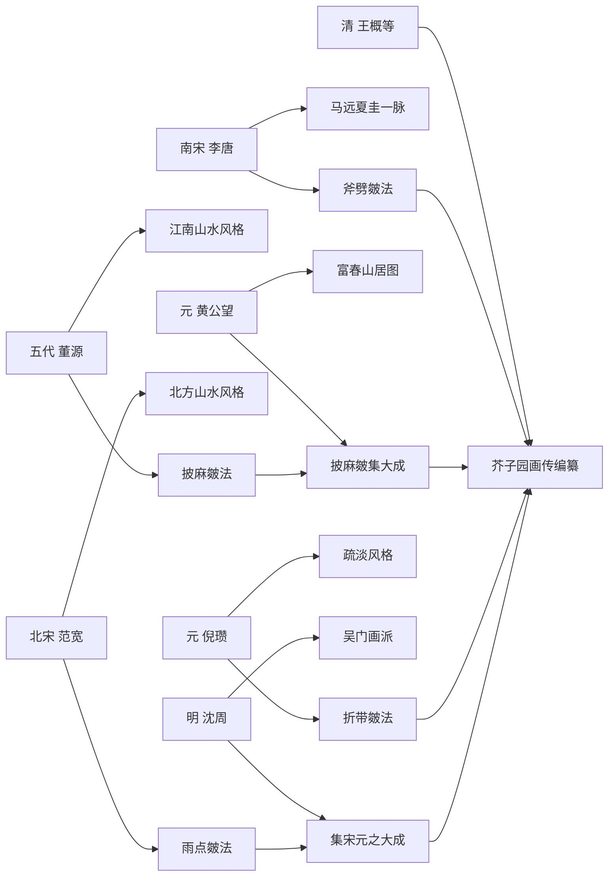
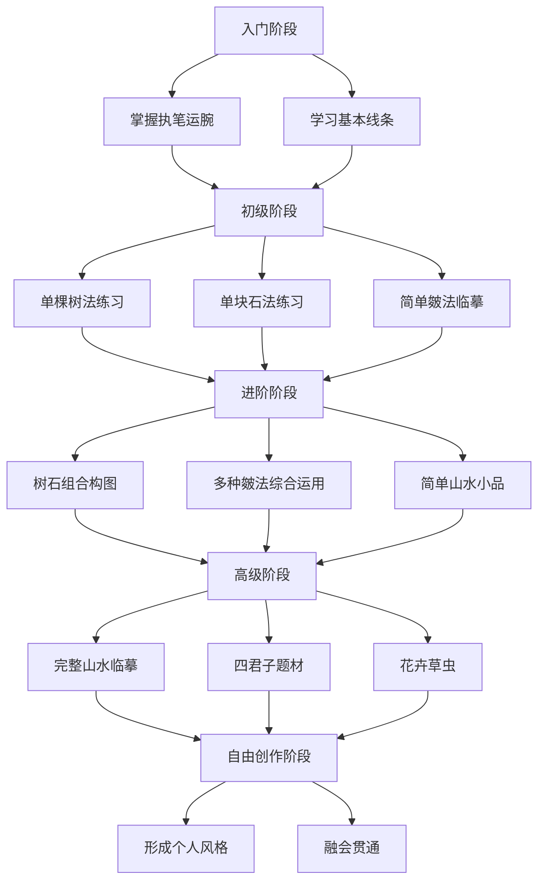
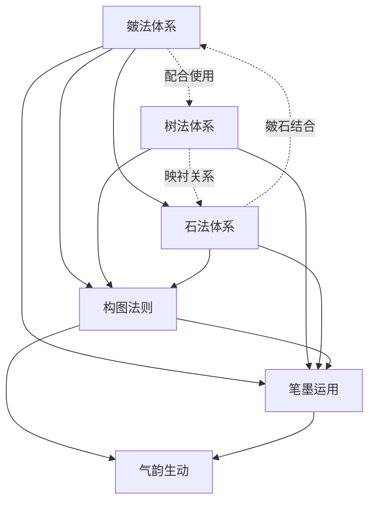

# 02-知识图谱：一张图看懂《芥子园画传》的技法宇宙

> "画传不是画册，是一套可视化的中国画教学系统。"

◆ **系列导航**
[01-读后感](#) ｜ [02-知识图谱](#) ｜ [03-图谱逻辑](#) ｜ [04-核心思想](#) ｜ [05-职场指南](#) ｜ [06-行动挑战](#)

---

## 图谱一：技法分类树

《芥子园画传》的技法体系，可以看作一棵完整的"分类树"。从根到叶，层层展开，每一层都有清晰的逻辑关系。

这棵分类树揭示了一个核心事实：中国画的教学，是有体系的。它不是"跟着感觉走"，而是从基础笔画到复杂构图，每一步都有章法。

---

## 图谱二：师承人物图谱

《芥子园画传》虽为清代编纂，但其技法源头可以追溯到宋元明诸家。理解这些师承关系，有助于把握中国画的演进脉络。

这条师承线说明，《芥子园画传》不是凭空创造的，而是对前人技法的系统整理。它把分散在历代名家作品中的"技法碎片"，拼成了一张完整的"学习地图"。

---

## 图谱三：学习路径图

学习《芥子园画传》不是一蹴而就的事。它有一条清晰的学习路径，从基础到进阶，从局部到整体。

这条路径的关键词是"循序渐进"。每一个阶段都建立在前一阶段的基础之上。跳过任何一个环节，都会导致后续学习的困难。

---

## 图谱四：技法关联网络

中国画技法之间存在着千丝万缕的联系。皴法不是孤立的，它与树法、石法、构图法相互关联，形成一个有机的整体。

这张网络图揭示了技法的"系统性"。单独学习某一种皴法或某一种树法是不够的，必须在整体的框架下理解它们之间的关系。

---

## 互动话题

● 从知识图谱中，你发现中国画技法体系的哪些特点？
● 你觉得这种"分类-师承-路径-关联"的图谱方法，是否可以迁移到其他领域的学习中？

欢迎在评论区分享你的观察。

---

> **下期预告**：03 期，我们将深入解析这些知识图谱背后的逻辑：为什么《芥子园画传》要这样编排？它的教学设计有什么精妙之处？

◆ **系列导航**
[01-读后感](#) ｜ [02-知识图谱](#) ｜ [03-图谱逻辑](#) ｜ [04-核心思想](#) ｜ [05-职场指南](#) ｜ [06-行动挑战](#)

---

*本文属于「人类文明经典阅读计划」系列第 22 期。用现代视角重读经典，让古老智慧照亮当下生活。*
