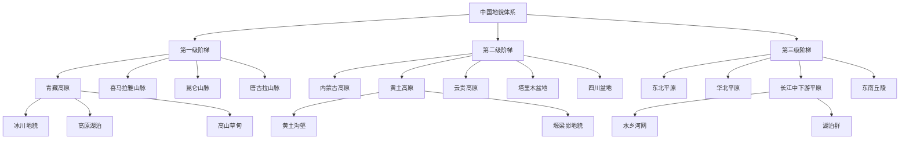
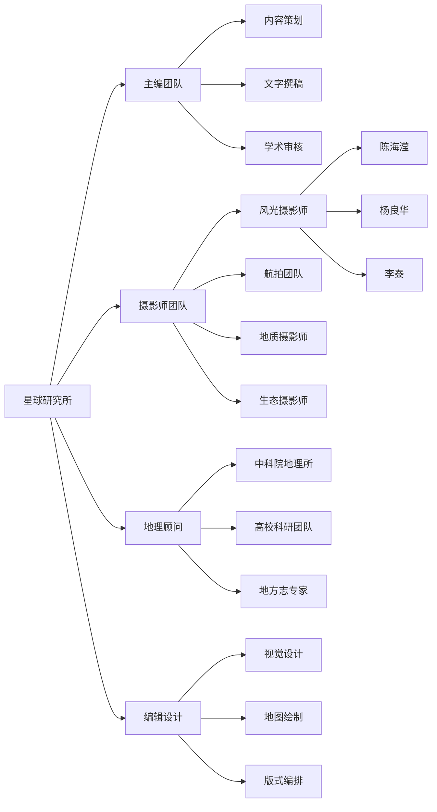
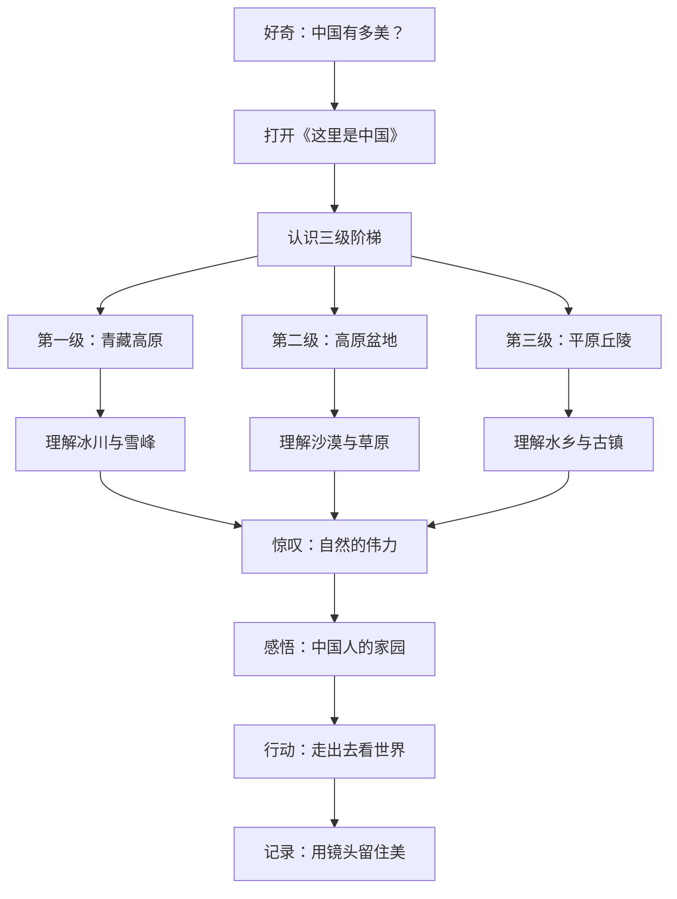
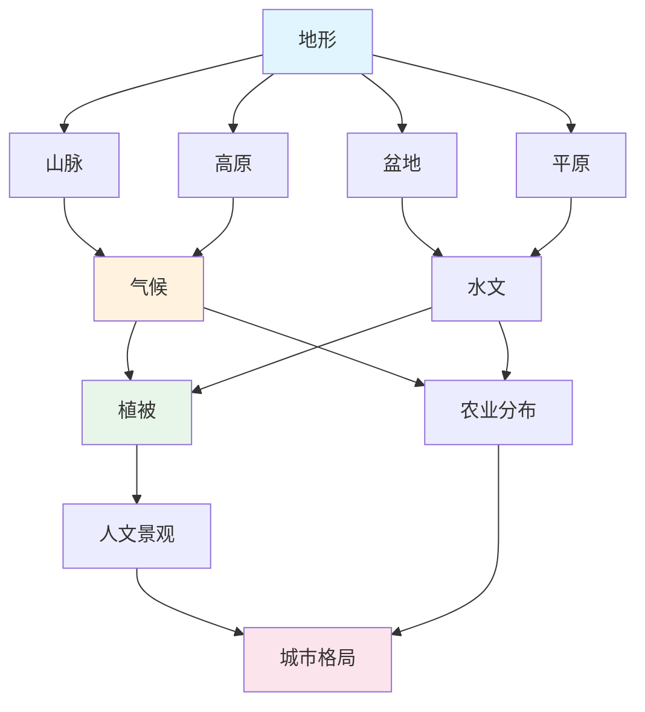
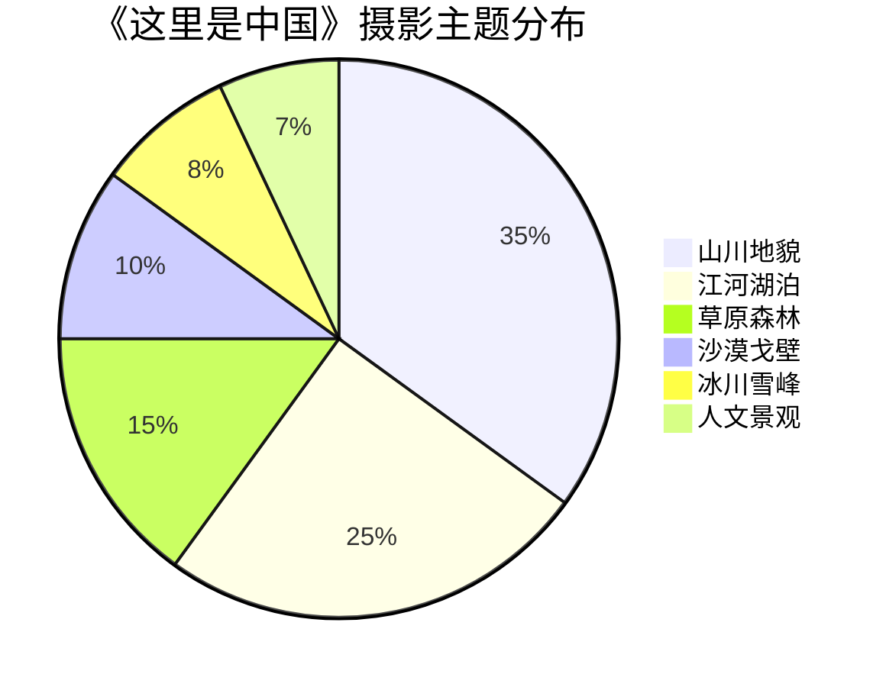

# 《这里是中国》知识图谱

> 一张图，看懂中国地理的底层逻辑。

---

## ◆ 图表一：中国地貌分类树

**解读**：中国地貌按三级阶梯展开，每一级阶梯下细分典型地貌单元，构成完整的地理知识框架。

---

## ◆ 图表二：《这里是中国》创作人物图谱

**解读**：一本好书的背后是跨学科团队的协作，从学术严谨到视觉震撼，缺一不可。

---

## ◆ 图表三：中国之美探索路径

**解读**：从好奇出发，经过认知、理解、惊叹、感悟，最终走向行动——这正是这本书希望带给读者的旅程。

---

## ◆ 图表四：中国地理要素网络图

**解读**：地形决定气候，气候影响水文和植被，最终塑造人文景观和城市格局。这是一张理解中国地理因果关系的核心网络。

---

## ◆ 图表五：中国摄影美学主题分布

**解读**：山川与水域是本书的核心视觉主题，合计占比超过 60%，完美诠释了"山河壮美"这四个字。

---

## ◆ 图表使用指南

| 图表 | 适用场景 | 核心价值 |
|------|----------|----------|
| 分类树 | 理解中国地貌体系 | 建立全局框架 |
| 人物图谱 | 了解创作团队 | 感受专业力量 |
| 路径图 | 阅读旅程指引 | 激发探索欲望 |
| 网络图 | 地理要素关联 | 理解因果关系 |
| 饼图 | 视觉主题分布 | 把握内容重点 |

> 将这些图表嵌入文章，可以让读者从"感性欣赏"走向"理性认知"，这正是知识图谱的价值。

---

## ◆ 系列导航

> **人类文明经典阅读计划**  
> 第 23 期 · 艺术美学系列  
> 主题：《这里是中国》知识图谱

◇ [01 读后感](01-公众号排版文稿_读后感.md)  
◆ [02 知识图谱](02-知识图谱图片描述.md)  
◆ [03 图谱逻辑](03-公众号排版文稿_图谱逻辑.md)  
◇ [04 核心思想](04-公众号排版文稿_核心思想.md)  
◇ [05 职场指南](05-公众号排版文稿_职场指南.md)  
◇ [06 行动挑战](06-公众号排版文稿_行动挑战.md)

---

> **下期预告**：我们将解读这些知识图谱背后的设计逻辑，看看它们是如何帮助读者建立认知框架的。

**星标公众号，不错过每一期精彩内容。**
