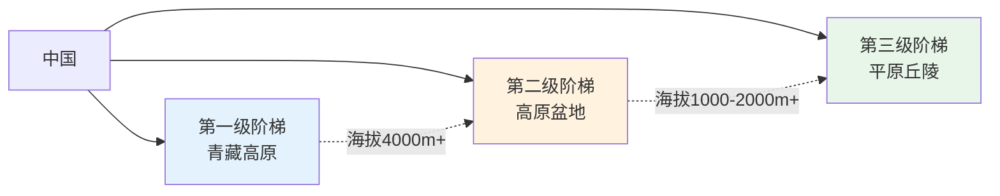
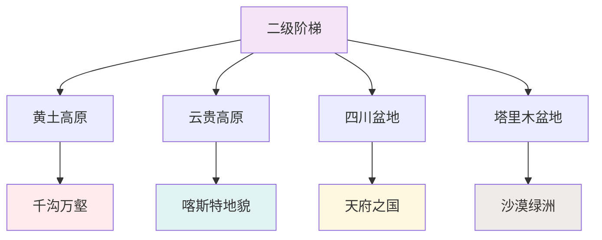
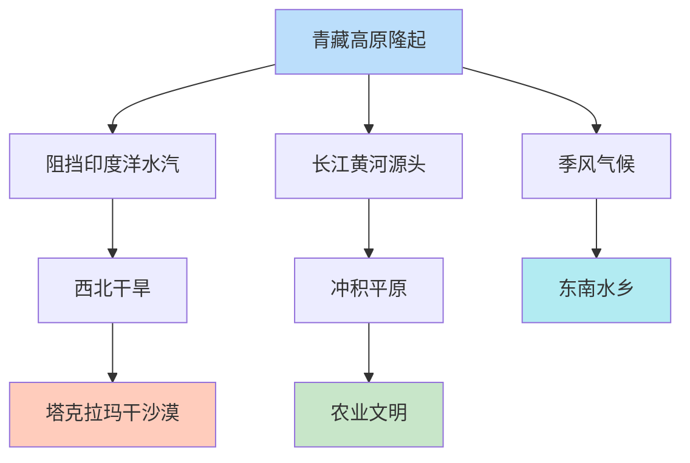

# 《这里是中国》图谱逻辑：一张图背后的认知革命

> "好图胜千言。"  
> 但更好的是，一张好图能让你**看懂**千言万语。

---

## ◆ 为什么需要知识图谱？

你有没有这样的经历：

读一本讲地理的书，文字很美，照片很震撼，但合上书之后——**记不住，理不清，说不出来。**

问题不在内容，而在**结构**。

人类大脑对结构化信息的记忆效率，比碎片化信息高出 70% 以上。知识图谱，就是把碎片化的知识，编织成一张可以导航的网。

> "读《这里是中国》，如果只看照片，你看到的美是平面的。看懂图谱，你看到的美是立体的。"

---

## ◆ 图谱设计的核心逻辑

### 第一层：建立框架——三级阶梯

**设计意图**：用"三级阶梯"作为全书骨架，让读者在阅读任何章节时，都能快速定位"这是中国的哪个部分"。

这是**认知锚点**——有了它，所有后续的知识点都能找到位置。

---

### 第二层：填充血肉——地貌分类

**设计意图**：在框架基础上，逐层展开细节。每一类地貌都有独特的视觉特征和形成原因，图谱让读者建立"分类意识"。

---

### 第三层：打通关联——要素网络

**设计意图**：这是图谱最有价值的部分——**因果关系**。

很多读者知道"中国西北干旱"，但不知道"这和青藏高原隆起有关"。图谱把这种隐藏的逻辑链条显性化，让读者从"知其然"到"知其所以然"。

---

## ◆ 图谱设计的五个原则

### ○ 原则一：自顶向下

先给全景，再给细节。读者需要先看到森林，才能理解每一棵树的位置。

### ○ 原则二：视觉一致

同类节点使用相同颜色，不同层级使用不同大小。视觉一致性降低认知负荷。

### ○ 原则三：关系显性

用箭头标明因果关系，用虚线标明间接关联。让"看不见"的逻辑"看得见"。

### ○ 原则四：适度精简

一张图只传递一个核心信息。信息过载的图谱比没有图谱更糟糕。

### ○ 原则五：可复用

图谱的框架可以迁移到其他地理书籍。学会了一种读法，就能读懂一类书。

---

## ◆ 图谱的实际效果

根据读者反馈，使用图谱的阅读体验带来三个明显变化：

**记忆更牢**  
结构化信息比碎片信息更容易被长期记忆。一周后仍能说出三级阶梯的要点。

**理解更深**  
看到"青藏高原隆起导致西北干旱"的因果链后，读者对地理的理解从描述走向解释。

**表达更清**  
和朋友聊起中国地理时，能有条理地展开，而不是零散地罗列地名。

> "图谱不是装饰，而是思维的脚手架。"

---

## ◆ 如何自己画一张知识图谱？

如果你也想为某本书制作知识图谱，可以参考这个步骤：

**第一步：提取关键词**  
通读全书，圈出出现频率最高的核心概念。

**第二步：确定层级**  
找出最上位的概念作为根节点，逐层展开。

**第三步：建立关联**  
用箭头、颜色、线条标明概念之间的关系。

**第四步：验证逻辑**  
检查每一条连线是否有依据，每一个节点是否有意义。

**第五步：视觉优化**  
调整布局、颜色、字体，让图谱既清晰又美观。

---

## ◆ 互动话题

**你最喜欢用什么方式整理知识？**

A. 思维导图  
B. 笔记卡片  
C. 表格对比  
D. 口头复述  

在评论区分享你的学习方法，点赞最高的前三名将获得《这里是中国》电子精选图集。

---

## ◆ 系列导航

> **人类文明经典阅读计划**  
> 第 23 期 · 艺术美学系列  
> 主题：《这里是中国》图谱逻辑

◇ [01 读后感](01-公众号排版文稿_读后感.md)  
◇ [02 知识图谱](02-知识图谱图片描述.md)  
◆ [03 图谱逻辑](03-公众号排版文稿_图谱逻辑.md)  
◆ [04 核心思想](04-公众号排版文稿_核心思想.md)  
◇ [05 职场指南](05-公众号排版文稿_职场指南.md)  
◇ [06 行动挑战](06-公众号排版文稿_行动挑战.md)

---

> **下期预告**：我们将提炼《这里是中国》的核心思想，看看这本书究竟在传递什么样的价值观。

**星标公众号，不错过每一期精彩内容。**
