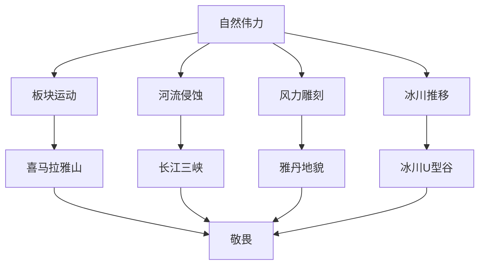
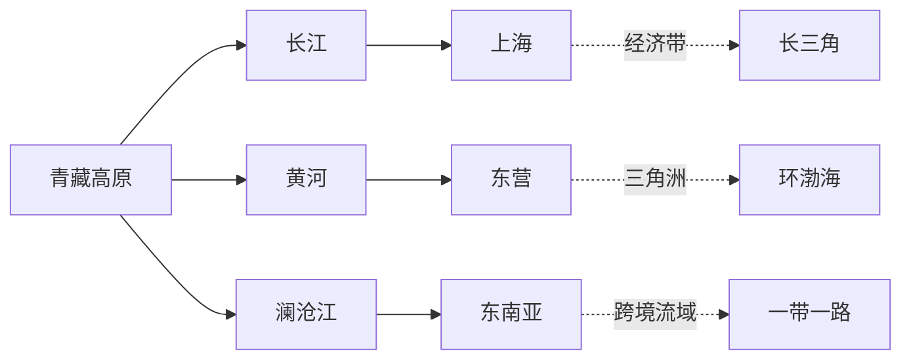
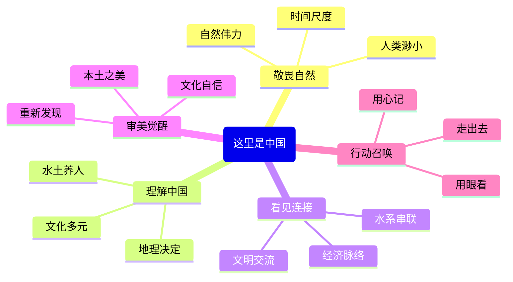

# 《这里是中国》核心思想：山河背后的中国精神

> "你脚下的大地，是一部写满了亿万年的史书。"

---

## ◆ 一本书的野心

《这里是中国》的野心，不只是展示中国有多美。

它真正想做的，是**用地理的视角，重新回答一个问题：什么是中国？**

不是地图上的雄鸡，不是新闻里的数据，而是那片有山有水、有沙漠有绿洲、有冰川有温泉的真实大地。

> "读懂了中国地理，就读懂了中国人的性格底色。"

---

## ◆ 核心思想一：敬畏自然

翻开《这里是中国》，最先冲击你的是**尺度的震撼**。

一座山的隆起需要几千万年，一条峡谷的形成需要上亿次水流冲刷。人类在自然面前，渺小如尘埃。

但这本书没有让你感到无力，反而让你感到**敬畏**——敬畏这颗星球塑造地貌的力量，敬畏时间雕刻大地的耐心。

> "每一道褶皱，都是大地写给时间的情书。"

---

## ◆ 核心思想二：理解中国

中国人常说"一方水土养一方人"。

《这里是中国》用地理证据告诉你，这句话不是修辞，是事实。

**● 黄土高原的沟壑**  
塑造了西北人坚韧、务实的性格。在贫瘠中求生，让人懂得珍惜。

**● 江南水乡的河网**  
孕育了东南人灵秀、细腻的气质。水汽氤氲中，生出诗画般的审美。

**● 草原的辽阔**  
培养了游牧民族豪迈、奔放的精神。天高地阔，心胸自然开阔。

**● 山川的阻隔**  
造就了中国的多元文化。十里不同音，百里不同俗，地理隔离让每个地方都长出了独特的文化基因。

> "地理不只是风景，它是中国人性格的模具。"

---

## ◆ 核心思想三：看见连接

中国之美，不在一山一水，而在**万物相连**。

青藏高原的冰川融水，化作长江黄河，流经几千公里，最终汇入大海。沿途滋养了农田、孕育了城市、串联了文明。

这就是中国的**地理连接力**——从世界屋脊到东海之滨，从雪域高原到鱼米之乡，一切都不是孤立的。

> "看懂了连接，就看懂了中国。"

---

## ◆ 核心思想四：审美觉醒

《这里是中国》最重要的贡献，是**唤醒中国人对本土之美的感知力**。

我们太熟悉"巴黎铁塔""东京樱花""瑞士雪山"，却对自己家门口的风景习以为常。

这本书在说：

**你不需要出国才能看到世界级的风景。**

● 稻城亚丁不输阿尔卑斯  
● 张掖丹霞不输科罗拉多大峡谷  
● 喀斯特峰林不输越南下龙湾  
● 呼伦贝尔草原不输蒙古大草原

> "最美的风景，就在你脚下这片土地。"

---

## ◆ 核心思想五：行动召唤

地理不只是知识，更是**行动的指南**。

知道雅鲁藏布大峡谷是世界第一大峡谷，你下次旅行会不会多一个目的地？

知道丹霞地貌的成因，你站在张掖的彩色山丘前会不会多一份感动？

知道三级阶梯的逻辑，你看中国地图时会不会多一层理解？

> "知识如果不转化为行动，就只是脑中的装饰。"

---

## ◆ 一张图看懂核心思想

---

## ◆ 核心金句

> "中国人对脚下的土地，有着最深沉的爱。这种爱不是抽象的口号，而是具象的——是一口井、一条河、一座山、一片田野。"

> "地理学最浪漫的地方在于，它告诉你：你此刻站立的地方，曾是一片海洋，曾是一座火山，曾是一条冰川。"

> "中国的美，不是精致的盆景，而是壮阔的画卷。它需要你用脚步去丈量，用眼睛去记录，用心去感受。"

---

## ◆ 互动话题

**《这里是中国》的五个核心思想中，哪个最触动你？**

A. 敬畏自然  
B. 理解中国  
C. 看见连接  
D. 审美觉醒  
E. 行动召唤  

在评论区告诉我们你的选择，并分享一个"被中国风景震撼"的瞬间。

---

## ◆ 系列导航

> **人类文明经典阅读计划**  
> 第 23 期 · 艺术美学系列  
> 主题：《这里是中国》核心思想

◇ [01 读后感](01-公众号排版文稿_读后感.md)  
◇ [02 知识图谱](02-知识图谱图片描述.md)  
◇ [03 图谱逻辑](03-公众号排版文稿_图谱逻辑.md)  
◆ [04 核心思想](04-公众号排版文稿_核心思想.md)  
◆ [05 职场指南](05-公众号排版文稿_职场指南.md)  
◇ [06 行动挑战](06-公众号排版文稿_行动挑战.md)

---

> **下期预告**：我们将把《这里是中国》的地理美学转化为职场方法论，看看山河壮美如何启发你的职业发展。

**星标公众号，不错过每一期精彩内容。**
