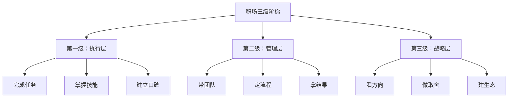
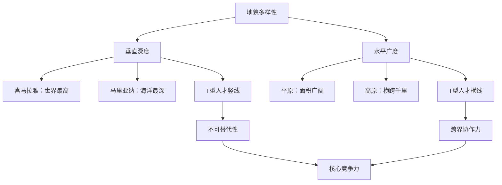
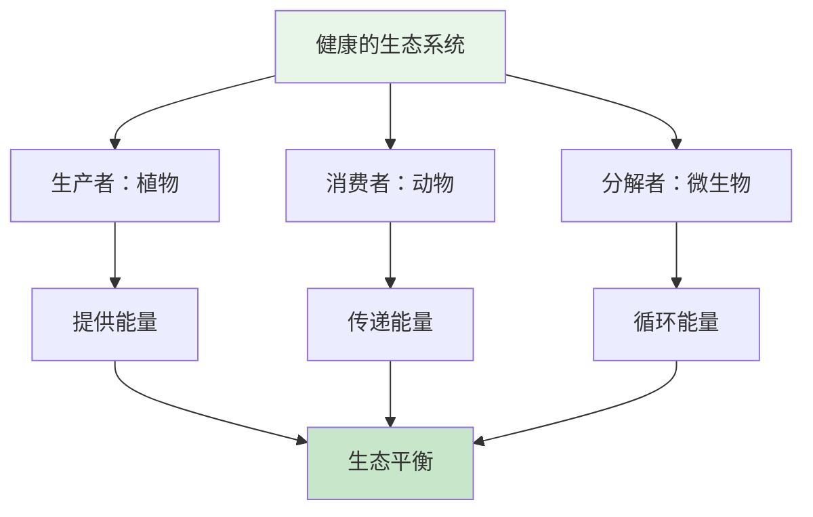

# 《这里是中国》职场启示：从山河壮美到职场突围

> "如果大地能隆起成山，你为什么不能成长为一座峰？"

---

## ◆ 地理思维：职场人的隐藏武器

你可能会问：一本讲中国地理的书，和职场有什么关系？

答案是：**地理思维，是最好的职场思维。**

三级阶梯教会我们定位，地貌演化教会我们耐心，水系连接教会我们协作，而每一幅极致摄影的背后，都藏着一套职场方法论。

> "读懂了中国地理，你就读懂了成长的底层逻辑。"

---

## ◆ 启示一：找准你的"阶梯"

### 职场三级阶梯模型

中国地形的三级阶梯，完美对应职场成长的三个阶段。

**关键洞察**：你不能跳过第一级直接上第二级。青藏高原的隆起花了数千万年，你的职业成长也需要台阶。

**行动建议**：
- 明确自己当前在哪一级
- 找到通往下一级的"地质运动"——也就是关键能力
- 不要急，但要稳

---

## ◆ 启示二：像河流一样成长

### 河流的职场智慧

长江和黄河有一个共同点：**从不怕绕路。**

长江在横断山区绕了无数个弯，黄河在黄土高原改道几十次。但它们最终都流入了大海。

**职场映射**：
- 短期看，绕路是浪费时间
- 长期看，绕路是积蓄能量

遇到阻碍时，不要硬刚，学会"绕"——换一条路，换一个方法，换一个角度。河流的智慧，就是**迂回前进**。

> "职场没有直路，但所有弯路最终都会汇入大海。"

---

## ◆ 启示三：地貌多样性 = 能力多样性

### T型人才的地貌学解释

中国地貌的伟大之处，在于**既有世界最高峰，也有世界最大平原**。

职场也是一样：
- 你需要在某一个领域足够深（像喜马拉雅）
- 同时需要知识面足够广（像华北平原）

**行动建议**：
- 找到你的"主峰"——你最擅长的领域，做到极致
- 拓展你的"平原"——相关领域的知识，建立连接
- 不要什么都学一点，也不要只会一件事

---

## ◆ 启示四：像摄影师一样思考

### 极致视角的职场应用

《这里是中国》的摄影师教会我们一件事：**同样的风景，不同的视角，完全不同的结果。**

**职场中的视角切换**：

**● 航拍视角**  
跳出细节，看全局。做项目时先画全景图，再填细节。

**● 微距视角**  
深入细节，找差异。做汇报时用数据和案例说话，不空谈。

**● 延时视角**  
拉长时间线，看趋势。做职业规划时看三年五年，不要只看眼前。

**● 对比视角**  
找到参照物，显价值。做方案时先展示"之前"和"之后"的对比。

> "好的职场人，都是视角切换的高手。"

---

## ◆ 启示五：生态系统的协作智慧

### 自然生态 vs 团队生态

一个健康的自然生态系统，需要生产者、消费者和分解者的协同。

一个健康的团队，也是一样的：

**● 生产者**——创造内容、产出方案的人  
**● 消费者**——使用内容、推动落地的人  
**● 分解者**——优化流程、复盘总结的人

**关键洞察**：没有谁比谁更重要。一个团队如果只有生产者，产出会堆积如山；如果只有分解者，什么都不会发生。

**行动建议**：
- 明确自己在团队中的角色
- 尊重其他角色的价值
- 在不同场景下灵活切换角色

---

## ◆ 职场行动清单

| 地理启示 | 职场行动 | 检查标准 |
|----------|----------|----------|
| 三级阶梯 | 明确职业阶段 | 能说清当前目标和下一台阶 |
| 河流智慧 | 学会迂回前进 | 遇到困难能换方法不硬刚 |
| 地貌多样 | 打造T型能力 | 有一项专长加三项辅修 |
| 摄影视角 | 切换思考角度 | 能用至少三种视角看问题 |
| 生态协作 | 定位团队角色 | 能说出自己对团队的价值 |

---

## ◆ 互动话题

**你目前处于职场"三级阶梯"的哪一层？**

A. 执行层——打磨技能，建立口碑  
B. 管理层——带团队，拿结果  
C. 战略层——看方向，做取舍  
D. 创业层——建生态，定规则  

在评论区分享你的阶段和目标，我会针对性地给出建议。

---

## ◆ 系列导航

> **人类文明经典阅读计划**  
> 第 23 期 · 艺术美学系列  
> 主题：《这里是中国》职场指南

◇ [01 读后感](01-公众号排版文稿_读后感.md)  
◇ [02 知识图谱](02-知识图谱图片描述.md)  
◇ [03 图谱逻辑](03-公众号排版文稿_图谱逻辑.md)  
◇ [04 核心思想](04-公众号排版文稿_核心思想.md)  
◆ [05 职场指南](05-公众号排版文稿_职场指南.md)  
◆ [06 行动挑战](06-公众号排版文稿_行动挑战.md)

---

> **下期预告**：我们将发起一个7天行动挑战，把《这里是中国》的启发变成实际改变。你准备好了吗？

**星标公众号，不错过每一期精彩内容。**
