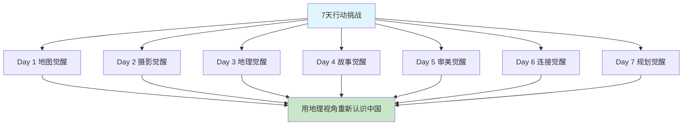

# 《这里是中国》7天行动挑战：把山河装进生活

> "读过一千次中国的美，不如真正走出去一次。"

---

## ◆ 为什么是挑战？

读完《这里是中国》，你最大的感受是什么？

震撼？感动？向往？

但如果这些感受只停留在"哇，好美"，然后关掉书继续刷手机——那这本书的价值，你只兑现了不到 10%。

**知识如果不转化为行动，就只是大脑的装饰品。**

这期内容，我们不谈理论，只做一件事：

**用 7 天时间，把《这里是中国》的启发，变成你生活里的真实改变。**

---

## ◆ 挑战总览：7天7个行动

---

## ◆ Day 1：地图觉醒

### 任务：重新看一张中国地图

**行动**：
1. 找一张中国地形图（纸质或电子版）
2. 花 15 分钟，找出三级阶梯的分界线
3. 在你去过的城市上贴标签
4. 在你想去的地方画圈

**思考**：
- 你去过的地方集中在哪个阶梯？
- 哪些地貌类型你还没见过？
- 你离"看遍中国地貌"还有多远？

**输出**：在笔记本上画一张简化的三级阶梯地图，标注你的足迹。

> "地图不是纸，是可能性。"

---

## ◆ Day 2：摄影觉醒

### 任务：用地理摄影师的眼光拍一张照片

**行动**：
1. 走出家门，找一个自然场景（公园、河边、山上都行）
2. 不要拍"到此一游"，拍"地貌特征"
3. 尝试三个角度：航拍视角（高处）、微距视角（近处）、延时视角（记录变化）
4. 从中选出最满意的一张

**思考**：
- 你拍到的地貌是什么类型？
- 光线、角度、构图如何影响了最终效果？
- 如果你是《这里是中国》的摄影师，你会怎么拍这个场景？

**输出**：在朋友圈或社交媒体发布照片，配上地貌类型的文字说明。

---

## ◆ Day 3：地理觉醒

### 任务：了解你所在城市的地质故事

**行动**：
1. 搜索你所在城市的地质背景
2. 回答三个问题：
   - 这里的地形是什么类型？
   - 这种地形是怎么形成的？
   - 地形如何影响了这座城市的发展？
3. 把答案整理成 300 字的小短文

**示例**：
"我住在成都，这座城市位于四川盆地西部。盆地形成于板块运动，四周被山脉环绕，中间是冲积平原。正是因为这种地形，成都平原成为天府之国，都江堰的灌溉系统让这里两千年旱涝从人。"

**输出**：完成你的城市地质小传。

---

## ◆ Day 4：故事觉醒

### 任务：给一个中国地貌写一段"自述"

**行动**：
1. 从《这里是中国》中选一个最打动你的地貌
2. 用第一人称写一段 500 字的"自述"
3. 包含以下信息：
   - 你是什么？在哪里？
   - 你是怎么形成的？
   - 你见证了什么？
   - 你对人类有什么期待？

**示例开头**：
"我是雅鲁藏布大峡谷，地球上最深的峡谷。印度洋板块和亚欧板块碰撞时，我被撕裂、被挤压、被抬升。我见过冰川从头顶滑过，见过江水在我身体里咆哮了千万年。"

**输出**：完成你的地貌自述。

---

## ◆ Day 5：审美觉醒

### 任务：建立你的"中国之美"收藏夹

**行动**：
1. 在手机里建一个相册，命名为"中国之美"
2. 从网上收集 20 张中国风景照片（建议来源：星球研究所、图虫、500px）
3. 按地貌类型分类：山川、江河、草原、沙漠、冰川、海岸
4. 给每张照片写一句"为什么选它"

**思考**：
- 你收集的照片有什么共同特点？
- 哪些地貌类型你收集得最多？为什么？
- 这些照片反映了你怎样的审美偏好？

**输出**：完成你的"中国之美"收藏夹。

---

## ◆ Day 6：连接觉醒

### 任务：绘制你的"山河连接图"

**行动**：
1. 选一条你感兴趣的中国河流
2. 从源头到入海口，画出它的流经路线
3. 标注沿途的主要城市、地貌、文化特征
4. 思考：这条河如何串联起中国？

**示例：长江**
- 源头：唐古拉山冰川
- 上游：横断山脉（高山峡谷）
- 中游：四川盆地（天府之国）
- 下游：长江中下游平原（鱼米之乡）
- 入海：上海（国际大都市）

**输出**：完成你的山河连接图。

---

## ◆ Day 7：规划觉醒

### 任务：制定你的"中国地貌打卡计划"

**行动**：
1. 列出你最想去的 10 个中国地貌景点
2. 按优先级排序（考虑时间、预算、季节）
3. 制定一个 1 年内可执行的旅行计划（至少 3 个目的地）
4. 为第一个目的地做初步攻略

**参考清单**：
- 第一级阶梯：珠峰大本营、纳木错、稻城亚丁
- 第二级阶梯：张掖丹霞、壶口瀑布、黄果树瀑布
- 第三级阶梯：黄山、武夷山、长白山

**输出**：完成你的地貌打卡计划。

---

## ◆ 挑战奖励

完成 7 天挑战后，你将获得：

**● 认知升级**  
从"看风景"升级到"看懂风景"，地理视角将成为你观察世界的默认模式。

**● 行动积累**  
7 天的输出将成为你的个人知识库，未来旅行时可以直接调用。

**● 审美提升**  
你的朋友圈将不再是千篇一律的自拍，而是有深度、有审美的中国风景记录。

**● 规划清晰**  
你将拥有一份真实的旅行计划，而不是停留在"有空再去"的幻想中。

---

## ◆ 挑战打卡规则

**参与方式**：
1. 在评论区回复"参加挑战"
2. 每天完成当天的任务
3. 在评论区打卡，格式为"Day X 完成+简短感想"
4. 7 天全部完成后，将获得"地理觉醒者"电子证书

**互动激励**：
- 连续打卡 3 天：评论区置顶鼓励
- 连续打卡 5 天：优先回复你的地理问题
- 连续打卡 7 天：获得定制电子证书+下期内容选题权

---

## ◆ 互动话题

**挑战 Day 0：你最期待 7 天挑战中的哪一天？**

A. Day 1 地图觉醒  
B. Day 3 地理觉醒  
C. Day 5 审美觉醒  
D. Day 7 规划觉醒  

在评论区回复你的答案和原因，让我们一起开始这场"山河觉醒"之旅。

---

## ◆ 系列导航

> **人类文明经典阅读计划**  
> 第 23 期 · 艺术美学系列  
> 主题：《这里是中国》行动挑战

◇ [01 读后感](01-公众号排版文稿_读后感.md)  
◇ [02 知识图谱](02-知识图谱图片描述.md)  
◇ [03 图谱逻辑](03-公众号排版文稿_图谱逻辑.md)  
◇ [04 核心思想](04-公众号排版文稿_核心思想.md)  
◇ [05 职场指南](05-公众号排版文稿_职场指南.md)  
◆ [06 行动挑战](06-公众号排版文稿_行动挑战.md)

---

> **系列结语**：从读后感、知识图谱、图谱逻辑、核心思想、职场指南到行动挑战，6 篇文章带你完整拆解《这里是中国》的价值。  
> 现在，轮到你行动了。

**星标公众号，不错过下一期精彩内容。**
