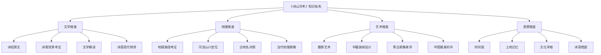
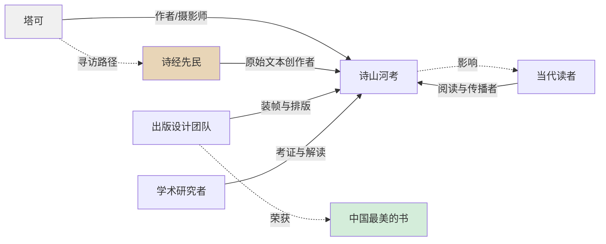
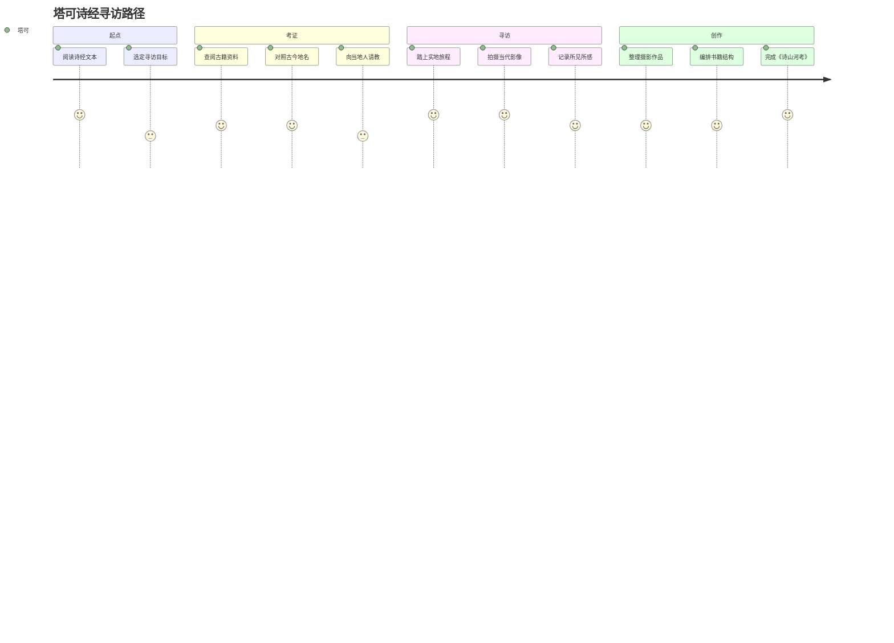
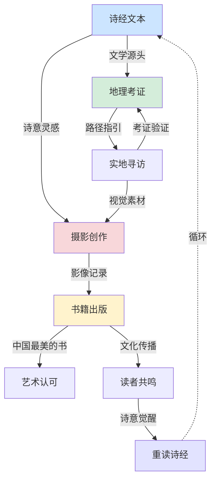

# 知识图谱 | 《诗山河考》全景解析：一张图读懂诗意地图的底层逻辑

> 从诗经文本到摄影影像，从地理考证到艺术表达，多维度拆解这本"中国最美的书"的知识体系。

---

## 核心知识分类树

《诗山河考》不是一本简单的摄影集，它是一个多维度的知识系统。以下是全书的核心知识架构：

---

## 关键人物图谱

《诗山河考》的创作与传播，涉及多个层面的关键人物：

---

## 诗意路径图

塔可的寻访路线，本质上是一条穿越千年的"诗意之路"：

---

## 知识网络图

《诗山河考》的知识点之间存在着紧密的关联网络：

---

## 核心知识点速查

### 文学层

| 知识点 | 说明 |
|--------|------|
| 诗经篇目 | 全书涉及《诗经》中多首诗歌，涵盖国风、小雅等 |
| 诗意转译 | 将古代诗歌的意境转化为当代视觉语言 |
| 文学考证 | 对诗歌创作背景、地理指向进行学术梳理 |

### 地理层

| 知识点 | 说明 |
|--------|------|
| 路径考证 | 按照诗歌线索，考证每首诗对应的具体地理位置 |
| 古今对照 | 将诗经中的古地名与当代地理进行对应 |
| 影像记录 | 用摄影记录每处地点的当代面貌 |

### 艺术层

| 知识点 | 说明 |
|--------|------|
| 黑白摄影 | 全片采用黑白影像，营造时间的厚重感 |
| 装帧设计 | 极简风格、大量留白，荣获"中国最美的书" |
| 艺术书定位 | 超越普通摄影集，是一件完整的艺术作品 |

### 思想层

| 知识点 | 说明 |
|--------|------|
| 时间观 | 三千年前与当下的对话 |
| 土地记忆 | 土地承载的文化与情感记忆 |
| 文化寻根 | 通过诗歌路径寻找中国人的精神原乡 |

---

◆ ◇ ◆

**互动话题**

这张知识图谱中，你最想深入了解的是哪个维度？
欢迎在留言区告诉我们。

◆ ◇ ◆

---

<strong>系列导航</strong>

[01 读后感](#) | [02 知识图谱](#) | [03 图谱逻辑](#) | [04 核心思想](#) | [05 职场指南](#) | [06 行动挑战](#)

人类文明经典阅读计划 · 艺术美学系列

