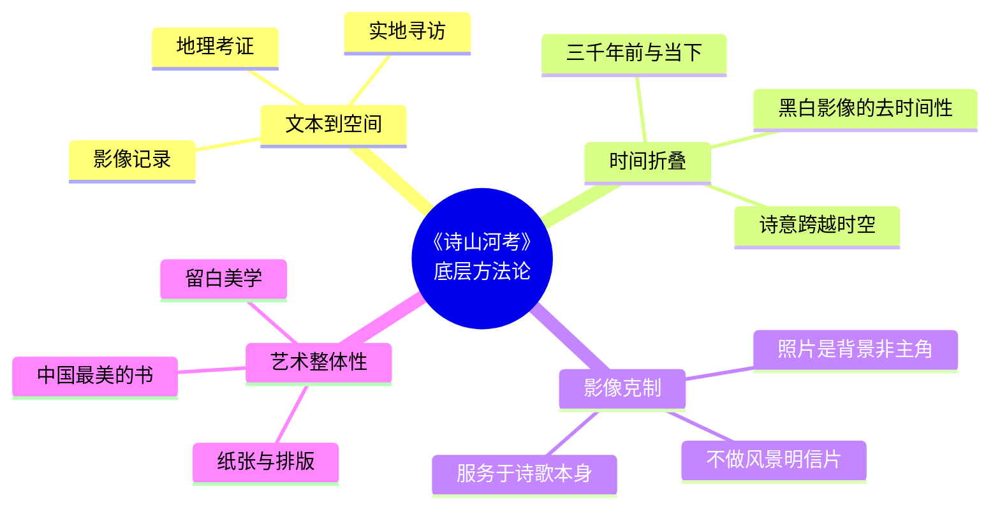

# 图谱逻辑 | 《诗山河考》是如何将"诗"变成"山河"的？

> 从文本到影像，从抽象到具象，解码塔可创作《诗山河考》的底层方法论。

---

## 一切从一首诗开始

《诗山河考》的创作起点，不是相机，不是地图，而是一首诗。

塔可的做法，可以用四个关键词来概括：**读诗、考证、寻访、拍摄**。这四个步骤构成了整本书的创作逻辑链条。

这个循环，被重复了无数次。每一次循环，都是一首诗与一片土地的相遇。

---

## 第一层逻辑：文本到空间的转换

这是《诗山河考》最核心的逻辑——**将抽象的文字转化为具象的空间**。

《诗经》中的诗歌，本质上是文字。文字是抽象的，"蒹葭苍苍"四个字，可以在任何人的脑海中形成不同的画面。

塔可要做的事，是让这些文字"落地"。

他做的第一步是**地理考证**。

这首诗说的是哪条河？那座山是在哪个方向？那个村庄今天还在不在？通过查阅古籍、比对史料、请教专家，他逐渐锁定了每首诗对应的具体位置。

然后，他出发了。

这不是一个学术研究项目，而是一次**身体的朝圣**。塔可相信，只有亲自站在那片土地上，才能真正理解一首诗。

---

## 第二层逻辑：时间的折叠

《诗山河考》的另一个重要逻辑，是**时间的折叠**。

三千年前，有人在河边唱了一首歌。三千年后，塔可站在那条河边，拍了一张照片。

这两件事，在时间上相隔了三千年，但在空间上，它们指向的是同一个坐标。

塔可的摄影，本质上是在做一件"折叠时间"的事。他把三千年前的诗意和今天的现实，压缩在同一个画面里。

这也是为什么他的照片大多是黑白的——黑白剥离了时代的色彩特征，让观者无法轻易判断这张照片拍摄于何时。它可以是三千年前，也可以是今天。

时间在这里失去了线性，变成了一种可以折叠、可以对话的维度。

---

## 第三层逻辑：影像的克制

塔可的摄影风格，是**克制的**。

他不拍风景明信片式的"美图"，不拍游客打卡式的"到此一游"。他的镜头里，是干涸的河床、荒芜的田野、斑驳的墙壁、沉默的山丘。

这种克制，是有意为之的。

因为塔可深知，如果他拍得太"美"，反而会喧宾夺主。观者会被照片的视觉冲击所吸引，而忽略了照片背后的诗歌。

他的照片，是**背景**，不是**主角**。真正的主角，是那首三千年前的诗。

照片的作用是提醒你：这首诗，不是凭空想象的，它曾经真实地发生过，在这片土地上。

---

## 第四层逻辑：书籍作为艺术品

《诗山河考》不是一本普通的摄影集，它是一件**完整的艺术作品**。

从纸张的选择、排版的设计、留白的处理，到黑白影像的呈现方式——每一个细节都在传递同一个信息：这是一件艺术品，而不是一本"图册"。

这也是它为什么能获评"中国最美的书"的原因。

它的美，不在于"好看"，而在于**整体性**。文字、影像、排版、材质，所有元素被统一在一个美学系统里，形成了一种沉静、克制、有深度的表达。

---

## 底层方法论总结

---

## 这套逻辑对我们的启示

《诗山河考》的创作逻辑，其实可以应用到我们生活的很多方面。

**第一，回归本源。** 塔可从诗歌文本出发，而不是从摄影技术出发。做任何事，都应该先回到最根本的出发点。

**第二，亲身抵达。** 他没有依赖卫星地图或文献资料就下结论，而是亲自走到现场。有些东西，只有亲身体验才能理解。

**第三，克制表达。** 好的表达不需要过度渲染，克制往往比张扬更有力量。

**第四，追求整体性。** 一件好作品，不是某个单点的突出，而是所有元素的和谐统一。

---

◆ ◇ ◆

**互动话题**

塔可的"读诗-考证-寻访-拍摄"四步法，
如果应用到你的工作领域，会变成什么？
欢迎在留言区分享你的创意。

◆ ◇ ◆

---

<strong>系列导航</strong>

[01 读后感](#) | [02 知识图谱](#) | [03 图谱逻辑](#) | [04 核心思想](#) | [05 职场指南](#) | [06 行动挑战](#)

人类文明经典阅读计划 · 艺术美学系列

