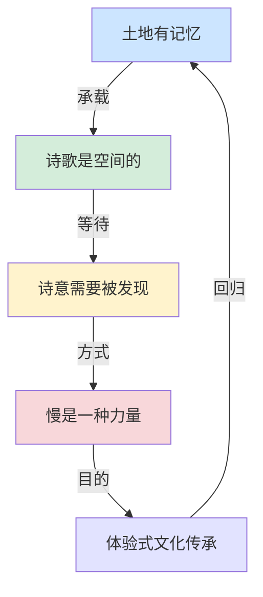

# 核心思想 | 《诗山河考》：三千年前的诗歌，今天还在吗？

> 如果诗歌可以被拍摄，如果三千年前的土地记忆可以被唤醒，那我们与古人之间，究竟隔着多远的距离？

---

## 一个看似天真的问题

《诗山河考》整本书的核心，其实可以用一个问题来概括：

**三千年前的诗歌，今天还在吗？**

那些被吟唱过的河流，还在流淌吗？那些被描绘过的山丘，依然矗立吗？那些被歌颂过的田野，是否还有人在耕作？

塔可用一本书来回答这个问题。

他的回答不是文字，而是影像。他走到那些诗歌诞生的地方，用镜头记录下了今天的样子。

答案是：还在。但又不完全在。

河流可能改道了，山丘可能变了模样，田野可能已经建起了楼房。但那些土地的气质，那种承载过诗意的"场"，依然在。

---

## 核心思想一：土地是有记忆的

这是《诗山河考》最打动人心的一个思想——**土地是有记忆的**。

我们今天踩在某块土地上，三千年前也有人踩在那里。我们今天看到的同一条河，三千年前也有人站在河边唱过歌。

土地记得一切。

它记得那些诗歌、那些歌声、那些悲欢离合。即使建筑消失了、河流改道了、村庄搬迁了，土地的记忆不会消失。

塔可的摄影，就是在唤醒这些记忆。

他拍的不是"现在的风景"，而是"承载着三千年前记忆的风景"。同一个坐标，两种时间，在一张照片里交汇。

---

## 核心思想二：诗歌是空间的艺术

我们习惯把诗歌当作文字艺术。但《诗山河考》提醒我们：**诗歌首先是空间的艺术**。

每一首诗，都诞生于一个具体的空间。

"关关雎鸠，在河之洲"——这首诗诞生于某条河中的某个沙洲。"蒹葭苍苍，白露为霜"——这首诗诞生于某个秋天的清晨，某片芦苇荡边。

诗歌不是从书房里写出来的，是从天地间生长出来的。

塔可的寻访，本质上是在还原诗歌的空间性。他把诗歌从书本里解放出来，放回它原本属于的那片土地。

这种视角的转换，是革命性的。

---

## 核心思想三：诗意不需要被"制造"，只需要被"发现"

在当代社会，我们习惯了"制造"诗意。

我们用滤镜美化照片，用修辞润色文字，用音乐渲染情绪。我们以为诗意是需要刻意营造的东西。

但《诗山河考》告诉我们：**诗意不需要被制造，它一直都在那里，只需要被发现。**

一条普通的河流，因为三千年前有人在河边唱过一首诗，便拥有了永恒的诗意。一片荒芜的田野，因为曾经被写入《诗经》，便承载了跨越千年的情感。

塔可所做的，不是"创造"诗意，而是"发现"诗意。

他用镜头作为工具，去发现那些被时间掩埋的诗意坐标。

---

## 核心思想四：慢是一种力量

在效率至上的时代，《诗山河考》提供了一种截然不同的价值观——**慢，是一种力量**。

塔可的寻访是慢的。

他不赶时间，不追热点，不追求产量。他按照自己的节奏，一首诗一首诗地走，一个地方一个地方地拍。

这种慢，恰恰成就了这本书的深度。

如果塔可是用"高效"的方式来完成这个项目——用卫星地图定位，用资料替代实地考察，用速度的追求产量——那么这本书将失去它最珍贵的东西：**真实感和温度**。

慢不是低效，而是一种对质量的坚持。

---

## 核心思想五：文化传承不是背诵，而是体验

我们对传统文化的传承，往往停留在"背诵"层面。

背《诗经》、背唐诗、背宋词——我们把这些经典当作知识点来记忆，却很少把它们当作体验去感受。

《诗山河考》提供了一种全新的传承方式：**用身体去体验文化。**

不是坐在书桌前背诵"蒹葭苍苍"，而是走到那片芦苇荡前，感受秋风拂过芦苇的声音，看白露凝结在叶片上的样子。

这种体验式的传承，比任何背诵都更深刻、更持久。

因为它不只是知识的传递，更是情感的连接。

---

## 五层思想的交汇

这五个核心思想，最终交汇成了一个完整的认知框架：

---

## 写在最后

《诗山河考》不只是一本摄影集或一本关于《诗经》的书。

它是一面镜子，照出我们这个时代缺少的东西——**对土地的感知、对时间的敬畏、对诗意的敏感、对慢的坚持、对体验的追求。**

也许，我们不需要每个人都去走一遍塔可走过的路。

但至少，在读完这本书之后，当我们再次读到"蒹葭苍苍，白露为霜"时，脑海中不再只是四个汉字，而是一片真实的、可以抵达的、承载着三千年记忆的芦苇荡。

这就够了。

---

◆ ◇ ◆

**互动话题**

你心中最"有画面感"的一句古诗是什么？
你曾去过与某首诗歌相关的实际地点吗？
欢迎在留言区分享。

◆ ◇ ◆

---

<strong>系列导航</strong>

[01 读后感](#) | [02 知识图谱](#) | [03 图谱逻辑](#) | [04 核心思想](#) | [05 职场指南](#) | [06 行动挑战](#)

人类文明经典阅读计划 · 艺术美学系列

