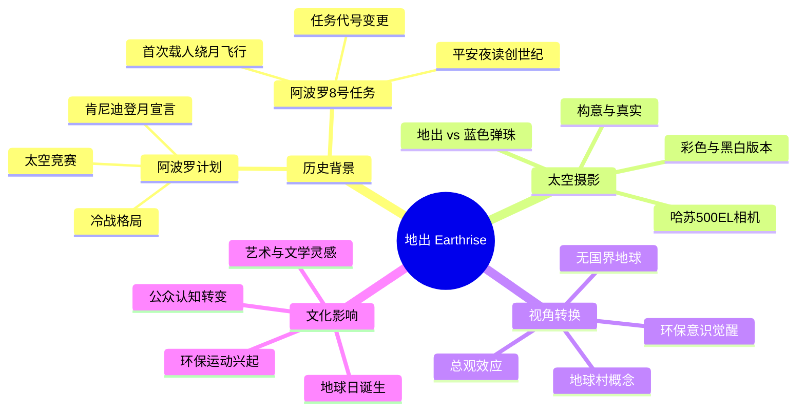
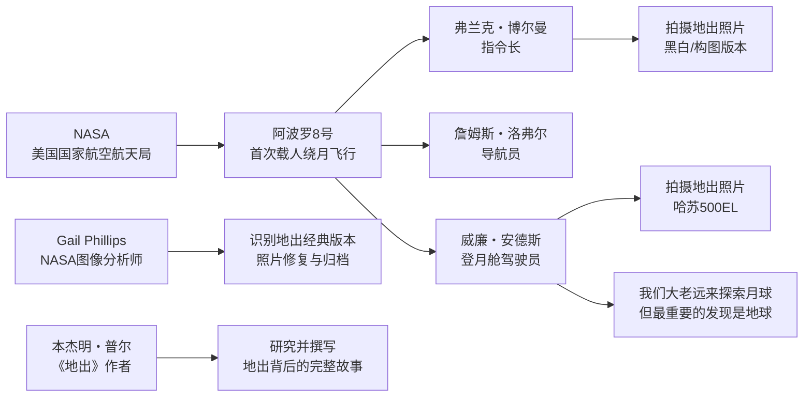
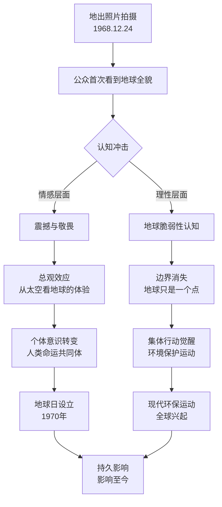
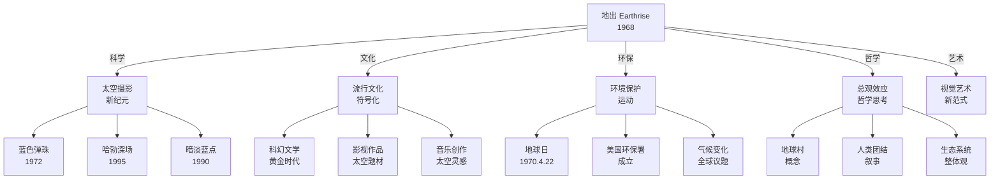

# 《地出》知识图谱图片描述

本文档为《地出》公众号系列文章中使用的知识图谱提供 Mermaid 图表代码及配套文字描述，用于微信公众号排版中的图片生成与替代文本。

---

## 图片一：《地出》主题分类树

### 用途说明
用于文章开头的全景式导览，帮助读者快速理解《地出》一书的核心主题架构。

### Mermaid 代码

### 文字描述替代文本

该图以"地出"为中心，向外辐射出四大核心分支：

◆ **历史背景** —— 涵盖阿波罗计划的宏观背景与阿波罗8号任务的具体细节，包括肯尼迪登月宣言、太空竞赛、冷战格局，以及任务从地球轨道测试升级为首次载人绕月飞行的戏剧性转变。

◆ **太空摄影** —— 聚焦摄影技术与艺术层面，涉及哈苏500EL相机设备、彩色与黑白版本的区别，以及"地出"与后续"蓝色弹珠"照片的对比关系。

◆ **视角转换** —— 阐述"地出"带来的认知变革，包括总观效应、无国界地球的视觉冲击、环保意识的觉醒和"地球村"概念的形成。

◆ **文化影响** —— 展示"地出"照片对人类社会的深远影响，涵盖地球日的诞生、环保运动的兴起、对艺术与文学的灵感启发，以及公众认知的根本性转变。

---

## 图片二：关键人物关系图谱

### 用途说明
用于梳理《地出》一书中的核心人物及其相互关系，帮助读者理解照片背后的人物故事。

### Mermaid 代码

### 文字描述替代文本

该图呈现了从NASA到阿波罗8号任务再到核心人物的层级关系：

◆ **顶层**：NASA作为任务的组织者，启动了阿波罗8号计划。

◆ **宇航员三人组**：
● 弗兰克・博尔曼（指令长）—— 发现地出现象并发出惊叹，拍摄了黑白版本
● 詹姆斯・洛弗尔（导航员）—— 任务导航与操作
● 威廉・安德斯（登月舱驾驶员）—— 拍摄了经典的彩色"地出"照片

◆ **名言关联**：安德斯的经典名言"我们大老远来探索月球，但最重要的发现是地球"直接关联到他的摄影行为。

◆ **幕后人员**：Gail Phillips作为NASA图像分析师，负责照片的识别、修复与归档工作。

◆ **作者**：本杰明・普尔通过研究这些人物与事件，撰写了完整的《地出》一书。

---

## 图片三：视角转换路径图

### 用途说明
用于展示从"地出"照片到人类认知转变的因果链条，帮助读者理解"视角转换"的深层逻辑。

### Mermaid 代码

### 文字描述替代文本

该图以流程图形式展示了从"地出"照片拍摄到持久社会影响的完整路径：

◆ **起点**：1968年12月24日，地出照片拍摄。

◆ **第一层效应**：公众首次看到地球全貌，产生认知冲击。冲击分为两个维度：
● 情感层面：产生震撼与敬畏
● 理性层面：认识到地球的脆弱性

◆ **第二层分化**：
● 情感冲击导向"总观效应"——从太空俯瞰地球的独特体验
● 理性认知导向"边界消失"——意识到地球在太空中只是一个微小的点

◆ **第三层深化**：
● 总观效应带来个体意识转变——人类命运共同体的觉醒
● 边界消失带来集体行动觉醒——环境保护运动的兴起

◆ **终点**：两条路径在1970年地球日设立和现代环保运动全球兴起中汇合，形成持久影响，延续至今。

---

## 图片四：太空摄影影响网络图

### 用途说明
用于展示"地出"照片在科学、文化、环保等多个领域产生的广泛影响网络。

### Mermaid 代码

### 文字描述替代文本

该图以网络形式展示了"地出"照片在五大领域产生的深远影响：

◆ **科学领域**：开启太空摄影新纪元，直接催生了"蓝色弹珠"（1972年）、哈勃深场（1995年）和"暗淡蓝点"（1990年）等标志性影像。

◆ **环保领域**：推动环境保护运动兴起，直接促成地球日设立（1970年4月22日）、美国环保署成立，并最终延伸至气候变化全球议题。

◆ **流行文化**：照片成为文化符号，深刻影响科幻文学黄金时代、太空题材影视作品和太空灵感的音乐创作。

◆ **哲学思考**：引发总观效应的哲学讨论，催生"地球村"概念、人类团结叙事和生态系统整体观。

◆ **视觉艺术**：建立视觉艺术新范式，重新定义了人类审美与宇宙视角的关系。

---

**使用说明**

● Mermaid 图表可用于支持 Mermaid 渲染的公众号排版工具
● 如公众号不支持 Mermaid 渲染，可将文字描述替代文本配图使用
● 建议图表配色方案：深空蓝（#1a1a2e）、地球蓝（#4a90d9）、月球灰（#c0c0c0）、白色文字
