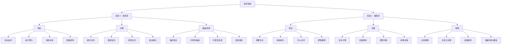
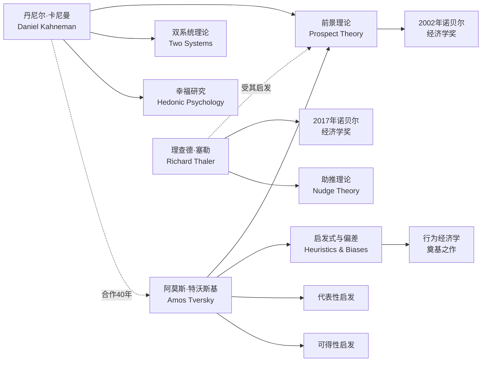
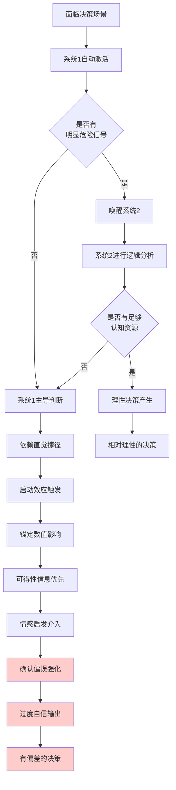
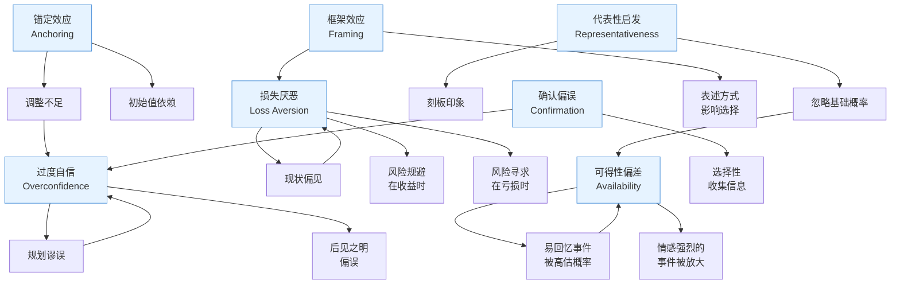

# 一张图看懂《思考，快与慢》核心知识体系

> 用 4 张知识图谱，帮你建立对全书的系统性认知框架。

---

## ◆ 图谱一：双系统理论分类树

这张图展示了卡尼曼理论的核心框架——大脑两套系统的完整分类与特征对比：



**阅读提示：** 这棵树的核心是理解系统 1 和系统 2 不是"两个人"，而是两种思维模式。系统 1 是默认的自动驾驶，系统 2 是手动驾驶——但大多数人一生都在用自动驾驶。

---

## ◇ 图谱二：核心人物关系图谱

理解这本书，不能脱离其背后的学术脉络。这张图展示了关键人物及其贡献关系：



**关键节点说明：**
- 卡尼曼与特沃斯基的合作被誉为心理学史上最成功的伙伴关系
- 前景理论推翻了传统经济学的"理性人"假设
- 塞勒将他们的研究延伸到政策设计领域，提出"助推"概念

---

## ○ 图谱三：认知偏差的形成路径

这张流程图揭示了一个日常决策是如何被认知偏差"劫持"的：



**路径解读：** 绝大多数日常决策都走的是左侧路径——系统 1 主导，偏差层层叠加，最终输出一个"感觉正确但实际有偏"的决策。只有当问题足够重要且你有足够精力时，系统 2 才会介入。

---

## ● 图谱四：认知偏差网络关系图

各种认知偏差之间并非孤立存在，这张网络图展示了它们的内在关联：



**网络洞察：** 这些偏差形成了一个"偏差网络"，它们常常同时出现、互相强化。比如锚定效应会加强过度自信，过度自信又会强化确认偏误。理解它们的关系，比单独理解每一个偏差更重要。

---

## ◆ 图谱使用建议

**建议收藏本文**，在以下场景中反复查阅：

1. **做决策前：** 对照图谱三，检查自己正走在哪条路径上
2. **复盘时：** 用图谱四分析过去的决策失误属于哪些偏差
3. **学习时：** 从图谱一的分类树出发，逐个深入理解每个概念
4. **讨论时：** 用图谱二了解学术脉络，增加讨论深度

---

## ◇ 系列导航

```
┌─────────────────────────────────────────┐
│        认知思维系列 · 阅读导航          │
├─────────────────────────────────────────┤
│ 上一篇：01 《思考，快与慢》读后感        │
│                                         │
│ 本篇：02 知识图谱图片描述                │
│                                         │
│ 下一篇：03 图谱逻辑深度解读              │
│                                         │
│ 系列进度：█░░░░░  1/6                   │
└─────────────────────────────────────────┘
```

---

**核心标签：** #双系统理论 #认知偏差 #行为经济学 #决策科学 #知识图谱

---

*本文是"人类文明经典阅读计划"系列第 08 期·认知思维篇。四张知识图谱建议保存备用，后续文章会基于这些图谱展开深入讨论。*
