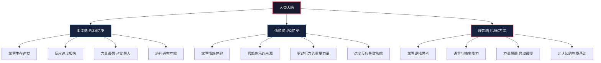
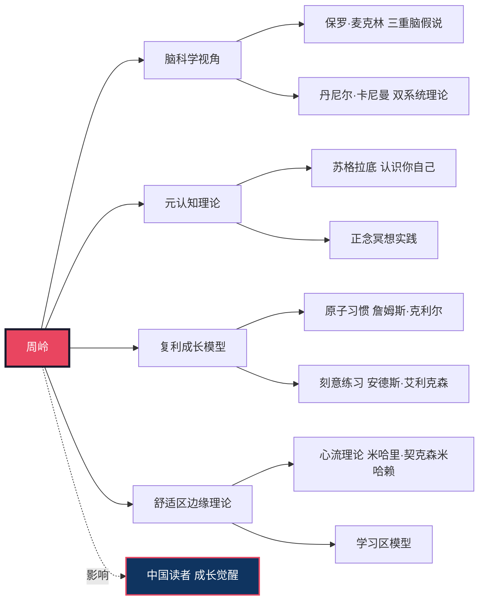
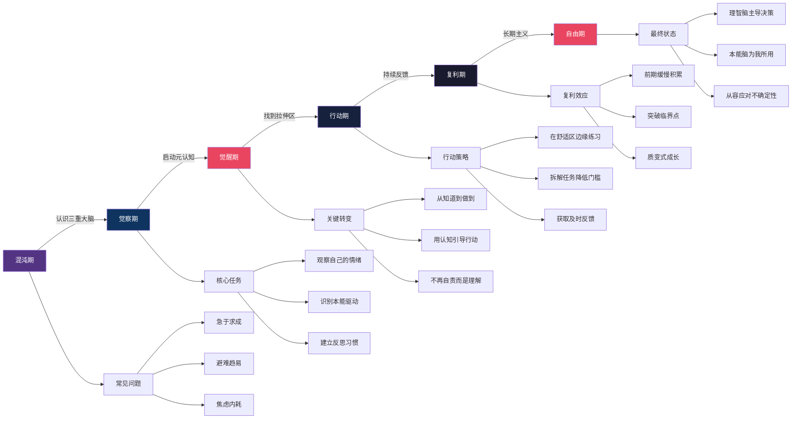
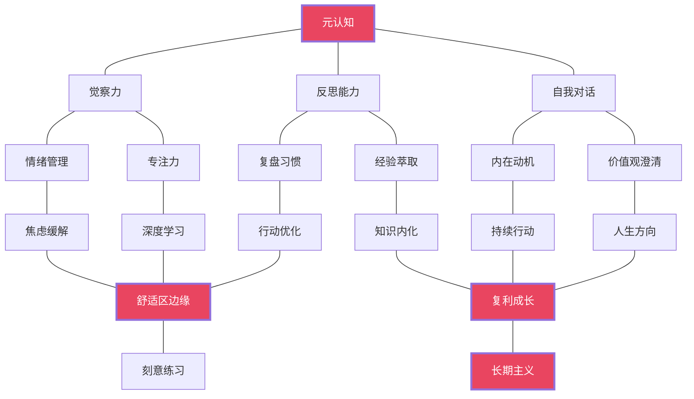

# 《认知觉醒》知识图谱图片描述

> 本文是「人类文明经典阅读计划」配套知识图谱的详细说明文档，用于公众号配图及可视化参考。

---

## ◆ 图谱一：三重大脑分类树

### 设计说明

以树状结构呈现人类大脑的三层进化结构，从底层到顶层依次展开，帮助读者直观理解「本能脑 - 情绪脑 - 理智脑」的层级关系。

### Mermaid 分类树图

### 视觉要点

- 本能脑和情绪脑用冷色调（深蓝），代表其原始、强大的特性
- 理智脑用暖色调点缀（红色边框），突出其虽弱但关键的角色
- 根节点用深色背景 + 白色文字，强化总领地位

---

## ◆ 图谱二：核心人物关系图谱

### 设计说明

以周岭为核心节点，向外辐射其知识来源、受影响的思想家、以及《认知觉醒》所涵盖的核心概念领域。

### Mermaid 人物图谱

### 视觉要点

- 周岭节点使用红色高亮，作为图谱中心
- 左侧为理论来源，右侧为核心概念
- 虚线连接到「中国读者」，表示知识传播方向

---

## ◆ 图谱三：个人成长路径图

### 设计说明

以流程图形式呈现从「混沌状态」到「觉醒成长」的完整路径，标注每个阶段的核心任务和常见陷阱。

### Mermaid 路径图

### 视觉要点

- 六个阶段用渐变色呈现，从暗到亮象征认知升级
- 每个阶段下方展开子节点，显示具体任务和问题
- 觉醒期用红色高亮，标注关键转折点

---

## ◆ 图谱四：成长要素网络图

### 设计说明

以网络图形式展示《认知觉醒》中各核心概念之间的关联关系，帮助读者建立系统化的认知框架。

### Mermaid 网络图

### 视觉要点

- 四个核心节点（元认知、舒适区边缘、复利成长、长期主义）用红色高亮
- 连线表示概念间的推导和支撑关系
- 整体呈现从「内在能力」到「外在行为」再到「成长结果」的逻辑流

---

## ◆ 使用建议

1. **公众号配图**：可将 Mermaid 图表渲染为 SVG/PNG 格式，插入对应文章的合适位置
2. **知识卡片**：提取单个图谱制作成竖版卡片，用于朋友圈分享
3. **互动素材**：在评论区发起「你目前处于成长路径的哪个阶段？」投票
4. **系列统一风格**：四张图谱建议统一配色方案，保持视觉连贯性

---

> 图谱数据来源：《认知觉醒》周岭 著，人民邮电出版社，2021 年。
