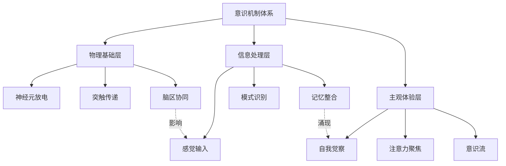
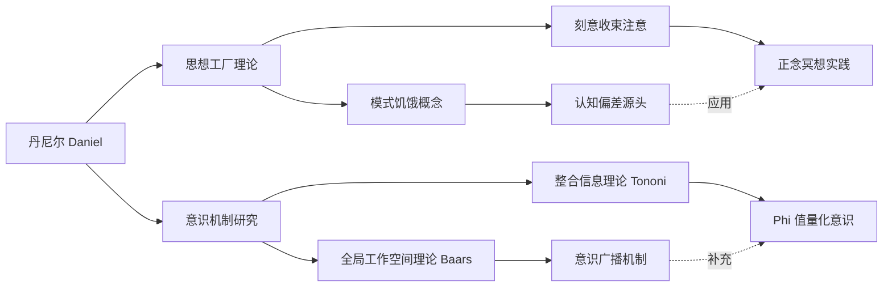
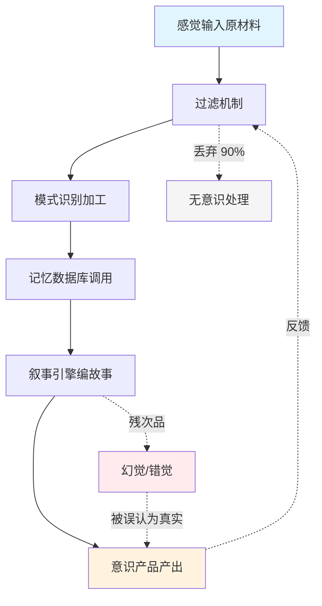
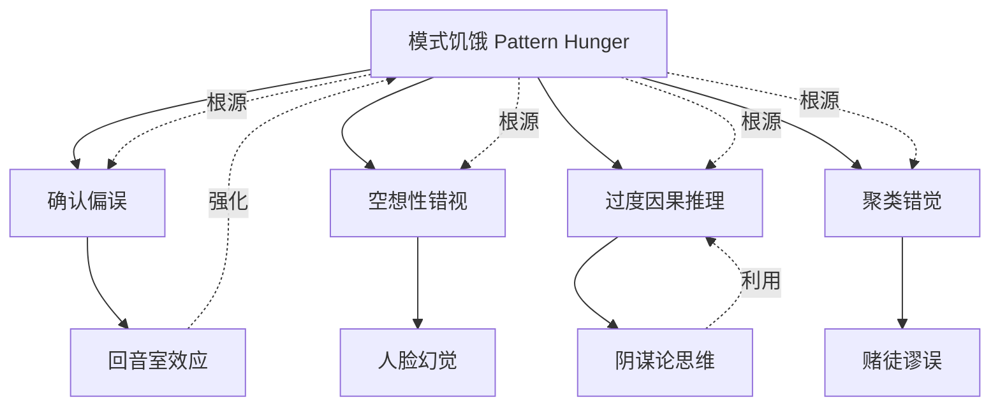

# 《贪婪的大脑》知识图谱图片描述

> 本文包含 4 张知识图谱 Mermaid 图表，分别展示：意识机制分类树、核心人物关系图谱、思想工厂运作路径图、认知偏差网络图。

---

## 图一：意识机制分类树

**图表类型**：分类树（Tree Diagram）

**设计说明**：展示意识的多层次结构，从物理基础到主观体验的完整分类体系。

**视觉要点**：
- 三层结构用不同颜色区分：物理层（冷蓝色）、处理层（绿色）、体验层（暖橙色）
- 横向箭头用虚线标注"影响"和"涌现"关系
- 适合横屏阅读，节点文字控制在 6 字以内

---

## 图二：核心人物关系图谱

**图表类型**：人物关系图（Network Graph）

**设计说明**：展示《贪婪的大脑》涉及的神经科学家、哲学家及其理论贡献的关联网络。

**视觉要点**：
- 丹尼尔居中，左右分支对称分布
- 理论节点用矩形，人物节点用圆形
- 虚线连接表示跨理论的应用和补充关系

---

## 图三：思想工厂运作路径图

**图表类型**：流程路径图（Flow Chart）

**设计说明**：可视化"思想工厂"从原材料输入到意识产出的完整流水线。

**视觉要点**：
- 主流程用实线箭头从左到右排列
- 旁支路径用虚线，标注关键数据（如"丢弃 90%"）
- 反馈回路用弯曲箭头表示循环特性
- 用不同底色区分阶段：输入（蓝）、产出（橙）、残次品（红）、无意识（灰）

---

## 图四：认知偏差网络图

**图表类型**：网络关系图（Mind Map Style）

**设计说明**：展示模式饥饿导致的各类认知偏差及其相互关联。

**视觉要点**：
- 中心节点"模式饥饿"用大圆或特殊形状突出
- 一级偏差用矩形，二级效应用圆角矩形
- "强化"和"利用"关系用不同颜色虚线标注
- 整体布局呈放射状，适合竖屏移动端阅读

---

## 图片生成建议

| 图表 | 推荐尺寸 | 配色方案 | 字体大小 |
|------|---------|---------|---------|
| 图一 分类树 | 800x600 | 蓝绿橙三色 | 14px |
| 图二 人物图谱 | 900x500 | 紫蓝主色 | 13px |
| 图三 路径图 | 750x650 | 蓝橙红灰四色 | 13px |
| 图四 网络图 | 800x700 | 紫色系渐变 | 12px |

**统一规范**：
- 背景色：浅灰 #f8f9fa
- 连线颜色：深灰 #6c757d
- 节点边框：圆角 8px
- 所有文字使用无衬线字体

---

*本文图谱配合《贪婪的大脑》正文阅读效果更佳。保存图片后可长按放大查看细节。*
