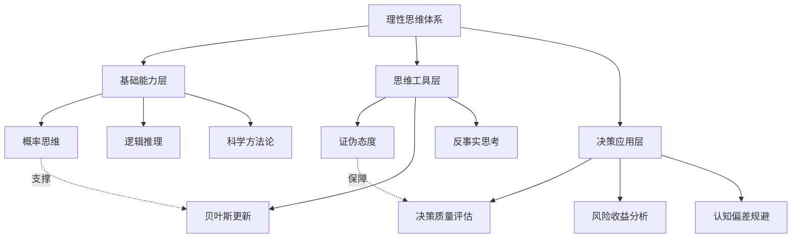
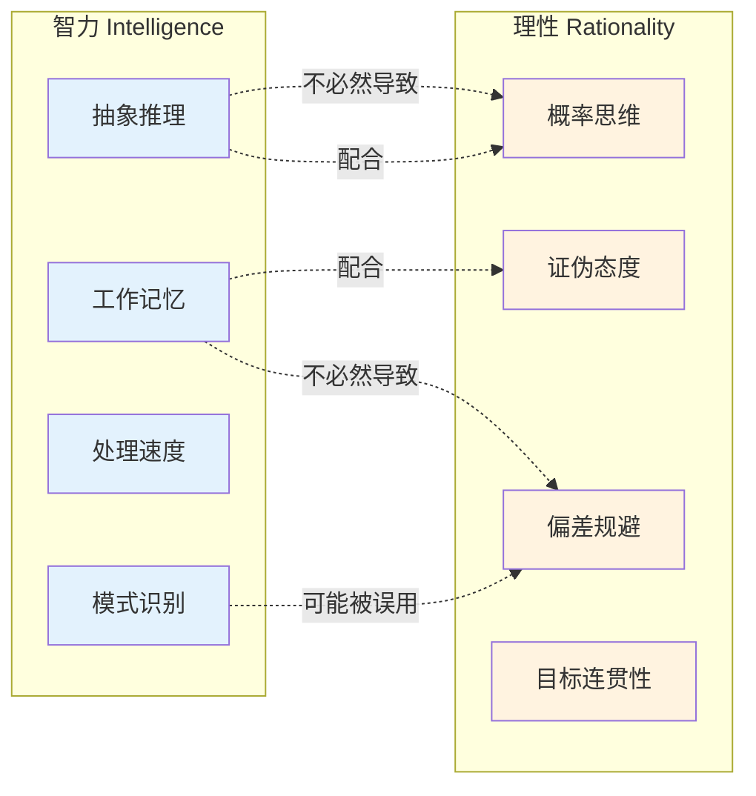
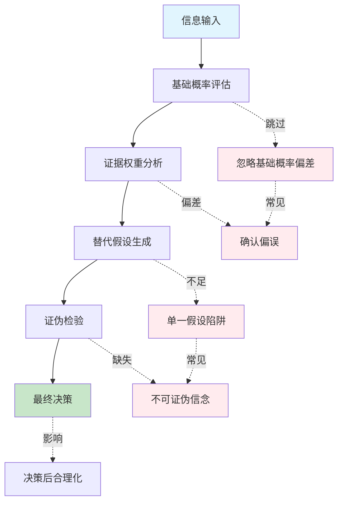
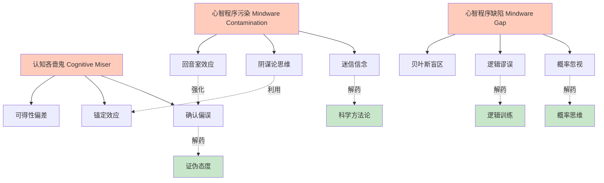

# 《超越智商》知识图谱图片描述

> 本文包含 4 张知识图谱 Mermaid 图表，分别展示：理性思维分类树、智力与理性对比图谱、理性决策路径图、认知偏差网络图。

---

## 图一：理性思维分类树

**图表类型**：分类树（Tree Diagram）

**设计说明**：展示理性思维的多层次结构，从基础能力到高级决策的完整分类体系。

**视觉要点**：
- 三层结构用不同颜色区分：基础层（蓝色）、工具层（绿色）、应用层（橙色）
- 横向虚线箭头标注"支撑"和"保障"关系
- 节点文字精简，适合移动端阅读

---

## 图二：智力与理性对比图谱

**图表类型**：对比图（Comparison Diagram）

**设计说明**：直观展示智力与理性的区别和联系，帮助读者理解"车速 vs 方向盘"的核心比喻。

**视觉要点**：
- 左右两组用不同背景色框区分
- 智力侧用蓝色系，理性侧用橙色系
- 虚线标注"不必然导致"，强调两者的独立性
- 实线标注"配合"，展示理想协作关系

---

## 图三：理性决策路径图

**图表类型**：流程路径图（Flow Chart）

**设计说明**：展示从信息输入到理性决策的完整路径，以及每一步可能的偏差陷阱。

**视觉要点**：
- 主流程从上到下，用绿色渐变表示正确路径
- 偏差陷阱用红色节点，标注在对应步骤旁边
- 虚线箭头标注"跳过"、"偏差"等风险动作
- 适合竖屏阅读

---

## 图四：认知偏差网络图

**图表类型**：网络关系图（Network Graph）

**设计说明**：展示导致非理性决策的核心认知偏差及其相互关联，以及对应的"心智程序"解药。

**视觉要点**：
- 三大根源用橙色节点居中排列
- 具体偏差用白色节点分布在两侧
- 解药用绿色节点，用不同颜色箭头连接
- "强化"和"利用"关系用紫色虚线
- 整体布局呈三层结构：根源 → 偏差 → 解药

---

## 图片生成建议

| 图表 | 推荐尺寸 | 配色方案 | 字体大小 |
|------|---------|---------|---------|
| 图一 分类树 | 800x600 | 蓝绿橙三色 | 14px |
| 图二 对比图 | 850x450 | 蓝橙对比 | 13px |
| 图三 路径图 | 750x700 | 蓝绿红三色 | 13px |
| 图四 网络图 | 900x650 | 橙白绿三色 | 12px |

**统一规范**：
- 背景色：浅灰 #f8f9fa
- 连线颜色：深灰 #6c757d
- 节点边框：圆角 8px
- 所有文字使用无衬线字体

---

*本文图谱配合《超越智商》正文阅读效果更佳。保存图片后可长按放大查看细节。*
