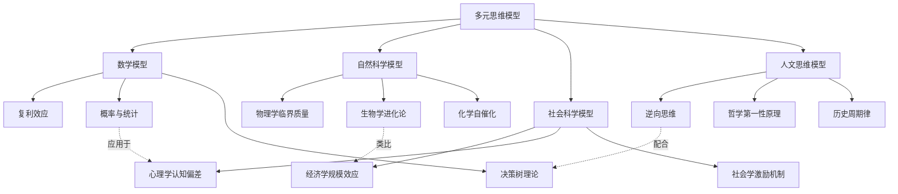
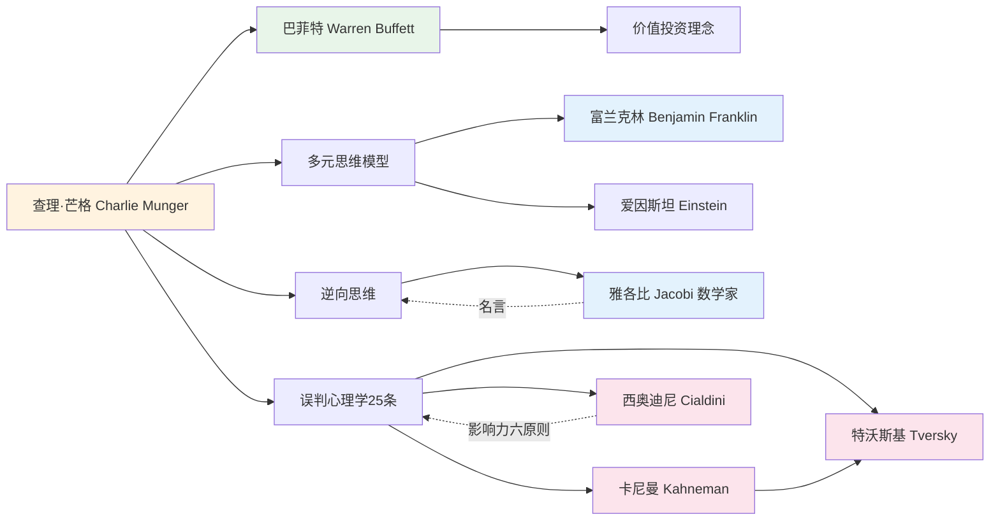
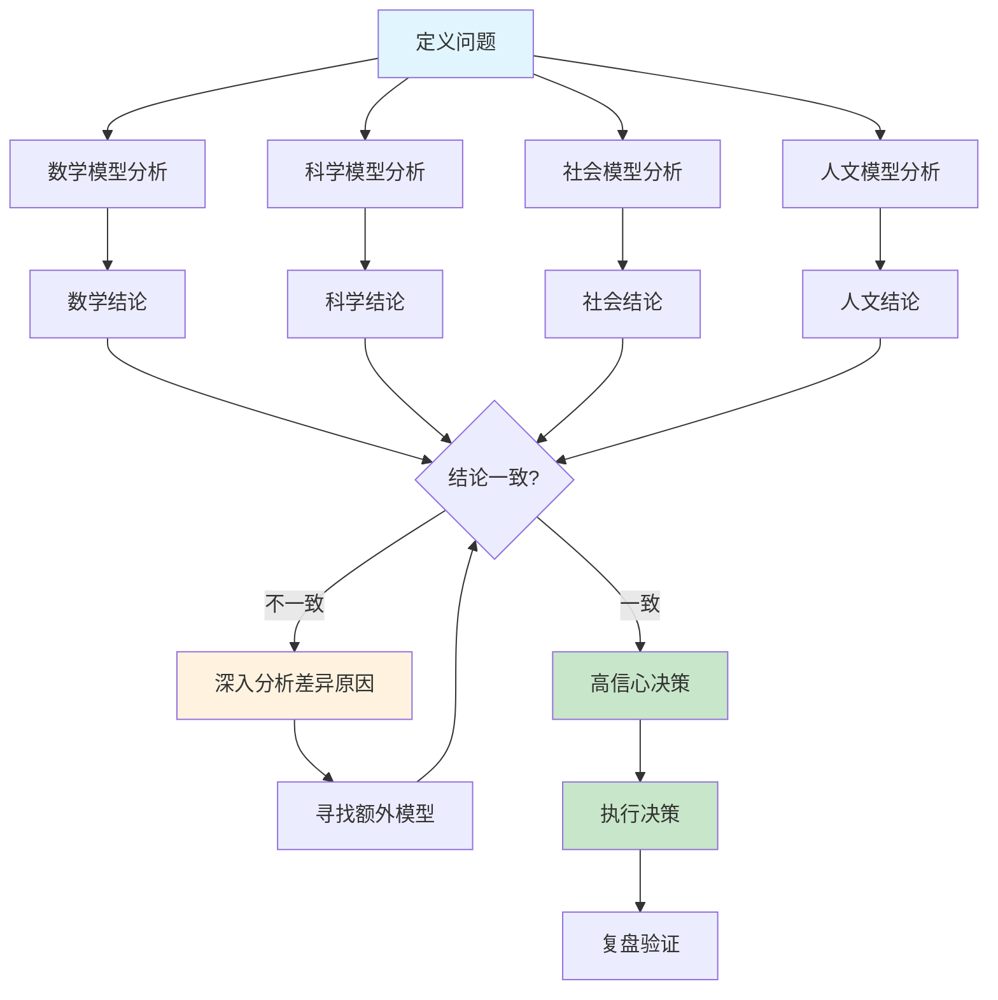
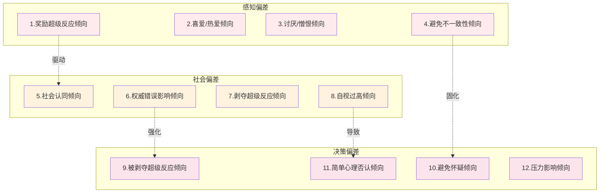

# 《穷查理宝典》知识图谱图片描述

> 本文包含 4 张知识图谱 Mermaid 图表，分别展示：多元思维模型分类树、芒格思想人物图谱、跨学科决策路径图、误判心理学网络图。

---

## 图一：多元思维模型分类树

**图表类型**：分类树（Tree Diagram）

**设计说明**：展示芒格多元思维模型的学科分类和核心概念，按学科领域分层呈现。

**视觉要点**：
- 四个学科领域用不同颜色区分：数学（蓝）、科学（绿）、社会（橙）、人文（紫）
- 跨学科关联用虚线箭头标注
- 每个学科 3 个核心概念，保持对称布局

---

## 图二：芒格思想人物图谱

**图表类型**：人物关系图（Network Graph）

**设计说明**：展示与芒格思想相关的关键人物及其理论贡献的关联网络。

**视觉要点**：
- 芒格居中，左右分支分别展示投资关系和思想渊源
- 人物节点用圆形，概念节点用矩形
- 不同学派用不同颜色区分：投资（绿）、数学（蓝）、心理学（粉）
- 标注关键名言引用关系

---

## 图三：跨学科交叉验证决策路径图

**图表类型**：流程路径图（Flow Chart）

**设计说明**：展示芒格式的跨学科决策流程，从问题定义到多模型验证的完整路径。

**视觉要点**：
- 问题定义到四个模型分析用并行结构
- 结论汇聚到判断节点（菱形）
- 不一致路径用橙色标注，形成闭环
- 最终决策用绿色表示高信心状态

---

## 图四：误判心理学 25 条网络图

**图表类型**：网络关系图（Mind Map Style）

**设计说明**：将 25 条误判心理学按功能分组，展示它们之间的关联和叠加效应。

**视觉要点**：
- 三组偏差用不同颜色 subgraph 框区分
- 跨组关联用虚线箭头标注"驱动"、"强化"等关系
- 展示偏差之间的叠加效应（多个偏差同时作用时危害更大）
- 实际使用时可展示全部 25 条，此处选取代表性的 12 条

---

## 图片生成建议

| 图表 | 推荐尺寸 | 配色方案 | 字体大小 |
|------|---------|---------|---------|
| 图一 分类树 | 850x650 | 蓝绿橙紫四色 | 13px |
| 图二 人物图谱 | 900x500 | 橙绿蓝粉四色 | 12px |
| 图三 路径图 | 800x700 | 蓝橙绿三色 | 13px |
| 图四 网络图 | 900x600 | 红橙粉三色 | 11px |

**统一规范**：
- 背景色：浅灰 #f8f9fa
- 连线颜色：深灰 #6c757d
- 节点边框：圆角 8px
- 所有文字使用无衬线字体

---

*本文图谱配合《穷查理宝典》正文阅读效果更佳。保存图片后可长按放大查看细节。*
