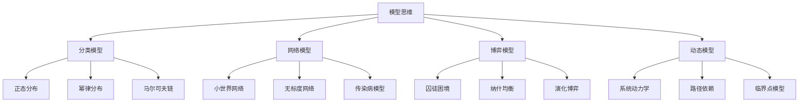
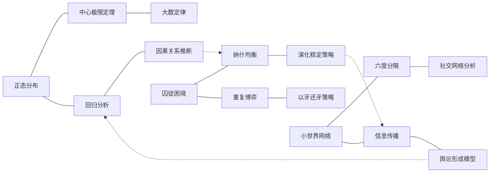
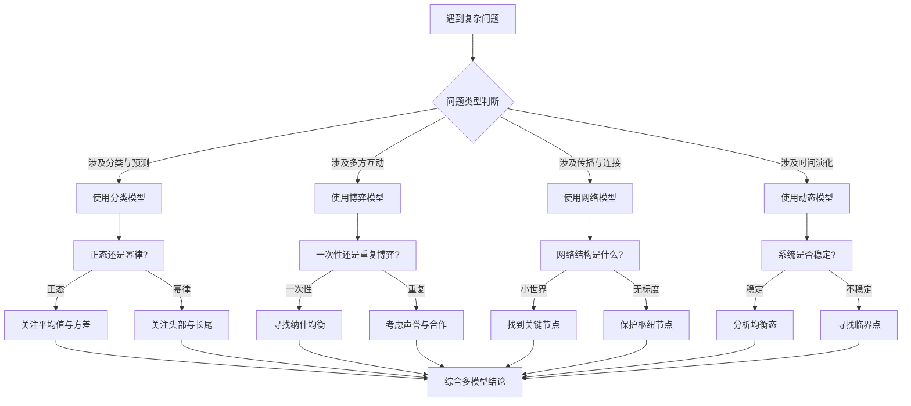
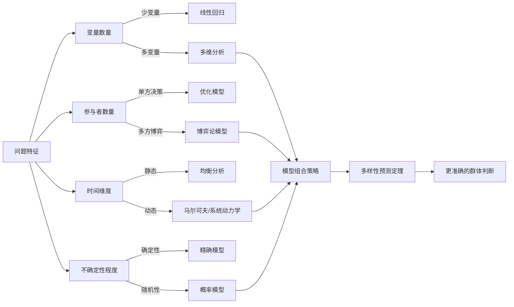

# 02-知识图谱图片描述 - 《模型思维》

---

## 图一：思维模型体系树（Tree Diagram）

展示《模型思维》中核心模型的层级分类关系。

**图片说明：** 以树状结构呈现思维模型的四大类别及各自子模型，帮助读者建立全局认知框架。每个分支代表一类分析视角，从分类、网络、博弈到动态，层层递进。

---

## 图二：多元模型协同网络（Network Diagram）

展示不同思维模型之间如何相互关联、协同工作。

**图片说明：** 网络图揭示了思维模型并非孤立存在，而是相互连接的知识网络。实线表示强关联，虚线表示跨领域的桥接关系。理解这些连接，才能真正做到"模型迁移"。

---

## 图三：问题分析路径图（Path Diagram）

展示面对一个复杂问题时，如何逐步选择和组合不同的思维模型。

**图片说明：** 路径图提供了面对实际问题时的决策流程。核心原则是"先分类，后选模，再综合"。避免用一个模型解决所有问题的陷阱。

---

## 图四：模型选择决策图（Graph Diagram）

展示如何根据问题特征选择最合适的思维模型组合。

**图片说明：** 决策图从四个维度（变量、参与者、时间、不确定性）帮助读者系统性地选择模型。最终指向佩奇的核心观点：多元模型的组合优于单一模型。

---

## 图片使用建议

- 图一适合作为文章开头的"知识地图"，帮助读者建立整体认知
- 图二适合在讲解模型关联时使用，展现知识的网络化特征
- 图三适合作为"行动指南"，指导读者实际应用
- 图四适合放在文末，作为总结性的决策工具
