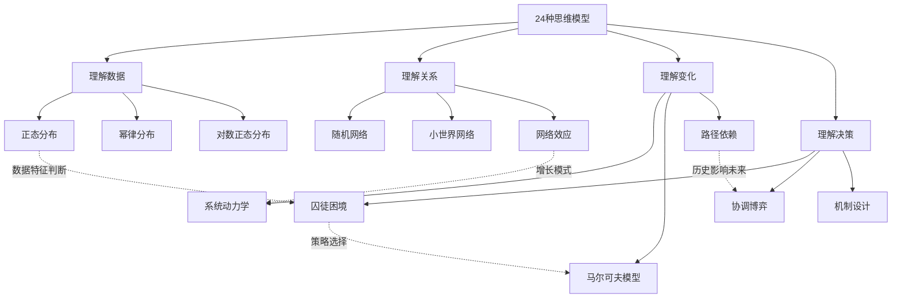

# 《模型思维》核心思想图谱逻辑

> 24种思维模型不是孤立的知识点，而是一个相互连接、相互补充的认知网络。

---

## 整体逻辑框架

《模型思维》的核心思想可以用一句话概括：

**多模型思维 > 单一模型思维 > 无模型思维**

斯科特·佩奇通过24个模型，构建了一个理解复杂世界的认知框架。这些模型之间存在深刻的内在联系，理解这些联系，比单独理解每个模型更重要。

---

## 模型之间的关系图谱

---

## 六大认知维度

### 维度一：理解数据分布

**核心问题：事物是如何分布的？**

世界上的数据分布主要分为两类：

- **正态分布**：身高、考试成绩等，极端值很少出现
- **幂律分布**：财富、城市规模等，极端值影响巨大

这个维度的意义在于：**选择正确的模型来理解数据，是正确决策的前提。**

### 维度二：理解网络连接

**核心问题：事物是如何连接的？**

网络模型揭示了连接的重要性：

- **随机网络**：连接是随机的
- **小世界网络**：六度分隔理论的基础
- **偏好连接**：富者愈富的马太效应

这个维度告诉我们：**在高度连接的世界中，理解网络结构就是理解信息、资源和影响力的流动规律。**

### 维度三：理解动态变化

**核心问题：事物是如何演化的？**

动力学模型关注时间维度上的变化：

- **系统动力学**：反馈回路驱动系统行为
- **马尔可夫模型**：未来只取决于现在，不取决于过去
- **路径依赖**：历史选择锁定了未来方向

这个维度提醒我们：**静态分析往往误导决策，必须考虑时间因素和动态演化。**

### 维度四：理解策略博弈

**核心问题：人们如何做出选择？**

博弈论模型分析了理性决策者的互动：

- **囚徒困境**：个体理性与集体理性的冲突
- **协调博弈**：如何达成一致行动
- **机制设计**：如何设计规则引导行为

这个维度的价值在于：**理解他人的决策逻辑，才能做出最优反应。**

### 维度五：理解系统行为

**核心问题：整体为何不等于部分之和？**

系统思维模型关注复杂系统的涌现行为：

- **反馈回路**：正反馈放大，负反馈稳定
- **延迟效应**：原因和结果之间存在时间差
- **临界点**：量变积累导致质变

这个维度是理解复杂性的关键：**系统行为无法通过简单加总个体行为来预测。**

### 维度六：理解不确定性

**核心问题：如何在不确定中做判断？**

统计与概率模型帮助我们在不确定性中决策：

- **贝叶斯更新**：根据新证据调整信念
- **中心极限定理**：大量独立随机变量的均值趋向正态分布
- **大数定律**：样本越大，结果越接近期望值

这个维度的意义在于：**接受不确定性，但用概率思维来管理它。**

---

## 模型组合的威力

佩奇在书中反复强调：**没有任何一个模型能解释所有现象。**

真正的智慧在于：

1. **知道何时使用哪个模型**
2. **知道如何将多个模型组合使用**
3. **知道每个模型的局限性**

这就是"多模型思维"的精髓——像工具箱一样管理你的思维模型，针对不同问题选择最合适的工具。

---

## 从模型到智慧

学习思维模型的最终目的，不是记住24个名词，而是：

- **建立多元视角**：不再用单一框架理解世界
- **提升判断质量**：在复杂情境中做出更好决策
- **增强解释能力**：用模型解释观察到的现象
- **培养系统思维**：看到事物之间的深层联系

---

## 互动思考

**你最想深入掌握哪个思维模型？为什么？**

在评论区告诉我们，也许下一篇文章就会深入讲解你选择的模型。

---

## 系列导航

- 上一篇：[《模型思维》知识图谱图片描述](02-知识图谱图片描述.md)
- 下一篇：[《模型思维》职场指南](05-公众号排版文稿_职场指南.md)
- 返回[认知思维系列首页](../../README.md)
