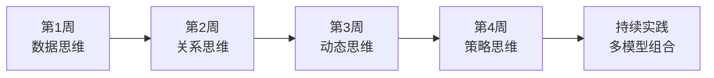

# 《模型思维》行动挑战：30天建立你的思维模型工具箱

> 知道24种模型不等于掌握它们。真正的掌握，是在实际中运用。以下30天挑战计划，帮助你把书中的知识转化为自己的思维能力。

---

## 挑战总览

这个30天挑战分为四个阶段，每个阶段聚焦不同类型的思维模型，循序渐进地建立你的多模型思维框架。



---

## 第一周：数据思维（第1-7天）

### Day 1：认识正态分布

**今日任务：** 观察生活中哪些现象符合正态分布。

记录三个你观察到的正态分布例子，比如同事的工作效率分布、日常通勤时间的波动等。

**思考题：** 这些现象为什么趋向正态分布？背后的原因是什么？

### Day 2：认识幂律分布

**今日任务：** 找出三个幂律分布的例子。

可以是：社交媒体粉丝数、城市人口规模、网站访问量等。

**思考题：** 幂律分布和正态分布的根本区别是什么？这对你的判断有什么影响？

### Day 3：区分两种分布

**今日任务：** 选择一个你工作中的数据集，判断它更接近哪种分布。

用简单的方法分析：计算平均值和标准差，看极端值的比例。

**思考题：** 如果误判了分布类型，可能导致什么决策错误？

### Day 4：对数正态分布

**今日任务：** 理解乘法过程和加法过程的区别。

想想哪些现象是多个因素相乘的结果（如收入 = 时薪 x 工作时间 x 效率），这些往往是对数正态分布。

### Day 5：Zipf定律

**今日任务：** 验证Zipf定律。

统计你常用词汇的频率，或者你所在城市的人口排名，看看是否符合Zipf定律（排名第n的频率约等于排名第1的1/n）。

### Day 6：数据思维综合练习

**今日任务：** 回顾本周学到的分布模型，写一篇简短的分析笔记。

选择你关注的领域，用分布模型来分析其中的规律。

### Day 7：复盘与反思

**今日任务：** 总结本周收获。

- 你最大的认知突破是什么？
- 哪个模型最实用？
- 哪个模型最难理解？

---

## 第二周：关系思维（第8-14天）

### Day 8：随机网络

**今日任务：** 分析你的人际网络。

随机网络中连接是随机产生的。你的人际网络中有多少是随机形成的？

### Day 9：小世界网络

**今日任务：** 验证"六度分隔"。

试着通过你的人脉，联系一个你完全不认识的行业的人。记录需要几步。

### Day 10：偏好连接

**今日任务：** 观察"富者愈富"现象。

在社交媒体或职场中，找到三个偏好连接的例子。

### Day 11：网络效应

**今日任务：** 分析你使用的产品是否有网络效应。

微信、钉钉等产品为什么难以被替代？网络效应的护城河有多深？

### Day 12：网络结构分析

**今日任务：** 画出你所在团队的网络结构图。

谁是信息的枢纽？谁被边缘化？你能成为桥梁吗？

### Day 13：关系思维综合练习

**今日任务：** 用网络模型分析一个社会现象。

可以是信息传播、流行趋势、或者行业变革。

### Day 14：复盘与反思

**今日任务：** 总结本周收获。

网络思维如何改变了你对"连接"的理解？

---

## 第三周：动态思维（第15-21天）

### Day 15：反馈回路

**今日任务：** 识别生活中的正反馈和负反馈。

正反馈：好的习惯带来好结果，好结果强化好习惯。
负反馈：温度过高触发降温机制。

各找三个例子。

### Day 16：延迟效应

**今日任务：** 找到一个"原因和结果之间存在延迟"的例子。

比如：锻炼的效果不会立即显现，教育投入的回报要多年后才体现。

### Day 17：马尔可夫模型

**今日任务：** 用马尔可夫思维分析用户行为。

假设用户只有"活跃"和"不活跃"两种状态，估计状态转移的概率。

### Day 18：路径依赖

**今日任务：** 回顾你的人生选择，找到路径依赖的例子。

因为某个早期选择，你被"锁定"在了某条路径上吗？

### Day 19：临界点

**今日任务：** 观察一个即将到达临界点的现象。

可以是社会趋势、团队氛围、或者个人习惯。

### Day 20：动态思维综合练习

**今日任务：** 用系统动力学分析一个工作中的问题。

画出反馈回路图，识别关键变量和延迟效应。

### Day 21：复盘与反思

**今日任务：** 总结本周收获。

动态思维如何改变了你对"变化"的理解？

---

## 第四周：策略思维（第22-28天）

### Day 22：囚徒困境

**今日任务：** 在职场中识别一个"囚徒困境"场景。

为什么个体理性导致了集体非理性？如何打破这个困境？

### Day 23：协调博弈

**今日任务：** 找到一个需要协调的场景。

团队如何就某个标准达成一致？协调的关键因素是什么？

### Day 24：演化博弈

**今日任务：** 观察一种"策略"如何在群体中传播。

可以是工作习惯、沟通方式、或者管理风格。

### Day 25：机制设计

**今日任务：** 思考如何设计一个规则来引导期望的行为。

比如：如何设计绩效考核机制，让员工既有动力又不会恶性竞争？

### Day 26：贝叶斯更新

**今日任务：** 实践贝叶斯思维。

选择一个你不太确定的判断，给出初始概率。然后根据新证据不断更新。

### Day 27：策略思维综合练习

**今日任务：** 用博弈论分析一个商业竞争案例。

参与方是谁？各自的策略是什么？均衡点在哪里？

### Day 28：复盘与反思

**今日任务：** 总结本周收获。

策略思维如何改变了你对"决策"的理解？

---

## 最后两天：综合应用

### Day 29：多模型组合

**今日任务：** 选择一个复杂问题，用至少3个不同的模型来分析。

记录每个模型给出的视角，比较它们的异同。

### Day 30：建立个人思维模型清单

**今日任务：** 整理你最常用的5个模型，制作成个人思维模型清单。

格式：

```
模型名称：
核心思想：
适用场景：
局限性：
我的应用案例：
```

---

## 挑战完成后的持续实践

30天只是一个开始。真正的多模型思维需要终身的实践和积累。

**持续行动建议：**

- 每月学习一个新模型
- 每周用模型思维分析一个现实问题
- 建立你的"模型-案例"数据库
- 与他人分享你的模型思维心得

---

## 互动挑战

**完成挑战后，在评论区分享：**

1. 你最常用的3个思维模型
2. 用其中一个模型分析你最近遇到的一个问题
3. 你的思维模型清单截图

让我们一起建立属于多模型思维者的社群。

---

## 系列导航

- 上一篇：[《模型思维》职场指南](05-公众号排版文稿_职场指南.md)
- 下一篇：[《底层逻辑》读后感](../07-底层逻辑/01-公众号排版文稿_读后感.md)
- 返回[认知思维系列首页](../../README.md)

---

*本文是「人类文明经典阅读计划」认知思维系列第6篇。关注我们，每周深度解读一本经典著作。*
