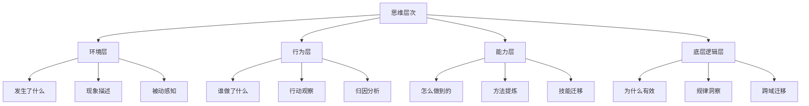
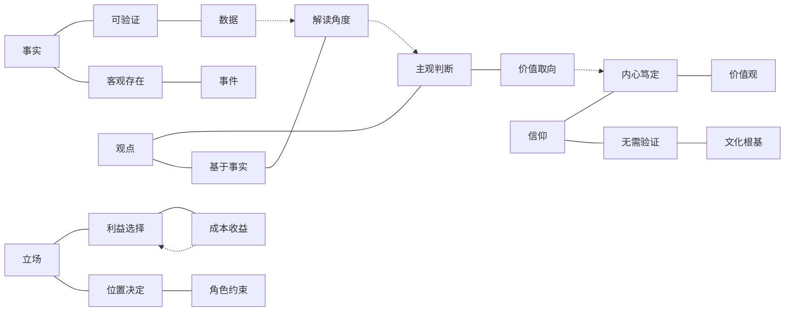
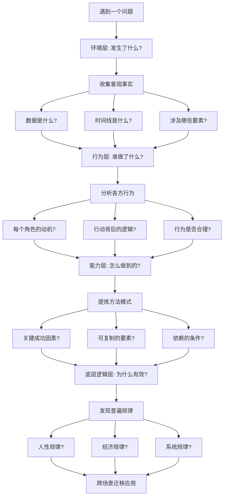
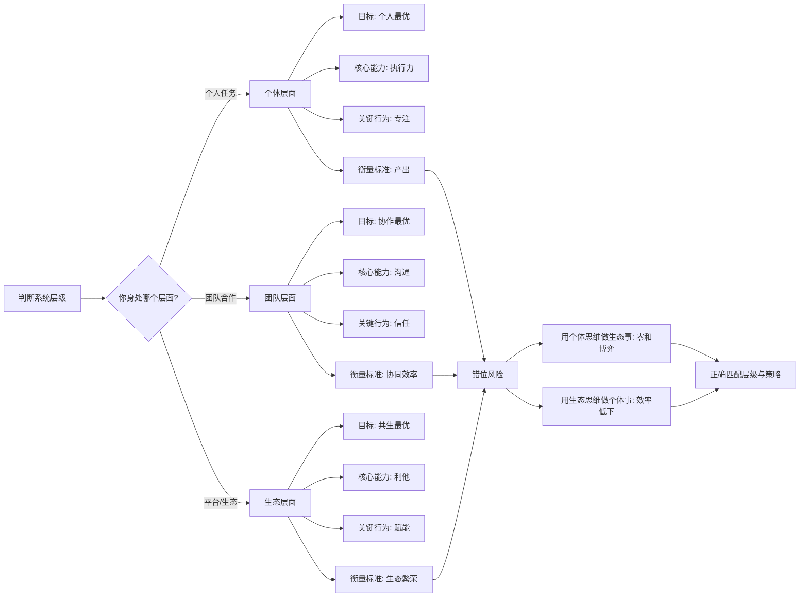

# 02-知识图谱图片描述 - 《底层逻辑》

---

## 图一：思维四层次树（Tree Diagram）

展示从表层到深层的思维层级结构。

**图片说明：** 四层思维结构从表象到本质逐层深入。大多数人停留在环境层和行为层，只有少数人能触及底层逻辑层。每向下一层，思考的深度和迁移能力都呈指数级提升。

---

## 图二：事实-观点-立场-信仰关系网（Network Diagram）

展示四种认知类型的区分及其相互转化关系。

**图片说明：** 四种认知类型的区分是避免无效争论的关键。实线表示定义特征，虚线表示相互影响路径。事实可以支撑观点，观点可能受立场影响，立场可能根植于信仰。

---

## 图三：从问题到底层逻辑的分析路径（Path Diagram）

展示面对一个商业或生活问题时，如何逐层深入找到底层逻辑。

**图片说明：** 这条路径是从表象到本质的标准分析流程。每向下一层，都需要提出更深的问题。最终目标不是解决眼前问题，而是发现可迁移的普遍规律。

---

## 图四：个体-团队-生态决策图（Graph Diagram）

展示不同系统层级下的决策逻辑和行为准则。

**图片说明：** 不同系统层级有不同的最优策略。最大的认知错误是用错层级的思维来处理当前问题。个体层面讲效率，团队层面讲协作，生态层面讲共生——三者不可混淆。

---

## 图片使用建议

- 图一适合在文章开头使用，建立思维层次的认知框架
- 图二适合在讨论"如何避免无效争论"时使用
- 图三适合作为深度分析的行动指南
- 图四适合在讨论商业决策和组织管理时使用
