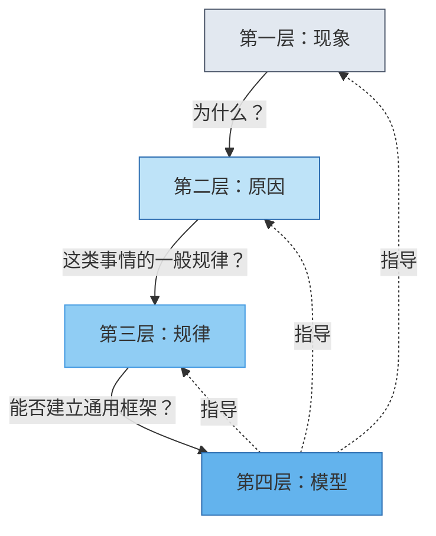
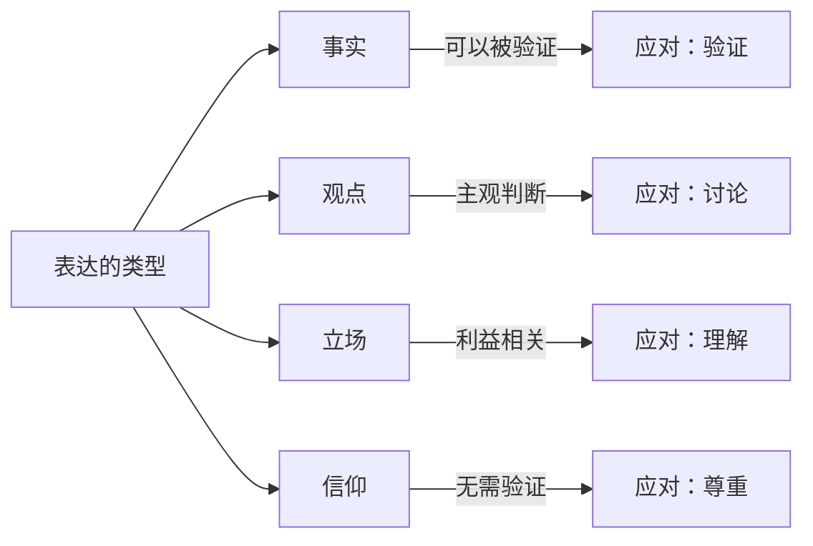

# 《底层逻辑》图谱逻辑：从表象到本质的认知升级之路

> 刘润说："看透事物本质的人，和只看到表象的人，过的是两种完全不同的人生。"

---

## 整体逻辑框架

《底层逻辑》的核心思想可以用一个递进关系来概括：

**看到现象 → 找到原因 → 发现规律 → 建立模型**

这四个层次，就是刘润在书中反复强调的"思考问题的四个层次"。每一层都比上一层更接近事物的本质。

理解这四个层次的关系，比记住书中的任何一个具体结论都重要。

---

## 四个层次的内在逻辑

---

## 事实、观点、立场、信仰的逻辑关系

这是全书另一个核心框架。理解这四者的关系，是有效沟通和正确决策的前提。

---

## 六大认知维度

### 维度一：什么是底层逻辑？

**核心问题：底层逻辑到底是什么？**

底层逻辑，就是事物的本质规律。

它不是表面的现象，不是个别的案例，不是暂时的趋势，而是那些**不随时间变化、不随场景改变、在多数情况下都成立的基本规律。**

刘润用了一个形象的比喻：底层逻辑就像操作系统的底层代码。表面上你看到的是各种应用程序（现象），但真正决定系统运行方式的，是那些你看不到的代码（底层逻辑）。

### 维度二：如何区分事实与观点？

**核心问题：为什么沟通如此困难？**

大多数沟通困难的根源，是混淆了事实和观点。

- 事实是客观的，观点是主观的
- 事实可以被验证，观点只能被讨论
- 把观点当事实，就会固执己见
- 把事实当观点，就会陷入相对主义

这个维度的意义在于：**正确的沟通，始于正确识别表达的性质。**

### 维度三：如何从现象走到模型？

**核心问题：如何提升思考深度？**

四个层次的递进关系：

- 现象层：知道发生了什么
- 原因层：知道为什么发生
- 规律层：知道这类事情的一般规律
- 模型层：知道如何建立通用框架

这个维度告诉我们：**思考的深度，决定了你解决问题的能力。**

### 维度四：如何理解商业的本质？

**核心问题：商业的底层逻辑是什么？**

刘润用三个要素定义了商业的本质：

- **创造价值**：你解决了什么问题
- **传递价值**：你如何让目标用户知道
- **获取价值**：你如何从中获得回报

这个维度的价值在于：**任何商业问题，都可以回归到这三个要素来分析。**

### 维度五：如何用系统思维看问题？

**核心问题：为什么局部最优不等于全局最优？**

系统思维的核心：

- 整体大于部分之和
- 原因和结果之间可能存在延迟
- 短期最优可能是长期最差

这个维度提醒我们：**不要孤立地看问题，要放在更大的系统中理解。**

### 维度六：如何做对关键决策？

**核心问题：决策的底层逻辑是什么？**

好的决策遵循以下逻辑：

- 基于事实，而非情绪
- 考虑概率，而非确定性
- 关注长期，而非短期
- 追求满意，而非完美

这个维度的意义在于：**决策质量不取决于结果，而取决于过程。**

---

## 框架之间的联系

这六个维度不是孤立的，它们之间存在深刻的内在联系：

- 理解底层逻辑（维度一）是基础
- 区分事实与观点（维度二）是前提
- 从现象到模型（维度三）是方法
- 理解商业本质（维度四）是应用
- 系统思维（维度五）是视角
- 关键决策（维度六）是目标

---

## 从认知到行动

刘润反复强调：**知道不等于做到。**

真正的底层逻辑思维，需要在实践中不断打磨。每遇到一个问题，尝试：

1. 区分这是事实还是观点
2. 用四个层次来分析
3. 寻找背后的底层规律
4. 建立可复用的思维模型

---

## 互动思考

**你在生活中遇到过哪些"看透本质"后豁然开朗的时刻？**

在评论区分享你的故事，也许你的经历能给别人带来启发。

---

## 系列导航

- 上一篇：[《底层逻辑》知识图谱图片描述](02-知识图谱图片描述.md)
- 下一篇：[《底层逻辑》核心思想](04-公众号排版文稿_核心思想.md)
- 返回[认知思维系列首页](../../README.md)
