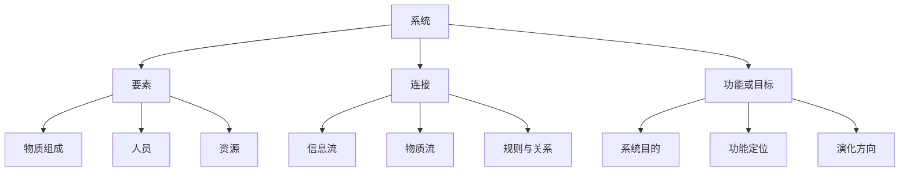
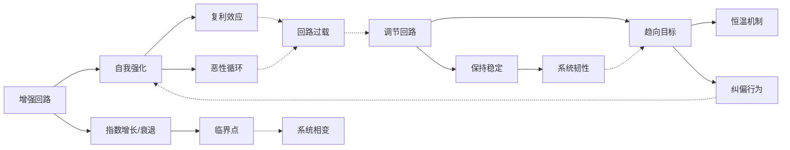
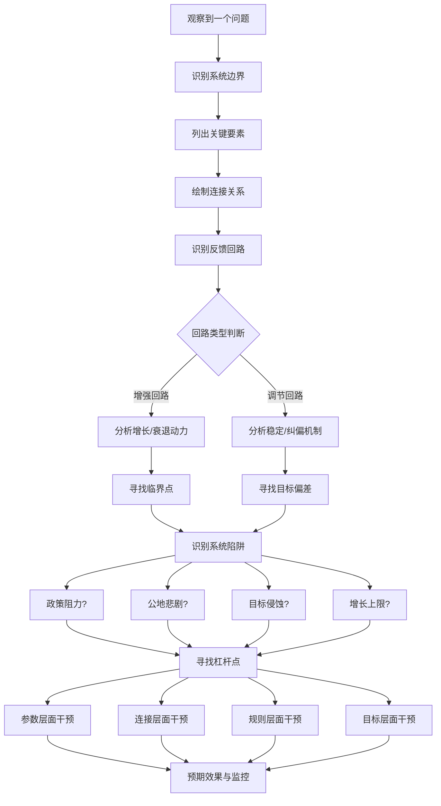
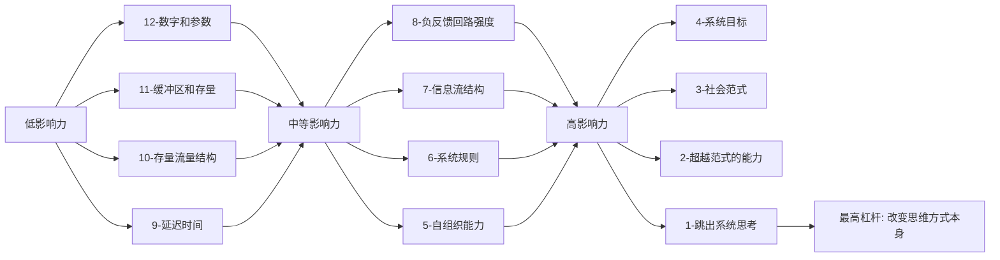

# 02-知识图谱图片描述 - 《系统之美》

---

## 图一：系统三要素树（Tree Diagram）

展示系统的基本构成要素及其关系。

**图片说明：** 系统的三个核心要素中，改变要素对系统影响最小，改变连接影响中等，改变功能或目标影响最大。理解这一点，就能明白为什么换人不一定能解决问题，而改变激励机制却能彻底改变局面。

---

## 图二：反馈回路网络（Network Diagram）

展示增强回路与调节回路的运作机制及其相互作用。

**图片说明：** 增强回路和调节回路是系统的两种基本运作机制。实线表示回路内部的正向驱动，虚线表示两种回路之间的相互作用。当增强回路过载时，调节回路会被激活以维持稳定。

---

## 图三：系统问题分析路径（Path Diagram）

展示面对一个系统性问题时的分析流程。

**图片说明：** 这条路径从问题识别到杠杆点寻找，是系统思维的标准分析流程。核心原则是"先看整体，再看局部；先找结构，再找参数"。

---

## 图四：系统杠杆点层级图（Graph Diagram）

展示梅多斯提出的12个杠杆点，按影响力从低到高排列。

**图片说明：** 梅多斯的12个杠杆点按影响力排列。大多数人试图通过改变参数来影响系统（影响力最低），而真正有效的是改变系统的目标、规则甚至思维方式。

---

## 图片使用建议

- 图一适合在文章开头使用，帮助读者建立系统的基本认知
- 图二适合在讨论反馈机制时使用，展示系统的动态特性
- 图三适合作为问题分析的行动指南
- 图四适合放在文末，作为系统干预的决策参考
