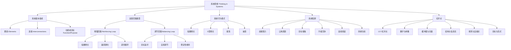
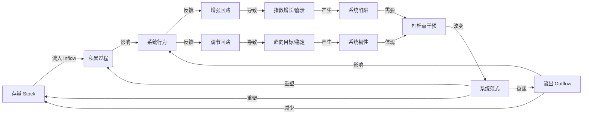
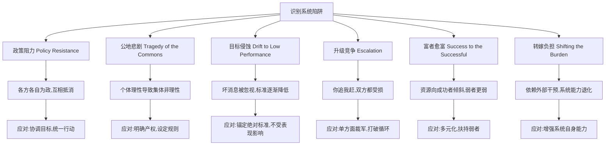
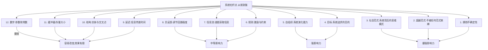

# 《系统之美》知识图谱

## 知识图谱概述

本篇图谱基于德内拉·梅多斯《系统之美》（Thinking in Systems: A Primer）的核心内容构建，涵盖系统思维的基础概念、核心要素、反馈机制、系统陷阱及杠杆点等关键知识维度。图谱旨在帮助读者建立完整的系统思考框架，理解复杂系统运行的底层逻辑。

---

## Mermaid 图表一：系统思维分类树

---

## Mermaid 图表二：核心概念关系网络图

---

## Mermaid 图表三：系统陷阱与应对路径图

---

## Mermaid 图表四：杠杆点层级路径图

---

## 关键术语表

| 术语 | 英文 | 说明 |
|------|------|------|
| 存量 | Stock | 系统中在某一时刻可测量的累积量 |
| 流量 | Flow | 在一段时间内改变存量的速率 |
| 增强回路 | Reinforcing Feedback Loop | 使变化不断放大的反馈循环 |
| 调节回路 | Balancing Feedback Loop | 使系统趋向稳定目标的反馈循环 |
| 延迟 | Delay | 原因与结果之间的时间差 |
| 杠杆点 | Leverage Point | 系统中微小改变可产生巨大影响的位置 |
| 政策阻力 | Policy Resistance | 系统中各方力量互相抵消导致政策无效 |
| 公地悲剧 | Tragedy of the Commons | 个体理性行为导致公共资源枯竭 |
| 目标侵蚀 | Drift to Low Performance | 绩效标准随表现下降而降低 |
| 自组织 | Self-Organization | 系统产生新结构和行为模式的能力 |

---

## 图谱说明

本知识图谱从四个维度呈现《系统之美》的核心知识体系：

1. **分类树**：展示系统思维的知识层级结构，从基本概念到具体应用
2. **关系网络图**：揭示存量、流量、反馈回路之间的动态关联
3. **陷阱与应对路径图**：列举六种常见系统陷阱及其对应的解决思路
4. **杠杆点层级路径图**：按照影响力从弱到强排列12个杠杆点

读者可结合图谱快速定位书中核心概念，建立系统思维的整体认知框架。
